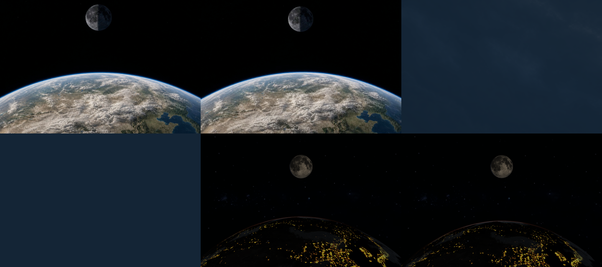
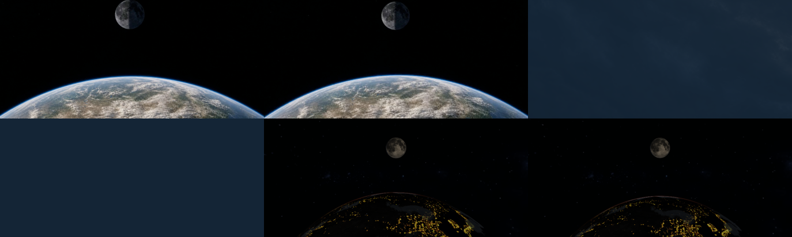

# LuBirth normalized cinematic prelude — implementation evidence

This directory binds the query-only `/lubirth-cinematic-prelude` implementation to its authored media, source files, System Chrome runtime captures, and final route decision. The default homepage was not changed and no default-home promotion plan is authorized by this result.

## Decision

The implementation is retained as a working query-only validation route, but it is rejected for default-home promotion.

- The normalized opaque plate, real-IP Relief-lite prewarm, frame-addressed forward/reverse seeking, 0.195 source cut under a fully closed shared veil, 0.22 media release, hysteresis, and explicit live fallbacks are implemented.
- Desktop and mobile media pass their transfer, first-frame, presentation-residency, frame-addressability, cadence, crop, and opaque all-I contracts.
- The mobile-tier System Chrome run passes every automated gate, including Relief-lite cloud GPU p95.
- The desktop System Chrome run fails the unchanged post-handoff Relief-lite cloud budget: `4.233916 ms` p95 over 120 samples, against the required `3 ms` ceiling. There were no GPU-timer capability gaps hidden as a pass.
- Physical iPhone/Pixel testing has not been performed. The mobile result is Chrome mobile-tier emulation on Apple M4 / ANGLE Metal and is not treated as a physical-device promotion gate.

Promotion is impossible if visual quality, frame addressability, transfer/residency, first-frame readiness, cadence, no-double-image behavior, or post-handoff Relief-lite GPU limits fail. Because the desktop GPU limit fails, this evidence cannot authorize a default-home integration even though the transition mechanism itself is valid.

## Bound source and media

- Baseline: `b680891b3b7293ebfddb1b1135f908f06fa7c559`
- Evidence source parent: `e48dc84`
- Branch: `codex/lubirth-cinematic-prelude-implementation`
- Media manifest: `apps/site/public/assets/lubirth/cinematic-prelude/manifest.json`
- Desktop plate: 1440×810, 48 frames at 30 fps, all-I H.264, 4,378,646 bytes, SHA-256 `ed6a4d15e108cf2e06504798764dc1e69d8858296e24d8e72ab7aa06cbf43e7f`
- Mobile plate: 960×444, 48 frames at 30 fps, all-I H.264, 1,708,660 bytes, SHA-256 `363bb292d83307cfe1144ef568a68a8f7451eac08a57f32f05eaf7341233b1d3`
- Provenance: internally generated HyperFrames sequence using an OpenAI ImageGen source still; renderer/tool versions, scene paths, source hashes, safe crop, timing frames, color contract, and internal license are recorded in the media manifest.

`manifest.json` in this evidence directory records the exact source and capture hashes. `checksums.sha256` verifies the evidence payload.

## System Chrome results

Both runs used installed System Chrome with WebGL 2 on `ANGLE (Apple, ANGLE Metal Renderer: Apple M4, Unspecified Version)`. Captures are at progress `0.000`, `0.180`, `0.194`, `0.195`, `0.220`, and `0.300`.

| Gate | Desktop | Mobile tier |
| --- | ---: | ---: |
| First decoded frame | 78.70 ms / ≤1200 ms | 75.10 ms / ≤1800 ms |
| Last target-frame latency | 7.60 ms | 15.30 ms |
| Transfer | 4,378,646 B / ≤6 MiB | 1,708,660 B / ≤2 MiB |
| Presentation residency | 12,830,400 B / ≤16 MiB | 4,688,640 B / ≤8 MiB |
| rAF p95 after reset | 18.00 ms / ≤33.4 ms | 17.70 ms / ≤33.4 ms |
| Dropped-frame rate after reset | 0 / ≤0.02 | 0 / ≤0.02 |
| Relief-lite cloud GPU p95 | **4.233916 ms / ≤3 ms — fail** | 0.917375 ms / ≤3 ms — pass |
| Relief-lite GPU samples | 120 | 120 |

The strict desktop command exits non-zero solely on the GPU p95 assertion. The evidence test writes its telemetry and captures before evaluating that assertion, so the failed gate remains auditable rather than being discarded.

## Visual review

- `0.000`: authored daylight plate is opaque and fills the Canvas crop in both tiers.
- `0.180`: the requested forward frame is 39 and is visibly presented before veil closure.
- `0.194`: frame 42 remains the plate source while the shared veil is approximately 93% closed.
- `0.195`: the source changes atomically to live while the veil is fully closed; no plate/live opacity crossfade is used.
- `0.220`: the veil has opened, presentation resources are released, and the real-IP Relief-lite scene owns the view.
- `0.300`: the live scene remains active with no plate reappearance.
- Review at 1× found no black/blank frame, continental double image, crop leakage, error overlay, or DOM title/navigation occlusion. The normalized daylight plate and real-IP live scene do not share identical geography or lighting; the full-veil match cut conceals that intentional semantic boundary.

Representative contact sheets:





## Reproduction

Run the deterministic contract and browser suite:

```sh
pnpm --filter @miralith/site typecheck
pnpm --filter @miralith/site lint
pnpm --filter @miralith/site build
pnpm exec playwright test --project=desktop tests/e2e/lubirth-cinematic-prelude-contract.spec.ts tests/e2e/lubirth-cinematic-prelude-controller.spec.ts tests/e2e/lubirth-cinematic-prelude.spec.ts
git diff --check
```

Run each strict System Chrome project serially so a desktop rejection does not suppress the mobile record:

```sh
MIRALITH_CINEMATIC_PRELUDE_STRICT_EVIDENCE=1 \
MIRALITH_CINEMATIC_PRELUDE_EVIDENCE_DIR="$PWD/docs/lubirth-cinematic-prelude-evidence/2026-07-30" \
pnpm exec playwright test --config=playwright.cinematic-system-chrome.config.ts \
  --project=system-chrome-desktop \
  tests/e2e/lubirth-cinematic-prelude.spec.ts \
  --grep "records prelude evidence"

MIRALITH_CINEMATIC_PRELUDE_STRICT_EVIDENCE=1 \
MIRALITH_CINEMATIC_PRELUDE_EVIDENCE_DIR="$PWD/docs/lubirth-cinematic-prelude-evidence/2026-07-30" \
pnpm exec playwright test --config=playwright.cinematic-system-chrome.config.ts \
  --project=system-chrome-mobile-landscape \
  tests/e2e/lubirth-cinematic-prelude.spec.ts \
  --grep "records prelude evidence"

shasum -a 256 -c docs/lubirth-cinematic-prelude-evidence/2026-07-30/checksums.sha256
```

The query route may be inspected directly after starting the site, for example:

```text
/lubirth-cinematic-prelude?copy=hidden&location=ip&geoLat=31.2&geoLon=103.8&progress=0&quality=high&reliefLiteGpuTimer=on
```

REJECT
