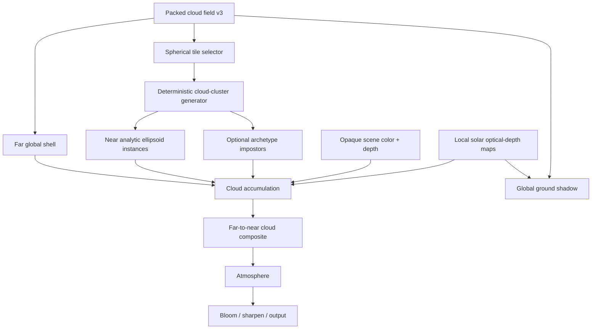

# LuBirth Hybrid Cloud Rendering Architecture

Status: Phase -1.1 depth-layer visual decision spike in progress for the isolated feasibility route
on Apple M4 with the system Chrome channel. The carrier/topology revision and the new 1-bin/2-bin
comparison must be evaluated with their own source-bound motion evidence; earlier accepted evidence is historical and cannot prove the new
renderer. The Chrome mobile-tier evidence is configuration evidence, not a physical iPhone/Pixel
performance result. The production homepage default remains unchanged.

Date: 2026-07-26

## 2026-07-30 offline-bake comparison decision

The query-only baked deep-impostor route is **rejected for production promotion**. It proves Earth-local attachment, IP lifecycle, optical handoff, mobile budgeting, and resource release, but real-opening review still exposes a vertically banded planar read and did not produce a verified <=3 ms GPU draw measurement.

The [source-bound evidence](lubirth-baked-cloud-evidence/2026-07-30/README.md) records the manifest hashes, telemetry, capture command, and decision. The Hybrid route remains an isolated Unit 3 comparison control only; neither experiment changes the production homepage cloud policy.

The [Phase -1 revalidation](lubirth-hybrid-cloud-evidence/phase-1-revalidation-2026-07-26/README.md)
and [2026-07-25 acceptance evidence](lubirth-hybrid-cloud-evidence/phase-1-accepted-2026-07-25/README.md)
are historical baselines only. Phase -1.1 must produce a fresh source-bound 1-bin/2-bin A/B
and motion capture before any status can be promoted.

Scope: `packages/lubirth-hero`, the LuBirth scene slot, and the LuBirth render pipeline only.

## 1. Decision

LuBirth will pursue a hybrid cloud renderer whose high-quality path combines:

```text
global packed cloud field
  + far global cloud shell
  + Earth-local spherical tile clipmap
  + analytic soft-ellipsoid splats for near clouds
  + optical-depth LOD composition
  + local optical-depth shadowing
```

The renderer is introduced as an isolated `hybrid-splat` cloud mode. It does not replace `shell-lite`, `relief-lite`, `nasa-lite`, or the surface fallback until the visual, GPU, memory, and physical-device gates in this document pass.

The current art-directed LuBirth camera and Moon composition remain authoritative. This project does not convert the opening into a physically scaled ISS-to-Moon flight and does not require reverse-Z or logarithmic depth.

## 2. Why this architecture

The existing implementations cover individual parts of the desired result but not the complete near-to-far cloud experience:

- `shell-lite` is the stable production far/fallback representation.
- `relief-lite` provides bounded height and shallow optical integration on one shell.
- `nasa-lite` validates screen-size budgets, hysteresis, and bounded view integration.
- the packed cloud field already provides a global, seam-safe source of cloud structure.
- the atmosphere path already demonstrates scene-color and depth render targets.

The missing capability is a true three-dimensional near representation with cloud-tower parallax, lobe overlap, underside depth, and a broken horizon silhouette without a traditional per-pixel raymarch through a global volume.

Analytic ellipsoid splats supply that near representation. The global shell preserves the complete Earth at far distance. Optical-depth composition keeps both representations tied to one energy model during LOD transitions.

## 3. Goals

The target renderer must provide:

1. Visible cloud-tower parallax during the close LuBirth opening frame.
2. Broad cloud bodies with lit tops, shaded sides, and dark undersides rather than embossed texture edges.
3. A fragmented three-dimensional horizon silhouette without white ribbons or black ridges.
4. Stable global cloud placement from close framing to the complete-Earth framing.
5. Consistent cloud and ground shadows driven by the same cloud field, cloud offset, and sun direction.
6. Screen-space LOD decisions that remain stable across viewport size, DPR, and FOV changes.
7. A bounded high-quality path with explicit instance, overdraw, render-target, and shadow budgets.
8. Deterministic fallback to the existing cloud modes when capabilities or performance are insufficient.

## 4. Non-goals

- Do not replace the current LuBirth camera choreography with physical orbital distances.
- Do not move the Moon from its current screen-composition contract.
- Do not make all devices render ellipsoid splats.
- Do not remove the current cloud renderers during development or initial promotion.
- Do not introduce an unbounded global volumetric raymarch.
- Do not add a second independent final-render owner beside atmosphere and bloom.
- Do not treat draw-call count as the primary performance metric; proxy-volume overdraw is the main risk.
- Do not add TAA as an assumed finishing step. Temporal accumulation requires a separate motion/history design and is not part of this decision.

## 5. Locked architectural decisions

### 5.1 One cloud truth

The packed global cloud field is the sole source of cloud placement and morphology for every representation.

The hybrid path consumes this explicit linear-data contract:

| Channel | Meaning |
| --- | --- |
| R | optical depth / cloud mass |
| G | normalized cloud-top height |
| B | morphology / archetype selector |
| A | concavity / internal-structure control |

The contract identifier is:

```text
v3-r-depth-g-height-b-morphology-a-concavity
```

Every PNG, KTX2 derivative, loader result, shader, and telemetry snapshot must carry or assert this identifier. Legacy shaders that interpret `GB` as a normal or `A` as height must use an explicit adapter or a different declared layout. Silent channel reinterpretation is forbidden.

The texture is sampled in linear space. PNG remains the generation source of truth; a compressed derivative may be promoted only after its optical-depth, height, morphology, concavity, seam, and mip-error gates pass.

The hybrid path additionally requires a dual-asset cloud-truth contract before tile generation starts:

| Asset | Resolution | Consumer | Required properties |
| --- | ---: | --- | --- |
| GPU field | 2048×1024 KTX2 UASTC | far shell, near shader, shadow shader | layout ID, linear channels, declared Y orientation, mip seam gates |
| CPU truth field | about 512×256 RGBA8 plus min/max pyramid | tile generator, footprint, budget and debug tools | same layout ID, same orientation, same offsets, byte-addressable samples |

The Phase -1 route uses the real 512×256 CPU truth for deterministic hierarchy selection and
the source-equivalent 2048×1024 V3 PNG for fragment-level optical structure. This is intentional:
the CPU field owns identity and topology, while the GPU field owns sub-lobe detail. The production
candidate must replace that PNG with the validated KTX2 derivative without changing layout,
orientation, offsets, source hash, or hierarchy identity.

The CPU truth field is not an optional convenience. `HybridCloudTileManager` may not sample a Three `Texture`, and it may not independently decode a production KTX2 texture. KTX2 transcode format, mip generation, and Y-flip behavior are GPU concerns and are not a stable CPU random-access API.

Generation must emit both derivatives from the same decoded source in one script run and stamp both with:

```text
layoutId = v3-r-depth-g-height-b-morphology-a-concavity
orientation = equirect-u-repeat-v-clamp-north-up
offset = HOME_CLOUD_FIELD_OFFSET_X/Y
sourceSha256
generatorVersion
```

Tests must sample at least the seam, quadrants, poles, and ten deterministic high-mass points and prove CPU truth, PNG source, and KTX2 fallback orientation agree after the declared Y convention is applied.

The CPU truth asset API is locked before Phase 0:

```ts
interface HybridCloudTruthHeader {
  magic: "MLHC";
  version: 1;
  layoutId: "v3-r-depth-g-height-b-morphology-a-concavity";
  orientation: "equirect-u-repeat-v-clamp-north-up";
  width: 512;
  height: 256;
  levelCount: number;
  sourceSha256: string;
  generatorVersion: string;
  byteLength: number;
  levels: Array<{
    width: number;
    height: number;
    rgbaOffset: number;
    rgbaLength: number;
    minMaxOffset: number;
    minMaxLength: number;
  }>;
}
```

The on-disk file is a small binary container:

```text
headerLength uint32-le
UTF-8 JSON HybridCloudTruthHeader
RGBA8 level data
RGBA8 min/max pyramid data
```

The first level is exactly `512×256` unless the source cloud field dimensions change. Each following level halves width and height until `1×1`. `minMax` stores per-channel min and max in RGBA8 pairs for every texel footprint at that level. The initial uncompressed budget is `<= 1.5 MiB`; gzip/brotli transfer size is reported but not used for CPU memory budget.

Loading is abortable through `AbortSignal`, uses one shared cache keyed by `(sourceSha256, layoutId, orientation, generatorVersion)`, and exposes a reference-counted decoded buffer. Hash, layout, orientation, dimension, or budget mismatch rejects the hybrid path and falls back before tile generation starts. It may not produce a partial hybrid frame.

### 5.2 Earth-local coordinates

All tile coordinates and ellipsoid instances live in Earth-local space under the animated Earth group.

Each frame the renderer derives:

- `cameraLocal` by applying the inverse Earth world matrix to the camera position;
- `viewDirectionLocal` from the local camera ray;
- `sunDirectionLocal` by applying the inverse Earth world rotation to the shared scene sun direction;
- the active Earth-local view footprint and horizon.

This follows the existing LuBirth transformation pattern and keeps clouds attached to the rotating, translated, and uniformly scaled Earth. A world-identity cloud mesh whose centers are manually rewritten every frame is not part of the design.

The Earth parent must remain uniformly scaled. If a future composition introduces non-uniform Earth scaling, the hybrid path must either normalize it before rendering or reject the mode through policy.

### 5.3 Art-directed altitude

`composition.earth.radius` remains the base radius. Cloud height is stored as a ratio of that radius, not as literal world kilometers.

The following invariants are mandatory:

```text
earthRadius < cloudBottom < cloudTop < visibleAtmosphereRadius
```

The visual calibration range may span the current Relief-lite and Nasa-lite values. Exact bottom and top scales are policy parameters and are accepted by close-frame silhouette and parallax tests, not by a requirement to preserve literal 1-12 km height.

### 5.4 Dynamic sunlight

There is no static `iSunTau` instance attribute. LuBirth sunlight can change with date, location, route configuration, and runtime solar input.

Per-instance data stores geometry and stable material variation only. Aggregate solar occlusion comes from the local optical-depth shadow pass; analytic intra-lobe attenuation supplies the fallback when that pass is disabled.

### 5.5 One final render owner

When `hybrid-splat` is active, one LuBirth render-pipeline component owns the priority-1 render callback. Cloud accumulation, cloud composition, atmosphere, bloom, sharpening, output conversion, and render-target restoration execute under that owner.

No hybrid pass may independently call `gl.render()` to the default framebuffer from a sibling `useFrame(..., 1)` callback.

## 6. Target system



The three representations share cloud identity and optical depth:

| Band | Representation | Required use |
| --- | --- | --- |
| Far | one or two global cloud shells | complete Earth, fallback, low projected tile size |
| Mid | depth impostor archetypes | enabled only when direct Far/Near transition fails its visual gate |
| Near | analytic soft-ellipsoid splats | close frame, visible parallax, tower silhouette |

The Mid slot is part of the architecture and data flow, but its assets are not a prerequisite for the first Near/Far spike. It becomes mandatory if the direct optical-depth transition cannot pass the continuity gates.

### 6.1 Far optical adapter

Existing Relief/Nasa cloud renderers output premultiplied RGBA meant for direct composition. They are not a valid Far input for optical-depth partitioning.

Hybrid therefore owns a `HybridFarCloudPass` adapter. At minimum it outputs:

```text
RGB = source radiance * tauFar
A   = tauFar
D   = representative cloud depth or shell ray parameter
```

The pass may reuse packed-field sampling, sun direction, and visual constants from existing shell/relief work, but it may not consume an already-composited RGBA cloud layer. Far/Near LOD math operates on `tau`, not alpha. If a fallback mode cannot provide optical depth, it remains outside Hybrid and is labeled as fallback in telemetry.

## 7. Spherical tile clipmap

### 7.1 Tile identity

The clipmap uses stable cube-sphere cells rather than longitude/latitude rectangles as its topological identity. Each tile key contains:

```ts
interface HybridCloudTileKey {
  face: 0 | 1 | 2 | 3 | 4 | 5;
  level: number;
  x: number;
  y: number;
}
```

The packed equirectangular field remains the data source. Tile sample directions are converted to equirectangular UV only when reading that field. This avoids a tile-topology seam at longitude wrap and avoids singular tile shapes near the poles.

### 7.2 Active set

The selector operates in Earth-local space and maintains concentric resolution rings around the camera's visible ground footprint. It considers:

- horizon and frustum visibility;
- tile projected diameter in physical pixels;
- cloud-field mass bounds;
- quality and instance budgets;
- a guard band around the active footprint;
- an eviction delay to prevent churn during small camera reversals.

Tile selection must not trigger React state updates per frame. It owns pooled records and typed arrays outside React reconciliation.

### 7.3 Deterministic generation

Each tile generates a stable candidate set from `hash(face, level, x, y, candidateIndex)`. Candidate placement does not use frame time or array insertion order.

For each candidate:

1. Sample R to determine whether sufficient cloud mass exists.
2. Sample G to determine the tower-height envelope.
3. Sample B to choose or blend a cloud archetype.
4. Sample A to control branching, cavities, and density variation.
5. Use the stable hash for sub-tile position, yaw, scale, and detail variation.

Clouds that overlap a tile edge are generated with a guard region, but exactly one owner tile emits each instance. This prevents cracks and duplicates at LOD boundaries.

Tile generation output is cached by key, packed-layout version, generator version, and CPU-truth source version. Buffers are pooled; normal camera movement must not allocate geometry or materials.

Continuous `cloudOffset` is not part of the instance-cache key. Instances are generated in canonical cloud coordinates. The animated cloud offset is applied as one shared Earth-local Y rotation or equivalent continuous transform to:

- Far cloud shell sampling;
- Near ellipsoid centers and shadow footprints;
- CPU truth footprint queries;
- global and local ground-shadow lookup;
- debug overlays and telemetry.

If a future mode quantizes cloud offset into epochs for streaming, that epoch must represent coarse data paging only. It may not invalidate visible instance buffers every frame and may not cause Far/Near drift.

### 7.4 Cloud archetypes

The initial archetype library contains at least:

- low flat cumulus base;
- broad rising body;
- branched tower;
- anvil or high cap;
- broken edge/detail cluster;
- thin high-cloud patch for the far or impostor path.

An archetype is a deterministic hierarchy of ellipsoid lobes, not a baked world-positioned cloud. Morphology controls relative lobe placement and density; the packed field controls global occupancy and height.

## 8. Near analytic ellipsoid representation

### 8.1 Instance contract

The high-quality instance stream contains:

```text
iCenter       vec3   Earth-local center
iRadii        vec3   Earth-local ellipsoid radii
iQuat         vec4   Earth-local orientation
iDensity      float  extinction-density scale
iSeed         float  stable material variation
iMorphology   float  archetype/lobe role
iLodWeight    float  representation transition weight
```

One instanced unit cube bounds each ellipsoid. The shader analytically intersects the local view ray with the ellipsoid. The instance stream is compacted to visible tiles and constrained by an explicit lobe budget before drawing.

### 8.2 Hierarchical soft analytic density

A uniform-density chord makes overlapping lobes read as translucent bubbles. Phase -1 assigns
different analytic profiles to explicit hierarchy roles:

```text
base mass:       rho(q) = rho0 * max(1 - dot(q, q), 0)
tower / detail:  rho(q) = rho0 * max(1 - dot(q, q), 0)^2
```

The broader quadratic base carries continuous optical mass. The softer quartic child profiles keep
towers and broken-edge detail from reading as independent hard spheres. Every tower or detail lobe
must carry a valid `parentId`; unconstrained fill lobes are forbidden.

Phase -1 hierarchy revision `base-tower-detail-v4` locks one real weather system for the visual
gate, then grows its broad base mass through overlapping Earth-local neighbours. This prevents the
base role from degenerating into a global top-k set of unrelated ellipses while keeping the
kill-spike focused on one traceable cloud body. Tower and detail candidates are selected
independently inside each base footprint, inherit that base's tangent frame, and receive explicit
positive Earth-normal elevation. Global cross-role exclusion and count-filling fallbacks are
forbidden: they turn the roles into mutually exclusive selectors instead of a parented cloud body.
Telemetry records the mean tower/detail elevation and maximum normalized parent attachment
distance. Base connectivity is computed from the uploaded ellipsoids' actual jittered centers,
rotated anisotropic tangent axes, and support radii—not their nominal source normals—and reports
the connected-component count, maximum nearest-neighbour distance, and maximum normalized nearest
separation. This verifies a geometrically connected base system without inferring connectivity
from a screenshot or claiming that every low-opacity child belongs to one optical-mask component.

For the quartic child profile:

```text
rho(q) = rho0 * max(1 - dot(q, q), 0)^2
```

After transforming the Earth-local ray to unit-ellipsoid space:

```text
q(t) = o + t d
a = dot(d, d)
b = dot(o, d)
c0 = dot(o, o)
```

the intersection roots remain analytic. Optical depth over a clipped interval `[t0, t1]` is also analytic:

```text
r(t) = 1 - dot(q(t), q(t))
     = k - 2 b t - a t^2
k = 1 - c0

integral = ∫ r(t)^2 dt
  = k^2 t
  - 2 k b t^2
  + (4 b^2 - 2 k a) t^3 / 3
  + a b t^4
  + a^2 t^5 / 5
  evaluated from t0 to t1

tau = extinction * iDensity * max(integral, 0)
```

The centered symmetric shader form uses the interval midpoint, where the odd terms cancel:

```text
integral =
  k^2 * segment
  + (4 b^2 - 2 k a) * segment^3 / 12
  + a^2 * segment^5 / 80
```

The centered quadratic base integral is:

```text
integral =
  k * segment
  - a * segment^3 / 12
```

The analytic Phase -1.1 control exposes
`hierarchical-quadratic-quartic-v1`. Phase -1.2 instead exposes
`source-native-patch-height-field-v4`: each shallow view ray interpolates between its real
source-patch entry and exit coordinates, then uses the native field's encoded directional
transmittance rather than creating another runtime sun march. Any profile or role-assignment
change must include numerical reference tests, a hierarchy-identity hash change, and visual A/B.

### 8.3 Occlusion

The shared opaque depth texture is authoritative for clipping cloud segments against the Earth and future opaque scene objects. Depth is reconstructed into the same Earth-local ray parameter used by the ellipsoid intersection.

An analytic Earth-sphere intersection may provide early tile or fragment rejection, but it does not replace the shared opaque depth contract.

The shader must support:

- normal and reversed depth decoding as explicit pipeline variants, even though reversed depth is not enabled by this project;
- camera-inside-proxy handling;
- front-face and back-face proxy coverage without double accumulation;
- horizon rejection before expensive lighting work.

### 8.4 Lighting

The source-radiance model combines:

- shared LuBirth ambient and light color;
- a density-gradient pseudo-normal transformed by the ellipsoid inverse transpose;
- direct-light transmittance from the local solar optical-depth maps;
- analytic intra-lobe attenuation;
- a bounded Henyey-Greenstein approximation;
- controlled forward scattering and silver edge;
- height-dependent top light and underside darkening;
- stable, low-amplitude seed variation.

Noise may break up lighting and edge density, but it cannot define the primary cloud mass. The ellipsoid hierarchy and packed cloud field remain responsible for the silhouette.

The analytic Phase -1.1 renderer evaluates the same quadratic/quartic profile from each visible
surface point toward the sun. That local solar optical depth is converted once into
transmittance and combined with the signed packed-field opening/occlusion term. It is not reused as
a second alpha or shadow multiplier. This keeps bright tops, side attenuation, and soft undersides
on one extinction path without adding a texture sample.

## 9. Optical-depth accumulation

### 9.1 Accumulation outputs

Each active depth bin stores:

```text
RGB = sum(sourceRadiance * tau)
A   = sum(tau)
```

Additive accumulation is order-independent within one bin. Final composition for a bin is:

```text
T = exp(-A)
S = RGB / max(A, epsilon)
result = under * T + S * (1 - T)
```

Bins composite from far to near.

### 9.2 Depth bins

The high-quality target uses four logarithmic view-depth bins. Bin boundaries derive from the visible Earth-local cloud interval, not from fixed world constants.

An ellipsoid is not assigned only by segment midpoint. If `[t0, t1]` crosses a boundary, the shader evaluates the analytic density integral separately for every overlapped bin and writes the corresponding optical depth and radiance. Large lobes therefore cannot pop between bins or move all their energy to the wrong depth layer.

Capability-resolved modes are:

| Mode | Bins | Use |
| --- | ---: | --- |
| high MRT | 4 | capable desktop high-quality path |
| constrained MRT | 2 | validated constrained desktop path |
| fallback | 0 | existing shell/relief/surface renderer; no degraded fake hybrid |

A one-bin experimental diagnostic may exist, but it is not a production hybrid mode.

### 9.3 Resolution

Cloud accumulation starts at half physical resolution with a maximum pixel cap. Upsampling uses opaque depth, representative cloud depth, and optical-depth gradients. A plain bilinear stretch is insufficient at the Earth limb.

Render-target allocation must be derived from physical drawing-buffer size, not CSS viewport size. Telemetry reports dimensions, format, attachment count, and estimated bytes.

### 9.4 LOD crossfade

Representations share optical depth rather than independently fading alpha:

```text
tauFar  *= 1 - blend
tauMid  *= midWeight
tauNear *= blend
```

Weights form a partition of one. No overlap range may render two full-strength cloud representations.

The same global field sample and stable cloud identity drive both sides of a transition. Crossfade duration, hysteresis, and queued reversal behavior follow the proven LuBirth LOD pattern.

## 10. Mid depth impostors

Mid impostors are archetype assets rather than unique baked textures for every world tile.

Each archetype view stores:

```text
RGB   source radiance or lighting-neutral cloud response
A     optical depth or transmittance
Depth representative front/mean depth
Normal optional, only if relighting quality requires it
```

Six to eight tangent-space view directions form the initial budget. Runtime chooses the two nearest directions and interpolates in optical-depth space.

The Mid path is implemented when either of these conditions is observed:

1. Far-to-Near crossfade fails the silhouette/parallax continuity gate.
2. The Near lobe budget must drop before the Far shell becomes visually sufficient.

If neither condition occurs on the complete LuBirth camera path, the Mid slot remains disabled without removing its interface from the architecture.

## 11. Shadows

### 11.1 Global ground shadow

The existing packed-field-derived Earth shadow remains the far and global ground-shadow source. It shares texture identity and cloud offset with the visible Far representation.

### 11.2 Local solar optical depth

Near clouds render additive optical depth from the sun direction into one or two Earth-local tangent-space cascades:

- a high-resolution inner cascade around the active close-frame footprint;
- a lower-resolution outer cascade covering the visible near-cloud region.

The maps serve:

- neighbor-lobe self-shadow;
- cloud underside and side attenuation;
- local correction to the global Earth shadow;
- cloud-tower separation.

Cascade centers are snapped to shadow texels. Updates occur when the snapped footprint, active tile set, canonical cloud-coordinate page, or sun direction changes beyond a threshold. Continuous cloudOffset is applied as a shared transform and does not by itself invalidate instance or shadow data every frame. “Every two to four frames” is not itself a valid policy because a moving clipmap can shimmer even under a static sun.

The local ground-shadow correction blends out with the Near optical-depth weight. Far and Near shadow paths may not darken the same mass at full strength.

Local shadow update is Pass 0 of the hybrid frame, not a later side effect. When the Earth surface consumes local shadow correction in the same frame, the shadow maps must be updated or explicitly validated before opaque Earth rendering.

If a constrained mode uses previous-frame local shadows, it must declare:

- one-frame latency;
- reprojection from previous snapped cascade centers;
- invalidation on camera cuts, tile-set discontinuities, sun-direction threshold changes, and cloud-offset discontinuities;
- a visual gate proving no swimming during the opening path.

## 12. Render pipeline

### 12.1 Pass order

The hybrid render graph is:

```text
0. Local cloud-shadow update, when local shadows are enabled

1. Opaque/background pass
   - space background
   - Earth surface
   - opaque Moon contribution where applicable
   - HDR color + shared depth

2. Far cloud optical contribution
3. Mid impostor optical contribution, when enabled
4. Near ellipsoid optical accumulation
   - half resolution
   - 4 or 2 depth bins

5. Cloud far-to-near composite
6. Atmosphere scattering/composite
7. Aurora and designated transparent overlays
8. Bloom, restrained sharpen, tone/output conversion
```

The exact Moon/overlay partition must preserve the current visual composition, but every object belongs to one declared pass. Objects cannot be captured recursively by a fullscreen pass that also renders them later.

### 12.2 State ownership

`LuBirthRenderPipeline` owns and restores:

- active render target;
- viewport and scissor;
- clear color, alpha, and auto-clear state;
- tone mapping and output color space assumptions;
- scene visibility/layer masks used by each pass;
- depth and blend state expected by fullscreen composition;
- resize and DPR-driven target allocation;
- disposal on policy, quality, renderer, or size changes.

Fullscreen scenes and quads are separate from the content scene. They are never included in the source scene capture.

### 12.3 Existing post effects

When the unified pipeline is active:

- `LandingVolumetricAtmospherePass` provides resources or shader logic but does not independently render to the default framebuffer;
- `LandingFullBloom` provides composer passes or equivalent resources but does not own another priority-1 callback;
- analytic-halo and stack fallbacks remain available outside the hybrid path.

Pipeline unification must reach visual parity before Near clouds are promoted. A cloud implementation cannot be used to conceal a render-order regression.

## 13. Quality and capability policy

### 13.1 New policy value

The shared type gains:

```ts
type LandingCloudMode =
  | "surface"
  | "shell-lite"
  | "nasa-lite"
  | "relief-lite"
  | "lookdev"
  | "hybrid-splat";
```

During development, `hybrid-splat` is selected only by an isolated route or explicit review override. Production policy does not select it until promotion is approved.

Mobile identity is not a second `LandingCloudMode`. It is resolved as:

```ts
type HybridCloudTier = "desktop-mrt" | "mobile-splat" | "fallback";
```

Telemetry reports both fields:

```ts
cloudMode: "hybrid-splat";
hybridTier: HybridCloudTier;
```

Tests, screenshots, and performance reports may not call a frame “hybrid mobile” unless `cloudMode === "hybrid-splat"` and `hybridTier === "mobile-splat"`. A fallback frame must report `hybridTier: "fallback"` even when the route requested hybrid.

### 13.2 Capability probe

The high MRT path requires a runtime probe for:

- WebGL2 renderer;
- at least four draw buffers and color attachments;
- renderable RGBA16F targets;
- additive blending into the selected floating-point target format;
- required half-float filtering behavior;
- successful shader compilation with four explicit outputs;
- sufficient drawing-buffer and target allocation without context loss.

Extension strings alone are insufficient. The probe creates a tiny target, performs the required blend, reads or validates the result, and disposes it.

Timer-query support is optional for rendering but required for authoritative GPU promotion measurements on at least one desktop and each physical mobile target under consideration.

### 13.3 Policy matrix

| Tier / capability | Cloud path |
| --- | --- |
| fallback | existing static/surface fallback |
| low | existing surface or shell-lite policy |
| medium | existing shell-lite or relief-lite policy |
| high without verified MRT | existing lookdev/relief path |
| high with verified MRT | query-only `hybrid-splat` candidate |

Mobile does not enter the high MRT hybrid path merely because WebGL2 reports the required limits. Physical-device performance and context-stability evidence is required first.

A separate `hybrid-splat-mobile` constrained path is required before claiming mobile cloud-volume progress. It is not allowed to silently fall back to the current flat shell while reporting hybrid success. The initial mobile candidate is:

| Property | Initial mobile value |
| --- | ---: |
| accumulation resolution | half physical resolution, capped by policy |
| depth bins | 2 |
| visible lobes | 256-512 |
| local shadow cascades | disabled for first mobile gate |
| ground shadow | global packed-field shadow only |
| required evidence | Pixel Chrome and iPhone Safari 30-second motion runs |

Capability or performance failure may still fall back to Far shell, but telemetry and screenshots must label that state as fallback rather than `hybrid-splat-mobile`.

Reverse-Z remains disabled unless a separate camera/depth decision demonstrates a need and updates every depth consumer together.

## 14. Module boundaries

The proposed package structure is:

```text
packages/lubirth-hero/src/
├── LandingHybridCloud.tsx
├── LuBirthRenderPipeline.tsx
└── hybrid-cloud/
    ├── types.ts
    ├── hybridCloudPolicy.ts
    ├── hybridCloudCapabilities.ts
    ├── HybridCloudTileManager.ts
    ├── HybridCloudInstancePool.ts
    ├── hybridCloudGenerator.ts
    ├── createEllipsoidCloudMaterial.ts
    ├── HybridCloudAccumulationPass.ts
    ├── HybridCloudCompositePass.ts
    ├── HybridCloudShadowPass.ts
    ├── HybridCloudImpostorPass.ts
    └── hybridCloudTelemetry.ts
```

Responsibilities:

| Module | Responsibility |
| --- | --- |
| `LandingHybridCloud` | R3F-facing orchestration and Earth-scene integration |
| `LuBirthRenderPipeline` | sole final-render owner and pass ordering |
| `hybridCloudPolicy` | pure quality, LOD, bin, target-scale, and budget decisions |
| `hybridCloudCapabilities` | renderer capability and blend correctness probe |
| `HybridCloudTileManager` | active spherical cells, hysteresis, cache, eviction |
| `HybridCloudInstancePool` | allocation-free visible instance packing |
| `hybridCloudGenerator` | packed-field-to-archetype deterministic generation |
| accumulation pass | proxy rendering and optical-depth MRT output |
| composite pass | far-to-near composition and bilateral upsample |
| shadow pass | local solar optical-depth cascades |
| impostor pass | optional Mid representation |
| telemetry | immutable test/debug snapshots; no policy decisions |

`EarthMoonScene` selects the cloud implementation and passes shared references, projection data, lighting, and composition. It does not absorb tile generation or render-target logic.

`LuBirthSceneSlot` remains the application-facing policy and runtime-input boundary. Package code must not read route query parameters directly.

The current `LandingCloudLayer`, `LandingReliefCloud`, and `LandingNasaLiteCloud` remain isolated fallback/reference implementations. Their shaders are not expanded into a single conditional mega-shader.

## 15. Planet optics contract

Hybrid Cloud does not by itself define the final NASA-like Earth look. A parallel Planet Optics contract is required before any default-home promotion.

### 15.1 Responsibilities

| Layer | Owner | Purpose |
| --- | --- | --- |
| Surface shader | Earth material | disk-interior Fresnel, terminator airlight, city-light gate |
| Boundary needle | dedicated limb term or pass | 1-2 px white-blue Kármán line, sun-direction gated |
| External diffuse bloom | quarter-resolution limb mask + blur/composite | soft atmosphere glow outside the disk, night side near zero |
| Atmosphere shell | directional atmosphere pass | narrow colored atmospheric scattering, warm twilight |
| Cloud renderer | hybrid cloud passes | cloud optical depth and cloud radiance only |

No single pass may own both the disk-interior Fresnel and the wide external bloom unless tests can isolate those terms independently.

### 15.2 Required energy gates

Promotion requires fixed-composition screenshots and pixel gates for:

- disk-interior day-side Fresnel visible inside `0.90R-0.995R`;
- boundary needle width locked in CSS pixels through framebuffer-aware math;
- external bloom derived from boundary/atmosphere energy, not a full night ring;
- twilight red/orange band visible at the terminator without city-light leakage;
- deep-night city lights gated by sun direction and exposure, not by cloud brightness;
- cloud-on/off comparisons proving clouds do not hide missing atmosphere energy.

### 15.3 Delivery order

Planet Optics may start after the kill-spike proves clouds can become volumetric. It does not wait for the full Hybrid Cloud pipeline. The first optics spike should keep existing cloud modes and only isolate:

```text
surface Fresnel
+ white needle
+ quarter-res directional external bloom
+ city/terminator gate
```

This prevents Hybrid Cloud from becoming responsible for every visual weakness in the planet.

`fwidth` is defined in framebuffer pixels, not CSS pixels. If a gate specifies a CSS-pixel needle width, the shader or composite pass must receive the active drawing-buffer-to-CSS scale:

```text
cssPixelWidth = framebufferPixelWidth / devicePixelRatioOrResolvedRenderScale
```

The implementation may instead define all optics widths in framebuffer pixels, but then tests and documentation must stop calling them CSS pixels.

## 16. Runtime budgets and telemetry

The hybrid path must expose at least:

- active cloud mode and capability verdict;
- packed-field source, UUID, layout, dimensions, compression, and estimated residency;
- active tile count by clipmap level;
- generated, visible, culled, and rendered cluster/lobe counts;
- instance-buffer capacity and reallocations;
- projected-size histogram and active LOD weights;
- active depth-bin count and boundaries;
- cloud target dimensions, formats, attachment count, and estimated bytes;
- cloud accumulation and composite GPU p50/p95 where timer queries are supported;
- proxy fragments or an available overdraw proxy metric;
- shadow cascade dimensions, updates, snapped centers, and estimated bytes;
- texture and render-target allocation counts;
- context-loss count and shader/capability failures;
- frame-transition continuity samples during LOD changes.

Budgets are resolved by policy and stored in one snapshot. Shader constants, CPU culling, tests, and telemetry must agree on the resolved values.

Initial non-promotion budgets are:

| Mode | Physical pixel cap | Depth bins | Topology budget | Mean proxy coverage | P95 proxy coverage | Shadow |
| --- | ---: | ---: | ---: | ---: | ---: | --- |
| desktop kill-spike | 960×640 half-res equivalent | 1 | 12-48 hierarchy members for the locked real patch | diagnostic only | ≤ 3.5× | off |
| desktop candidate | 1280×720 half-res equivalent | 2-4 | ≤ 4,096 | ≤ 2.2× | ≤ 4.0× | 1 local cascade |
| mobile kill-spike | 480×270 half-res equivalent | 1 | 8-24 hierarchy members for the locked real patch | diagnostic only | ≤ 2.5× | off |

The Phase -1 fixed patch is not passed by reaching an arbitrary visible-lobe count. It is passed by
stable optical mass, explicit `base → tower/detail` parentage, bounded spatial and temporal overdraw,
and non-bubbly motion. Candidate-scale lobe throughput is a separate scaling curve after topology
passes; adding filler lobes to hit a count invalidates the kill-spike.

Initial render-target budget for `1440×960 @ DPR 2` must be computed from physical pixels. The first desktop candidate may not allocate more than:

```text
4 optical-depth attachments at RGBA16F half resolution
+ representative depth
+ shared opaque depth
+ one composite scratch target
<= 64 MiB hybrid-only auxiliary targets
```

Any implementation that needs more attachments, higher resolution, or shadow cascades during the kill-spike must fail the spike rather than silently changing the budget.

Render scale is resolved in this order:

```text
physicalWidth  = drawingBufferWidth
physicalHeight = drawingBufferHeight
halfWidth      = ceil(physicalWidth  * 0.5)
halfHeight     = ceil(physicalHeight * 0.5)
targetWidth    = min(halfWidth,  physicalPixelCap.width)
targetHeight   = min(halfHeight, physicalPixelCap.height)
```

The cap applies after the half-resolution calculation. If either target dimension is clamped by the cap, telemetry must report both unclamped and resolved dimensions.

Proxy coverage is measured after Earth/depth/horizon culling and before color blending. The denominator is `targetWidth * targetHeight`; one fragment covering one target pixel contributes `1`. Spatial p95 is computed per frame from per-pixel coverage. Temporal p95 is the p95 of frame-level spatial p95 values across the capture window. Mean proxy coverage is the mean over all target pixels and all sampled frames. Promotion reports must state whether hardware occlusion/depth rejection was active during the measurement.

Initial promotion ceilings:

1. Production-home promotion must preserve the existing desktop `18 ms` rAF p95 and mobile-landscape `18.5 ms` rAF p95 gates.
2. Near accumulation plus composition must demonstrate GPU p95 at or below `6 ms` on the agreed desktop reference GPU.
3. Hybrid-only auxiliary render targets must stay within `64 MiB` on desktop at the tested maximum DPR.
4. Steady camera motion must produce zero instance-buffer or render-target reallocations.
5. Context loss, incomplete framebuffer status, shader fallback after activation, or target-allocation failure is an automatic rejection.

rAF cadence remains a user-visible frame gate, not a substitute for GPU timer data.

The kill-spike may subsample timer queries to avoid making the diagnostic itself a steady GPU
barrier. It must report the total and per-phase sampling intervals, warm-up length, valid sample
counts, renderer string, and disjoint resets. The acceptance p95 comes from direct non-nested
`accumulation + composite` total queries; sparse clear/accumulation/composite queries are diagnostic
breakdowns and are not summed to manufacture the gate value.

`gpuDisjointResetCount` is part of every runtime telemetry snapshot. A disjoint event deletes pending
queries, clears the timing windows, increments this counter, and requires a fresh warm-up before a
new p95 can be reported.

## 17. Delivery phases

### Phase -1 - Visual kill-spike

This phase precedes render-pipeline unification. It exists to prove that analytic ellipsoid clouds can visually solve the problem before the project pays for a full render-graph refactor.

Deliver:

- `/lubirth-hybrid-cloud-kill-spike` or equivalent isolated review route;
- one fixed LuBirth close-frame camera and one fixed oblique camera;
- one geodesic or cube-sphere patch extracted from the current real V3 cloud field;
- one stable `base → tower/detail` Earth-local hierarchy whose role and parent identities do not
  change between near, oblique, and sweep cameras;
- half-resolution 1-bin diagnostic accumulation; 2-bin work starts only after this gate passes;
- local shadows disabled;
- no production policy integration;
- no unified render-graph requirement beyond what the spike needs.

The patch is not hand-authored test data. It must record:

```text
sourceSha256
layoutId
orientation
sourceUvBounds or cube-sphere cell key
HOME_CLOUD_FIELD_OFFSET_X/Y
generatorVersion
candidate seed range
```

At least one selected patch must include broad cloud mass, broken edge detail, and a height-gradient region from the current V3 field. A pretty synthetic patch can be used for shader debugging, but it cannot satisfy the kill-spike gate.

Before screenshots count as evidence, the route must run the same executable capability probe required by the future candidate path for its selected accumulation mode:

- floating-point render target allocation;
- required draw-buffer count for the selected bin mode;
- additive blend correctness into the selected target format;
- shader compile for the selected outputs.

If the probe fails, the route may display a fallback for liveness, but the kill-spike is not passed.

Exit gate: 1× screenshots and motion clips show cloud-tower parallax, top/side/underside ordering, non-bubbly silhouettes, and no proxy boxes or foam balls. Render scale, proxy coverage, and GPU p95 must use the formulas in Section 16. Desktop cloud accumulation plus composite must be at or below `3 ms` GPU p95 on the agreed reference machine. If this fails, stop Hybrid Cloud implementation and preserve Relief-lite as Far/fallback only.

The motion clip must also prove:

- candidate and hierarchy hashes remain stable;
- every child keeps the same parent;
- submitted-member churn remains bounded without filler insertion;
- temporal coverage is the p95 of per-frame spatial-p95 samples, not the p95 of an area estimate;
- optical mass remains stable across the near-to-oblique sweep.

### Phase -1.1 - Depth-layer visual decision spike

The revalidation route may enter this **query-only** extension when the one-bin result is
mechanically correct but still reads as a soft extruded sheet. It is not Phase 3, does not
change the default LuBirth policy, does not introduce local ground shadows, and must not be
used to claim a production Hybrid renderer.

Its purpose is to answer one narrow question: can a low-cost hierarchy-aware near/far split
create readable tower parallax and internal attenuation that a one-bin average necessarily loses?
The experiment keeps the fixed real V3 patch, its source hash, CPU truth, Earth-local hierarchy,
half-resolution target policy, and the existing direct 1-bin mode as the A/B control.

The constrained two-target mode uses one view-depth boundary through the locked
Earth-local cloud interval. Every analytic ellipsoid segment is clipped at that
boundary; the back segment writes the far target and the front segment writes the
near target. Carrier/base and tower/detail are therefore **role priors**, not a
false replacement for geometry: the low-density carrier biases broad mass toward
the far target while elevated towers naturally contribute more front-segment energy. A role may
weight an already-valid clipped segment, but may never bypass the ray-depth clip or create a
segment on the wrong side of the boundary.

```text
ray/ellipsoid segment = [tEnter, tExit]
tSplit                = view-depth boundary
far segment            = [max(tEnter, tSplit), tExit]
near segment           = [tEnter, min(tExit, tSplit)]
```

The resulting targets are:

```text
far target  = back segments of the carrier/base/tower/detail hierarchy
near target = front segments of the carrier/base/tower/detail hierarchy
```

Each target is an independent RGBA16F additive target using the Section 9.1 contract. The
composite resolves each target independently, then composes the far result under the near result:

```text
S_far  = RGB_far  / max(A_far,  epsilon)
S_near = RGB_near / max(A_near, epsilon)
T_far  = exp(-A_far)
T_near = exp(-A_near)

cloudPremul = S_near * (1 - T_near)
            + T_near * S_far * (1 - T_far)
cloudAlpha  = 1 - T_near * T_far
```

This is a hierarchy-aware visual diagnostic, not a general replacement for Phase 3: it proves
one clipped boundary only and does not implement the candidate path's logarithmic multi-bin
partition, shared opaque-depth reconstruction, or local shadow system.

Carrier policy changes for this experiment:

- the carrier is low-density glue only and cannot own the majority of total optical depth;
- base remains the broad V3-derived weather mass;
- a tower may exceed the carrier only through its upper, sun-facing part; its lower contour stays
  contained so the result cannot regress into a necklace of ellipsoids. A tower is anchored to its
  parent's upper sunward shoulder with bounded tangent drift; arbitrary child displacement is not
  an acceptable substitute for cloud-top elevation;
- every analytic ellipsoid evaluates the exact local quartic density integral from the visible
  point toward its sunward exit. The resulting self optical depth feeds direct/scattered light
  once, never a second alpha path.
- the radial integral is modulated by a single broad vertical occupation profile: a soft lower
  density floor, a finite height-dependent top cutoff, and no second cloud shell or texture
  sample. This profile must change optical mass, not merely recolor a surface normal.

Evidence adds a fixed **mid-oblique** camera with 35–55° elevation, alongside near, oblique, and
the near-to-oblique sweep. The mid-oblique inspection lens may tighten around the locked patch so
the 1× evidence can actually read tower parallax rather than hide it inside a full-Earth frame. It
must show a visible 1× two-bin improvement over `bins=1`: tower
parallax relative to the base, a controlled internal dark groove or side attenuation, and no
detached bubble/foam contour. The telemetry records bin mode, the locked view-depth boundary,
the exact `view-ray-clipped` segmentation policy, conservative submitted counts per target,
role-prior optical-mass estimates, target count, and total accumulation-plus-composite GPU timing.
The role-prior mass is explicitly a topology diagnostic, not a claim that a target has measured
its final optical mass; each target's real contribution comes only from the clipped analytic
segments. If the two-bin A/B is not plainly better, or exceeds the Phase -1 desktop `3 ms` gate,
the Hybrid direction stops here rather than escalating into the full render graph.

### Phase -1.2 - Local-density rejection spike

Phase -1.2 is only permitted if the exact Phase -1.1 depth split is mechanically correct but the
one-ellipsoid-per-lobe path still reads as bands, beads, or a soft extruded sheet. It is a narrow
negative/positive decision experiment, not a production volume renderer and not permission to add
a second cloud shell, a general raymarch, local ground shadows, adaptive quality, or default-home
integration.

The experiment samples one immutable, V3-native inspection patch from the existing 2K packed
field. Its offline truth asset records the source SHA-256, `sourceUvBounds`, and original source
resolution, so a local texel retains native V3 coverage, height/morphology, and directional
transmittance instead of being reconstructed from the small global CPU-truth atlas. The transient
RGBA field is derived only from that recorded patch: alpha is density, RG encodes the true
three-dimensional density normal, and B is the source-native sunward Beer–Lambert
transmittance. No hand-authored noise, synthetic patch, or unrelated cloud asset is allowed.

The `base → tower → detail` hierarchy remains V3-derived, but it is now a bounded carrier/tile
ownership and audit structure rather than an independent density source. The same Earth-local
proxy, Earth hit clipping, source/hash contract, and view-depth boundary from Phase -1.1 define
the occupied domain. In particular, hierarchy lobes must not fill clear V3 columns or replace
the native patch's height field.

The renderer must use fixed shallow Beer–Lambert integration, with one shared sun-density lookup
per pixel:

```text
desktop: 4 view samples + 1 sun-density lookup
mobile:  3 view samples + 1 sun-density lookup
```

View samples are front-to-back accumulated in a far/near partition of unity around the shared
view-depth boundary; the overlap removes a hard reconstruction seam while preserving the same
total optical depth before the resolved far-under-near composite. The test is passed only when 1×
mid-oblique evidence shows a continuous cloud top, controlled side attenuation, a soft underside,
and readable tower parallax without the analytic lobe bands. It must remain at or below the same
`3 ms` desktop accumulation-plus-composite gate. If this fixed `4+1 / 3+1` experiment cannot
plainly beat the analytic-lobe control, the Hybrid direction is rejected rather than expanded.

For this rejection spike, the two constrained depth layers are emitted by **one MRT accumulation
draw**. It is not valid to run the full `4+1`/`3+1` fragment program once per target and report the
per-draw budget as the frame budget. The local-volume output uses the following temporary,
front-to-back contract (the analytic control keeps Section 9.1's order-independent contract):

```text
for every view sample i, ordered camera-near → camera-far:
  tau_i       = density_i * delta_s * sigma
  tau_near_i  = tau_i * nearWeight(sampleT_i)
  tau_far_i   = tau_i - tau_near_i
  C_layer    += T_layer * (1 - exp(-tau_layer_i)) * L_i
  T_layer    *= exp(-tau_layer_i)

far target:  RGB = C_far,  A = sum(tau_far_i)
near target: RGB = C_near, A = sum(tau_near_i)
```

`sampleT` grows away from the camera: samples before the boundary belong to the **near** layer and
samples after it belong to the **far** layer. Composite places the far premultiplied radiance under
the near premultiplied radiance. One shared sun-density sample is reused with each sample's analytic
sunward exit length; it does not add one lookup per view step. Telemetry must report the **total**
per-pixel view lookup count, sun lookup count, and accumulation draw count.

### Phase 0 - Isolated contract and evidence route

Deliver:

- `/lubirth-hybrid-cloud-spike` review route;
- query-only `hybrid-splat` policy override;
- capability probe and debug telemetry;
- fixed near/middle/far/sun-direction evidence matrix;
- CPU/GPU cloud-truth dual asset and consistency tests;
- no production default changes.

Exit gate: the route deterministically selects the candidate or an existing fallback without console errors, context loss, or asset duplication.

### Phase 1 - Unified render graph

Deliver:

- one priority-1 LuBirth render owner;
- shared opaque HDR color and depth;
- existing cloud/atmosphere/bloom output reproduced through the graph;
- resize, DPR, disposal, and state-restoration tests.

Exit gate: current production screenshots and performance remain within their existing thresholds before any Splat contribution is enabled.

### Phase 2 - Cloud truth and tile system

Deliver:

- asserted packed-field v3 layout and CPU truth pyramid;
- cube-sphere tile keys and active-set policy;
- deterministic archetype/lobe generation;
- pooled instance packing;
- tile, lobe, cache, and allocation telemetry;
- debug modes for tiles, archetypes, height, and cloud truth.

Exit gate: identical inputs produce byte-identical instance records; continuous cloudOffset produces no instance-cache churn; camera reversals and longitude wrap produce no cracks, duplicates, or allocation churn.

### Phase 3 - Near analytic rendering

Deliver:

- soft analytic density integral;
- four-bin high MRT and two-bin constrained MRT;
- segment splitting across bin boundaries;
- shared-depth clipping;
- optical-depth composition and half-resolution upsample;
- explicit lobe and overdraw budgets.

Exit gate: close-frame clouds show volume and parallax without sphere bubbles, proxy boxes, opaque discs, white ribbons, black ridges, or depth-order popping.

### Phase 4 - Lighting and shadows

Deliver:

- shared dynamic local sun direction;
- analytic intra-lobe attenuation;
- snapped local solar optical-depth cascades;
- global/local ground-shadow blending;
- forward-scattering and silver-edge controls.

Exit gate: front, side, back, low-sun, and runtime-solar matrices all retain readable cloud mass without shadow swimming or double-darkened ground.

### Phase 5 - Representation transitions

Deliver:

- screen-pixel tile thresholds and hysteresis;
- optical-depth Far/Near transition;
- queued rapid-reversal behavior;
- optional Mid impostor assets and pass if the direct transition fails.

Exit gate: the complete opening path and rapid forward/reverse sweeps pass pixel-continuity, silhouette, optical-mass, and frame-time gates.

### Phase 6 - Promotion review

Deliver:

- desktop GPU evidence;
- physical iPhone Safari and Pixel Chrome evidence if mobile promotion is proposed;
- transfer/residency report;
- 30-second motion/context-stability reports;
- visual side-by-side against production, Relief-lite, and Nasa-lite;
- explicit promotion or rejection decision.

Exit gate: a separate decision changes `landingVisualPolicy`. Completing implementation tasks alone does not promote the renderer.

## 18. Verification strategy

### 18.1 Pure tests

- packed-layout assertion and rejected-layout behavior;
- cube-sphere tile identity, neighbors, longitude wrap, and polar coverage;
- deterministic generation and owner-tile rules;
- projected-size LOD thresholds and hysteresis;
- rapid LOD reversal queueing;
- soft-density integral against numerical reference samples;
- clipped integral and multi-bin energy conservation;
- optical-depth weight partition sums to one;
- render-target byte estimates and policy ceilings;
- capability-probe result mapping.

### 18.2 Renderer tests

- framebuffer completeness for 4-bin and 2-bin targets;
- additive half-float blend correctness;
- all MRT outputs compile and receive only their intended energy;
- depth reconstruction at near, middle, far, Earth limb, and background;
- camera-inside and horizon proxy cases;
- resize/DPR changes dispose old targets once and preserve output;
- no render-state leakage into CoScroll or Radio Gaga canvases.

### 18.3 Pixel and motion gates

- cloud-on versus cloud-off body contribution away from the limb;
- measurable silhouette displacement from the Near path;
- top/side/underside luminance ordering;
- front/side/backlight cloud readability;
- ground-shadow offset and softness tied to cloud height;
- Far/Mid/Near coverage and optical-mass continuity;
- maximum and p95 frame MAD through normal and rapid-reversal transitions;
- no clipped highlights, hard proxy rectangles, bubble outlines, double horizons, or atmosphere/cloud intersection.

### 18.4 Performance and device gates

- GPU timer queries on supported physical hardware;
- current production rAF budgets on desktop and mobile landscape;
- target memory and texture residency telemetry;
- no allocation churn during a full opening loop;
- no WebGL context loss in repeated 30-second runs;
- explicit fallback validation on unsupported floating-point blend configurations.

Automated software-WebGL results are useful for correctness and liveness but cannot satisfy the physical GPU promotion gate.

## 19. Risk register

| Risk | Consequence | Required mitigation |
| --- | --- | --- |
| Proxy overdraw | high fragment cost despite one draw call | tile/lobe compaction, half resolution, physical-pixel target cap, overdraw telemetry |
| Bubble-shaped lobes | visibly synthetic clouds | soft analytic density, hierarchical archetypes, correlated morphology, visual rejection gate |
| Packed-layout drift | incorrect height, normals, or density | explicit layout ID and loader/shader assertions |
| Render-owner conflict | duplicate or reordered scene output | unified render pipeline before activation |
| Float MRT/blend variance | incomplete targets or missing accumulation | executable capability probe and existing-renderer fallback |
| LOD mass doubling | clouds brighten or thicken during transition | optical-depth partition weights and energy-conservation tests |
| Tile seams/churn | popping during camera/earth motion | cube-sphere identity, guard bands, owner rule, hysteresis, pooled cache |
| Shadow swimming | unstable cloud and ground lighting | snapped cascades and change-driven updates |
| Dynamic-sun mismatch | stale self-shadow under runtime solar input | no static sun tau; shared local sun and shadow invalidation |
| Half-resolution limb artifacts | halos and detached cloud edge | depth/optical bilateral upsample and limb pixel tests |
| Excess target memory | mobile instability or context loss | byte telemetry, allocation ceilings, policy fallback |
| Scope coupling | cloud work destabilizes unrelated scenes | package-local modules, explicit scene-slot boundary, no shared renderer mutation outside pipeline |

## 20. Rollback and compatibility

Rollback is policy-only while the new modules remain isolated:

1. Stop selecting `hybrid-splat`.
2. Dispose its targets, instance pools, and shadow maps.
3. Resolve to the existing `shell-lite`, `relief-lite`, `lookdev`, or surface path.

The packed field, existing cloud offset, scene lighting, and current asset manifests remain usable by both systems. No migration may delete the old renderer or its assets until at least one released version has demonstrated stable hybrid fallback and rollback.

Public exports, new package modules, render-pipeline ownership, or cross-module dependencies require an updated knowledge graph after implementation.

## 21. Definition of done

The hybrid architecture is complete only when all of the following are true:

- one packed cloud truth drives Far, Mid when enabled, Near, and ground shadow;
- Near clouds provide unmistakable three-dimensional parallax and lighting in the close frame;
- complete-Earth framing retains the current global cloud composition;
- LOD transitions conserve optical mass and pass normal plus reversal continuity tests;
- one LuBirth render pipeline owns final rendering without pass-order races;
- capability failure returns to an existing renderer without blank frames or context loss;
- render-target and instance allocations remain stable during motion;
- current production visual and performance gates still pass;
- desktop physical GPU evidence passes;
- mobile either passes the explicit `hybrid-splat-mobile` gate or is reported as a labeled fallback, never as implicit hybrid success;
- a separate recorded decision explicitly promotes or rejects `hybrid-splat` as a default policy.

Until those conditions are met, `hybrid-splat` remains a review path rather than the LuBirth production default.
