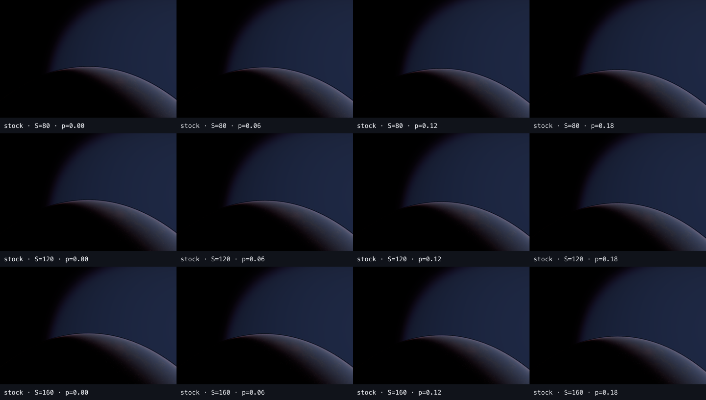

# Takram cloud-scale similarity — Stage A0 historical control

Clean-HEAD stock-only public-parameter control at coverage `0.3`, using `S=80/120/160` and opening progress `0.00/0.06/0.12/0.18`.

## Decision after correctness review

```text
UNSCALED_STOCK_WEATHER_CONTROL
SCALED_STOCK_WEATHER_CONTROL_NOT_RUN
STOCK_PASSING_SCALES=[]
STAGE_B_NOT_RUN
STAGE_C_NOT_RUN
MIP_DISTANCE_PATCH_NOT_AUTHORIZED
TASK_0P_LOCKED
ORIGINAL_TASK_0_TO_8_LOCKED
```

All 12 exact-frame captures have zero runtime contract drift, the explicit official R/G/B/A layer array is active, and the public scale values read back correctly. However, the stock adapter remained at `localWeatherRepeat=[100,100]` for every `S`. The matrix therefore mixes scaled morphology with unscaled local weather and is retained only as a historical A0 control.

The frames genuinely show no readable stock cloud mass, but this result does **not** classify public-parameter similarity, V3, or mip causality. The next required population is Stage A1 with `localWeatherRepeat=[100/S,100/S]`. Conditional Task M is not eligible until that healthy-control A/B is complete.



## Audit

- Harness/base commit: `589e0517bc6c07622cccc78645ccb91a2511e7ec`
- Browser: System Chrome `151.0.7922.109`
- GPU: `ANGLE Metal Renderer: Apple M4`
- Viewport: `1440×960`, DPR `1`
- Population: `12` source PNGs, each native exact frame `32`
- Screenshot SHA-256: `12/12` verified
- Contact-sheet SHA-256: verified
- Renderer/runtime drift: `0` for every population
- Requested mip patch: inactive; this historical manifest did not capture actual runtime shader/uniform readback
- Physical AerialPerspective parity claim: false; this remains an artistic orbital presentation domain

## Reproduce

```bash
MIRALITH_TAKRAM_CLOUD_SCALE_CAPTURE=1 pnpm exec playwright test -c playwright.takram-parity-system-chrome.config.ts lubirth-takram-cloud-scale.spec.ts --headed --grep "Stage A"
```

The detailed per-scale review is in `stage-a-visual-review.json`; complete runtime contracts, frame/jitter/STBN metadata, GPU identity, and every artifact hash are in `manifest.json`.
