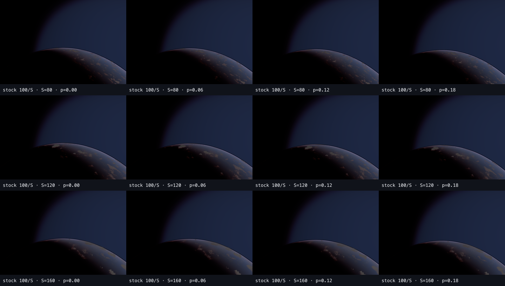

# Stage A1 scaled stock-weather health control

Stock coverage `0.3` with `localWeatherRepeat=[100/S,100/S]` on `S=80/120/160 × progress=0.00/0.06/0.12/0.18`.

## Decision

```text
SCALED_STOCK_WEATHER_CONTROL_FAIL_MIP_UNPROVEN
STOCK_PASSING_SCALES=[]
STAGE_B_NOT_RUN
STAGE_C_NOT_RUN
MIP_DISTANCE_PATCH_NOT_AUTHORIZED
TASK_0P_LOCKED
ORIGINAL_TASK_0_TO_8_LOCKED
```

Unlike Stage A0, all three scales now expose a stable stock weather footprint. This proves the old `[100,100]` weather mapping was a material confounder. None of the candidates reaches the orbital visual floor, however: the masses remain surface-like, lack clear limb elevation and soft opacity depth, and do not show legible local BSM modulation. `S=120` is the strongest but still fails those hard gates.

The result does not prove mip causality and does not classify V3. Conditional Task M is merely eligible for a separately authorized read-only same-frame diagnostic; the mip patch itself remains unauthorized.



## Audit

- Harness/base commit: `4d65e6cd84a23996914d272825984791dcbc5d11`
- Browser: System Chrome `151.0.7922.137`
- GPU: `ANGLE Metal Renderer: Apple M4`
- Population: `12` exact native frame `32` captures
- Screenshot/contact-sheet SHA-256: `13/13` verified
- Runtime contract drift: `0` for all populations
- Mip runtime: `native-hardcoded`, one `rayDistance * 1e-5`, no patch uniform
- Installed build SHA-256: `c2115702324e01760429187faf6203c2a118812c508429edbebe37e2e1d7c018`
- Installed cloud fragment SHA-256: `b29eeac1f5edc205cc578edf2a711aa2ffc8b50e1ea835e8b1abb50de68b77ff`
- Package patch SHA-256: `2bfa2dd78d4e9ac82c82eddba1273f9d2f95e932b7021584ce840f497b4f745c`

## Reproduce

```bash
MIRALITH_TAKRAM_CLOUD_SCALE_CAPTURE=1 pnpm exec playwright test -c playwright.takram-parity-system-chrome.config.ts lubirth-takram-cloud-scale.spec.ts --headed --grep "Stage A1 captures"
```

Task 0P and the original Task 0–8 remain locked.
