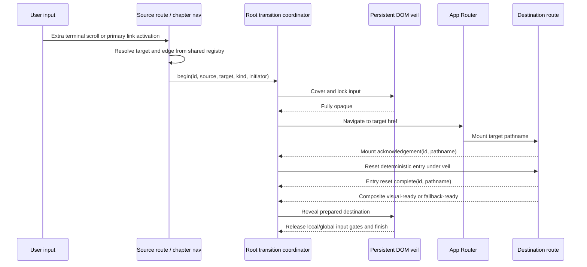

# feat: Add scroll-driven handoff across published chapters

## Overview

在每个已发布章节的既有滚动叙事结束后，允许用户通过一次明确的继续向下滚动进入**下一个已发布章节**。当前顺序必须遵循共享章节 registry：`01 LuBirth /` → `02 Radio Gaga /radio-gaga` → `03 CoScroll /coscroll`，不能让首页越界直接跳过 Radio Gaga。显式章节导航仍可跨章直达，但相邻滚动接力只走 registry 中的下一章。

转场由挂在根布局下、跨路由持久存在的 DOM 转场层负责：先遮住来源 Canvas 的卸载，再等待目标章节的真实 WebGL 首帧或降级画面就绪，最后揭开目标画面。首期交付同时覆盖 `/` → `/radio-gaga` 与 `/radio-gaga` → `/coscroll` 两条已发布相邻边；首页点击 `03 CoScroll` 等非相邻显式跳转复用同一协调器，但使用通用 veil，而不是伪装成相邻滚动叙事。

本方案维持当前“一条正式章节路由拥有一个 Canvas”的运行架构，不把 LuBirth、Radio Gaga 和 CoScroll 三套重场景同时塞入首页，也不使用 RenderTarget、Canvas 截图或第二个过渡 Canvas。它解决的是跨路由视觉连续性、顺序完整性、输入交接和加载遮蔽，而不是把三个项目改造成同一条 WebGL 时间线。

## Problem Frame

当前首页 `apps/site/app/page.tsx` 只挂载 `LuBirthRevisedRoute`；Radio Gaga 与 CoScroll 分别位于独立 `/radio-gaga`、`/coscroll` 路由，并各自拥有 Canvas。共享章节导航已经可以从首页点击进入后续章节，但直接路由切换会先销毁来源 Canvas，再创建目标 Canvas，容易产生黑闪、透明底、首帧跳变、错误滚动位置和 wheel 输入泄漏。

用户希望滚动也能完成章节跳转，同时保留一个经过设计的转场。需要把“到达当前章节末尾”“用户确认继续”“解析下一已发布章节”“遮住旧画面”“切换路由”“重置目标入口”“目标场景就绪”“开放目标输入”建模为明确生命周期，而不是在 GSAP `onUpdate` 中直接导航。

## Requirements Trace

- **R1 — Deliberate ordered scroll handoff:** 当前章节到达终点本身不自动跳转；终点帧需显示克制的下一章提示，只有随后的额外向下滚动、向上滑动或等价键盘操作越过阈值时才进入 registry 中的下一已发布章节。首页提示必须是 `02 Radio Gaga`，Radio Gaga 终点提示必须是 `03 CoScroll`。
- **R2 — Persistent visual cover:** 转场层必须位于根布局中，覆盖旧 Canvas 卸载和新 Canvas 创建的全过程，期间不能露出白底、透明底或任一未完成的目标首帧。
- **R3 — Readiness-gated reveal:** 每个目标章节必须提供目标特定的组合 ready 或明确 fallback-ready。Radio Gaga 至少等待入口模型、背景和一帧已提交画面；CoScroll 至少等待 Silk、当前锚字、首屏可见歌词字体/纹理和一帧已提交画面。完全覆盖后的目标 ready 硬等待上限为 3 秒；超时必须先切入可见 DOM/poster fallback 再揭幕，不能直接露出未完成 Canvas。
- **R4 — Input isolation:** covering、navigating、waiting-mount、waiting-ready、resetting-entry 和 revealing 阶段必须拦截 wheel、touch 和键盘翻页输入；揭幕完成后只接受一笔新的输入，转场前的惯性尾量不得驱动目标时间线。
- **R5 — Entry consistency:** 章节导航点击与滚动入口使用同一转场协调器；相邻滚动按顺序进入，显式链接可跨章直达。当前路由、自链接、修饰键点击、中键、新标签和无 JavaScript 场景保持标准链接语义。
- **R6 — Performance boundary:** 首页首屏不得请求 Radio Gaga 或 CoScroll 资产；仅在章节 rail 可交互、接近末尾或用户对某链接表达 hover/focus/touch intent 后预取相应路由及首帧关键资产。任何时刻不得并行运行两套完整 WebGL 场景。
- **R7 — Accessibility and recovery:** reduced-motion 使用短淡入淡出而非缩放/模糊；键盘和显式链接始终可用；浏览器返回后恢复首页滚动位置和可交互状态。
- **R8 — Visual preservation:** 不修改 LuBirth 已验收的地月节奏、Radio Gaga 五幕编排、CoScroll 原版 Silk shader、冷玉模型、歌词排布或滚动旋转行为；转场只负责进入、退出和输入交接。
- **R9 — Sequence and stale-signal integrity:** 相邻目标必须由 `miraLithChapters` 与 `publishedMiraLithChapterHrefs` 的顺序派生，不另建会漂移的章节序号表；所有 mount/ready/fallback 回报必须携带 transition id 与目标 pathname，迟到或来自旧路由的信号不得揭开当前 veil。
- **R10 — Deterministic target entry:** 路由切换发生在完全遮挡阶段；目标 pathname 确认后，在遮罩下完成目标入口滚动位置、ScrollTrigger/内部 progress 和焦点准备，再进入 reveal。不能依赖 App Router 默认 scroll 行为。

## Scope Boundaries

- 不把 Radio Gaga 或 CoScroll 重新嵌入首页后续幕，也不在本轮启用闲置的 `HomeVisualSceneSlot` 多场景切换路径。
- 不做跨项目几何/粒子的真实 morph，不增加后处理链、RenderTarget 或 Canvas 像素截图；连续感由目标特定的 DOM/SVG veil 建立。
- 不重写现有 LuBirth 开场时间线；终点越界门应独立于既有 `0..1` 进度映射，避免改变已验收的地月运动节奏。
- 首期只实现已发布的两条相邻正向边 `/` → `/radio-gaga`、`/radio-gaga` → `/coscroll`；不为 04–07 的未发布章节提前建立动画 DSL 或场景图。
- 不为浏览器后退制作完整的反向视觉编排；本轮保证返回可用、来源章节位置恢复，并允许使用通用短 veil 遮住恢复过程。
- 不删除 `/coscroll-spike` review 路由，也不改变正式 `/coscroll` 的内容时间线。

## Context & Research

### Relevant Code and Patterns

- `apps/site/components/LuBirthRevisedRoute.tsx` 已使用 GSAP ScrollTrigger 管理首页 pin、进度和章节 rail 解锁，是滚动越界门的唯一上游。
- `apps/site/components/MiraLithChapterNavigation.tsx` 与 `apps/site/content/miraLithChapters.ts` 已集中管理发布章节 href；新的点击转场不应再引入第二份章节映射。
- `apps/site/app/layout.tsx` 当前只渲染路由 children，适合加入跨 App Router 子路由持久存在的客户端 transition provider。
- `apps/site/components/RadioGagaRoute.tsx` 已使用独立 ScrollTrigger 将约 `11.6` 个视口高度的滚动距离映射到五幕进度，是第二条相邻越界门的上游；其 `RadioGagaSceneSlot` 已暴露 `onReady`，但 route 尚未把模型 ready、fallback、首帧提交和输入开放汇合为 destination-ready。
- Radio Gaga 当前先对两个 GLB 发 HEAD 请求，再由 `useGLTF` 发起真实加载，而且 radio/ESP32 位于同一 Suspense 路径；若不调整，入口会被晚幕 ESP32 阻塞且发生无收益的双请求。这需要在预热与 readiness 单元中一并收口，不能只在外层再加一层 prefetch。
- `apps/site/app/coscroll-spike/CoScrollSpikeExperience.tsx` 当前直接接管 wheel/touch，并将输入映射为 CoScroll 时间；它需要显式接受“目标已揭幕后才启用输入”的门控。
- `packages/coscroll-scene/src/CoScrollSceneContent.tsx` 已有 `onReady` / `onFallback` 契约，但当前 ready 主要来自锚字路径，不能直接等同于完整可揭幕首帧；实施时需把它扩展为 Silk、锚字、歌词字体/纹理和一次已提交帧的组合 ready，不能用组件 mount 或固定延时替代。
- `apps/site/visual/VisualCanvas.tsx`、Radio Gaga route 与 `packages/coscroll-scene/src/CoScrollStandaloneDemo.tsx` 证明当前三条正式路由分别拥有 Canvas，因此根转场层必须保持 DOM-only；`VisualCanvas` 的 `onCreated`/DOM mount 也不能替代目标组合 ready。
- `docs/superpowers/plans/2026-07-11-coscroll-miralith-migration.md` 记录了首页首屏零 CoScroll 请求、单 Canvas 和 scene-ready 的既有约束；本方案保留这些约束，但选择跨路由遮罩而非当前阶段的同 Canvas 第三幕。

### Institutional Learnings

- 项目已有的视觉验收反复表明：WebGL 首帧不能以 React mount 作为 ready；必须由纹理/模型或 fallback 明确信号驱动。
- 首页首屏对资源和上下文数量敏感，Radio Gaga/CoScroll 预热必须晚于 rail 解锁或明确 intent，且不能通过预挂载第二个 Canvas 实现。

### External References

- 无。本方案沿用仓库内现有 Next.js App Router、GSAP ScrollTrigger、R3F ready/fallback 和章节导航模式；外部研究不会改变核心决策。

## Key Technical Decisions

| Decision | Choice | Rationale |
|---|---|---|
| Transition owner | 根布局下的客户端 coordinator + DOM veil | 路由 children 卸载时仍能保持遮罩和输入锁 |
| Scroll target | 从共享 registry 派生下一已发布章节 | 保证 01 → 02 → 03，不让 handoff 顺序与导航数据漂移 |
| Scroll trigger | LuBirth 与 Radio Gaga 各自在终点后使用独立越界累计门 | 避免到达终点即误跳，也不重定时既有动画 |
| Route switch point | 遮罩完全覆盖后才导航 | Canvas 销毁/创建发生在不可见阶段 |
| Target entry reset | pathname mount 后、veil 下显式设置入口 progress/scroll，并等待 route refresh | 避免继承来源 scrollY 或依赖 Next 默认滚动行为 |
| Reveal condition | 带 transition id 的组合 visual-ready、fallback-ready 或受控强制 fallback | 以真实渲染状态为准，拒绝 stale ready，也避免永久等待 |
| Asset warmup | rail 解锁后预取下一章；具体链接 hover/focus/touch intent 再预热该目标 | 保持首屏零后续章节请求，同时兼顾非相邻显式跳转 |
| Visual language | 两个受控 edge variant + 一个通用 direct veil | 保持章节个性，但不建立任意动画 DSL |
| History recovery | session-scoped return snapshot + 临时 manual scroll restoration | 避免与 App Router 私有 history state 冲突，并保证返回不自动再次越界 |

建议的体验区间为：终点额外滚动约 `0.18–0.25` 个视口后确认进入；covering 约 450–650ms；目标 ready 后 revealing 约 350–500ms；完全覆盖后的典型等待应低于 1.5 秒，并在 3 秒时强制进入 fallback/recovery。delta 需按 `deltaMode`、触屏位移和时间窗口归一化，不能直接把不同设备的原始 wheel 数值共用为阈值。除硬超时外，这些是验收区间，不是必须照抄的实现常量，最终数值由桌面和触屏视觉检查确定。

## Alternative Approaches Considered

| Approach | Decision | Reason |
|---|---|---|
| 在根布局维持单一 R3F Canvas，同时装载三章 | 本轮不采用 | 需要处理透视/正交相机、多场景生命周期和显存峰值，范围远大于跨路由转场 |
| 截取 LuBirth Canvas 最后一帧作为转场贴图 | 拒绝 | `preserveDrawingBuffer` 成本高，跨浏览器捕获不稳定，也会引入额外像素复制 |
| 直接使用 View Transitions API | 仅可渐进增强 DOM | WebGL Canvas 快照和浏览器覆盖不足，不能成为正确性的基础 |
| 到达 ScrollTrigger 终点立即 `router.push` | 拒绝 | 容易误触，且无法遮住 Canvas 交接与目标资源加载 |

## Open Questions

### Resolved During Planning

- **是否必须同 Canvas 才能顺滑？** 不需要。只要根转场层跨路由持久、切换发生在完全遮挡阶段、揭幕受真实 ready 控制，视觉上可以稳定连续。
- **滚动跳转是否替代导航链接？** 不替代。显式链接仍是可发现、可访问和故障恢复入口；二者共用转场协调器。
- **首页滚动下一章是哪一章？** 必须是 `02 Radio Gaga`；滚动接力永远进入下一已发布章节。首页显式点击 `03 CoScroll` 仍然允许，但属于 direct transition。
- **是否提前挂载目标 Canvas？** 不提前挂载。只预取路由代码和资源缓存，避免来源页同时运行两套 WebGL。
- **是否更改 CoScroll 初始视觉？** 不更改 shader 或内容时间线；只在转场未完成时冻结输入，并从既有确定性初始进度显示。
- **reduced-motion 下从哪里进入？** 不能依赖可能被隐藏的 desktop chapter rail；每个终点帧必须提供稳定可见的下一章文本链接，允许直接激活并只播放短 opacity veil。

### Resolved During Implementation

- 终点越界阈值定为 `max(120px, 0.22 × viewport height)`，单笔输入最多累计 `0.14 × viewport height`，连续输入窗口为 `520ms`；触控位移使用 `1.15` 系数归一化，反向输入立即清空累计。
- 常规 cover/reveal CSS 时长分别为 `580ms` / `440ms`，transitionend 安全回调为 `680ms` / `560ms`；reduced-motion 统一为 `160ms` opacity transition（安全回调 `240ms`）。
- Radio Gaga opening warmup 与实际 `useGLTF` 共用缓存，只预载 `radio_gaga.glb`；ESP32 finale 在 route progress `0.58` 后独立挂载/预热。CoScroll warmup 复用现有 OBJ、HDR/normal 与字体缓存，只覆盖当前 source anchor。
- 完全覆盖后 `2600ms` 请求目标切换到真实可见 fallback，`3000ms` 为恢复来源的硬上限；reveal 结束后再隔离 `160ms` 惯性输入。恢复播报文案为“章节暂时无法载入，正在返回上一章节。”。

## High-Level Technical Design

> *This illustrates the intended approach and is directional guidance for review, not implementation specification. The implementing agent should treat it as context, not code to reproduce.*

Coordinator 生命周期为 `idle → covering → navigating → waiting-mount → resetting-entry → waiting-ready → revealing → idle`。终点滚动门自身另有 `idle → armed → committing`，不能与全局 transition state 混为一份状态。只有 veil 已完全覆盖、目标 pathname 与 transition id 匹配、入口 reset 完成且目标上报组合 visual-ready/fallback-ready 后，才允许 reveal。

同一生命周期内的重复滚动和点击必须幂等。目标 ready 早于 cover 或 reset 完成时可以缓存，但旧 id、旧 pathname 和已取消导航的迟到信号一律丢弃。`router.push` 没有可依赖的完成 Promise，因此 mount/pathname acknowledgement 是导航成功依据；完全覆盖后的 3 秒是单一总预算，而不是 mount timeout 与 ready timeout 各自再叠加 3 秒。

最小 contract boundary 如下，具体命名可在实现时调整，但职责不能互相渗透：

| Boundary | Input / output | Ownership rule |
|---|---|---|
| `beginTransition` | caller 只给 published `targetHref` 与 `initiator` | provider 从当前 pathname + registry 派生 source、kind、id；caller 不能指定视觉 variant |
| destination registration | `pathname`, `resetEntry`, `forceFallback` | route 注册入口控制能力；provider 不读取或直接修改场景内部 ref |
| destination report | `transitionId`, `pathname`, `mount/reset/visual/fallback` phase | provider 只接受当前 id/path；scene 不直接调用 router 或 veil animation |
| transition snapshot | readonly state、target metadata、`inputEnabled` | terminal gate、导航、目标 input controller 只消费快照，不各自复制状态机 |

## Implementation Units

- [x] **Unit 1: Establish the persistent transition contract**

**Goal:** 在根布局中建立跨路由存活的 transition coordinator、DOM veil 和可观察状态机。

**Requirements:** R2, R3, R4, R7, R9, R10

**Dependencies:** None

**Files:**
- Create: `apps/site/components/chapter-transition/ChapterTransitionProvider.tsx`
- Create: `apps/site/components/chapter-transition/ChapterTransitionLayer.tsx`
- Create: `apps/site/components/chapter-transition/chapterTransitionTypes.ts`
- Modify: `apps/site/app/layout.tsx`
- Modify: `apps/site/app/globals.css`
- Create/Test: `tests/e2e/chapter-transition.spec.ts`

**Approach:**
- Provider 同时拥有 transition id、source/target href、kind、initiator、状态、导航调用、mount/reset/ready 汇合、单一超时预算、恢复分支和全局输入锁；场景组件只上报带 id/pathname 的事件，不直接操纵遮罩。
- 对外只支持三个受控 kind：`arrival-to-signal`（01→02）、`signal-to-sutra`（02→03）和 `direct`（显式非相邻跳转、返回或未知 pair）。不要把第一版扩展成任意 route registry、场景图或动画 DSL。
- `beginTransition` 只接收共享 registry 可解析的 published target；相邻 kind 由 source/target pair 派生，调用方不得自行伪造章节序号或视觉 variant。
- Layer 使用 DOM/SVG/CSS/GSAP 完成 cover/reveal，在非 idle 阶段占据视口并拦截指针；不得创建 Canvas、RenderTarget、Canvas snapshot 或挂载目标场景。
- 导航动作只能在 veil 完全覆盖后发生；任何阶段的重复 begin 返回同一进行中 lifecycle。新的不同目标请求在当前 lifecycle 结束前不得覆盖旧目标。
- App Router 导航不能按 Promise 成败判断；coordinator 以目标 pathname 的 mount acknowledgement 作为成功信号。target mount 后由 route 在 veil 下执行确定性入口 reset，再等待组合 readiness。
- 从 veil 完全覆盖开始计时 3 秒总预算。若目标未 mount，则撤销/恢复来源并给出可操作的导航错误；若目标已 mount 但未 ready，则先要求目标切入真实可见的 DOM/poster fallback，收到 fallback-ready 后再 reveal。禁止在超时点直接揭开半初始化 Canvas。
- ready/fallback/reset 信号必须同时匹配 transition id 与 target pathname；完成、取消和 provider 卸载时清理 timeout、listener、root attributes 和缓存信号。
- 全局锁同时处理 wheel、touchmove、PageDown/ArrowDown/Space 等翻页输入与 pointer hit testing，并避免通过切换 `overflow` 引起滚动条宽度跳变；目标 route 还需有自己的 `inputEnabled` 门，不能只依赖冒泡阶段的全局拦截。
- 过渡期间在页面根节点表达 `aria-busy`，用 `aria-live="polite"` 只播报一次目标章节；veil 本身 `aria-hidden` 且不制造 tab stop。仅由用户发起的转场在 reveal 后移动焦点，直接访问不抢焦点。
- 暴露稳定的 `data-chapter-transition-state/kind/source/target/id` 与 `performance.mark`，供验收定位时序；生产 UI 不显示诊断文本。

**Execution note:** 先用失败的集成测试锁定状态顺序、幂等和输入锁，再接入视觉动画。

**Patterns to follow:**
- `apps/site/visual/VisualCanvas.tsx` 的错误边界与 fallback 思路。
- `apps/site/components/LuBirthRevisedRoute.tsx` 的 GSAP cleanup 和 reduced-motion 分支。

**Test scenarios:**
- **Happy path:** begin 后 veil 先 cover，路由随后变化，目标 ready 后 veil reveal，最终恢复 idle。
- **Edge case:** 同一帧内连续触发多次 begin，只发生一次导航和一次揭幕。
- **Edge case:** 旧 transition 的迟到 ready、错误 pathname 或错误 id 不会揭开当前 veil。
- **Edge case:** route ready 早于 cover/reset 完成时只缓存信号，不提前 reveal。
- **Error path:** 路由导航失败或 target 未 mount 时 veil 反向揭开，来源页仍可操作且输入锁解除。
- **Error path:** 目标长期未 ready 时先呈现受控 fallback，再 reveal；不永久保持全黑和 `aria-busy`，也不露出半初始化 Canvas。
- **Error path:** pathname 未变更或变为非目标 route 时，coordinator 识别导航未确认并恢复旧页面。
- **Accessibility:** reduced-motion 下不出现缩放或模糊，只保留短时 opacity cover/reveal。
- **Integrity:** provider 完成后清除 root data attributes、timeout 和全部输入监听器；下一次 transition 获得新 id。

**Verification:**
- 根布局切换路由时 transition provider 不重新挂载；状态与 veil 连续存在。
- 转场过程没有第二个 Canvas，失败后不会遗留 wheel/touch 拦截器。

- [x] **Unit 2: Add ordered terminal gates and route all chapter links through the coordinator**

**Goal:** 让首页末帧进入 Radio Gaga、Radio Gaga 末帧进入 CoScroll，并让所有当前窗口内的章节链接共享同一 coordinator。

**Requirements:** R1, R4, R5, R7, R9, R10

**Dependencies:** Unit 1

**Files:**
- Modify: `apps/site/content/miraLithChapters.ts`
- Modify: `apps/site/components/LuBirthRevisedRoute.tsx`
- Modify: `apps/site/components/RadioGagaRoute.tsx`
- Modify: `apps/site/components/MiraLithChapterNavigation.tsx`
- Modify/Test: `tests/e2e/chapter-navigation.spec.ts`
- Modify/Test: `tests/e2e/radio-gaga.spec.ts`
- Modify/Test: `tests/e2e/chapter-transition.spec.ts`

**Approach:**
- 在共享 registry 增加/复用 `getNextPublishedChapter(href)` 与 pair metadata；滚动越界只能取相邻 next，不能接收任意 target 参数。显式链接仍可跳到任一 published chapter。
- 保留 LuBirth 与 Radio Gaga 既有 ScrollTrigger/进度映射；只有各自 terminal frame 稳定后才武装独立额外滚动累计器，不能把转场阈值塞进原场景 `0..1` 时间线。
- 向下输入累计到归一化阈值后只调用一次 coordinator；反向滚动在阈值前取消或衰减累计。wheel `deltaMode`、触屏位移与键盘输入先归一化，避免触控惯性和高分辨率滚轮误跳。
- 首页 terminal prompt 固定指向 `02 Radio Gaga`，Radio Gaga terminal prompt 固定指向 `03 CoScroll`；两者都提供标准 href。移动 compact rail、键盘与 reduced-motion 不能依赖只显示当前章节的 rail，必须始终有可发现的 next-chapter CTA。
- next prompt 是共享 `MiraLithChapterNavigation` 的 terminal state/扩展行，而不是另做一个浮动 panel：常态继续高亮当前章并弱显其他已发布章；terminal 稳定后，在左下 rail 上方或 compact bar 内展开 `SCROLL TO CONTINUE · {next index/title}`。反向离开 terminal、开始 covering 或 route 卸载时立即收起，避免与正文和 veil marker 同时堆叠。
- wheel、touch 和 PageDown/ArrowDown/Space 共享“终点后的新输入”语义；普通页面滚动未到终点时不拦截。reveal 完成后先丢弃转场前的惯性尾量，必须等一笔新的输入才能推进目标章节。
- `MiraLithChapterNavigation` 对同源、当前窗口、未修饰的主按钮点击调用 coordinator；self-link 不开始 transition。`meta/ctrl/shift/alt`、中键、`target`、`download`、外链和无 JavaScript 场景保持原生链接语义。
- 只有两条**正向相邻**显式点击与终点滚动使用对应 edge kind；反向点击、首页直接点击 `03 CoScroll` 等其他显式跳转都使用 `direct`，不能冒充正向叙事 edge 或跳过 registry 的 scroll handoff 顺序。
- 离开前把 `{pathname, scrollY, routeProgress, terminalState, timestamp}` 写入 session-scoped return snapshot，不修改 Next 私有 history state。转场/恢复期间临时把 `history.scrollRestoration` 设为 `manual`，完成后恢复原值。
- 返回 LuBirth 或 Radio Gaga 后，等待各自 runtime 与 ScrollTrigger refresh，先在 veil 下恢复 scroll/progress，再清空 delta 与 armed 状态；浏览器 toolbar back/popstate 只使用通用短 veil 做 best-effort 遮蔽，不在本轮阻塞或重写原生历史导航。

**Execution note:** 先为首页/Radio Gaga 现有终点和导航 href 添加 characterization coverage，确认不改变两条 route 的既有滚动节奏。

**Patterns to follow:**
- `apps/site/components/LuBirthRevisedRoute.tsx` 现有 `syncHomeScrollAccess` 和 effect cleanup。
- `apps/site/components/MiraLithChapterNavigation.tsx` 的集中 href registry 与 inert/interactive 语义。

**Test scenarios:**
- **Happy path:** 到达 LuBirth 终点后继续向下滚动越过阈值，且只导航一次到 `/radio-gaga`；到达 Radio Gaga 终点后以同样语义只进入一次 `/coscroll`。
- **Sequence:** 连续滚动接力的 pathname 顺序严格是 `/` → `/radio-gaga` → `/coscroll`，不能从 `/` 越过 02。
- **Edge case:** 仅到达终点但没有额外输入，页面保持在首页末帧。
- **Edge case:** terminal prompt 只在 gate armed 时出现；反向离开 terminal 后隐藏，cover 开始后不与 transition marker 重叠。
- **Edge case:** 阈值前向下后立即向上滚动，不触发导航且累计状态复位。
- **Integration:** 点击首页 Radio Gaga rail 与滚动越界产生同一 edge lifecycle；首页点击 CoScroll 走 `direct` lifecycle。
- **Link semantics:** self-link 不转场；修饰键、中键、新标签、download 与外链不被拦截。
- **Accessibility:** PageDown/ArrowDown 可触发；标准链接仍可通过新标签或无脚本方式打开目标 route。
- **Accessibility:** reduced-motion 和移动 compact rail 下仍能看到并激活正确的 next-chapter 文本链接。
- **Recovery:** 从 Radio Gaga 返回首页、从 CoScroll 返回 Radio Gaga 都恢复来源末帧，但不会因残留 delta 自动再次进入。

**Verification:**
- 首页标题/project intro/地月进度和 Radio Gaga 五幕关键帧在加入 gate 前后保持同一位置。
- 非 terminal 状态下没有全局 `preventDefault`，普通滚动和其他可交互内容不受影响。

- [x] **Unit 3: Prefetch only the next or explicitly intended chapter**

**Goal:** 在用户已经进入章节选择阶段后预热下一章，或按显式链接 intent 预热被选择章节，同时保持首页首屏零后续章节请求。

**Requirements:** R3, R6, R8, R9

**Dependencies:** Unit 1; can proceed in parallel with Unit 2 after the coordinator contract is fixed

**Files:**
- Create: `apps/site/components/chapter-transition/preloadChapterTarget.ts`
- Create: `packages/radio-gaga-scene/src/preloadRadioGagaAssets.ts`
- Modify: `packages/radio-gaga-scene/src/RadioGagaModel.tsx`
- Modify: `packages/radio-gaga-scene/src/RadioGagaModelComposite.tsx`
- Modify: `packages/radio-gaga-scene/src/index.ts`
- Create: `packages/coscroll-scene/src/preloadCoScrollAssets.ts`
- Modify: `packages/coscroll-scene/src/CoScrollJadeAnchor.tsx`
- Modify: `packages/coscroll-scene/src/CoScrollTextBillboard.tsx`
- Modify: `packages/coscroll-scene/src/index.ts`
- Modify: `apps/site/components/LuBirthRevisedRoute.tsx`
- Modify: `apps/site/components/RadioGagaRoute.tsx`
- Modify: `apps/site/components/MiraLithChapterNavigation.tsx`
- Modify/Test: `tests/e2e/radio-gaga.spec.ts`
- Modify/Test: `tests/e2e/coscroll.spec.ts`
- Modify/Test: `tests/e2e/chapter-transition.spec.ts`

**Approach:**
- site-level dispatcher 从 shared registry 解析 target，再调用目标 package 的幂等 preloader；route code、模型/字体 loader 与 transition prefetch 必须命中同一 URL 和缓存，不维护第二套解析逻辑。
- 首页 rail 首次可交互或接近 terminal 时，只预取 `/radio-gaga` route 与入口首帧关键资产；Radio Gaga 接近 terminal 时才预取 `/coscroll` route 与首帧关键资产。
- 用户对任意非相邻章节链接触发 hover、focus 或 touch intent 时，可预取该显式 target；仅 hover rail 容器或渲染所有链接不能批量预热所有章节。
- Radio Gaga preloader 分为 opening 与 late/finale 两段：opening 只覆盖首幕可见的 radio GLB/必要纹理，ESP32 在目标已 reveal 后的 idle 时机或进入其前一幕时预热。当前 `RadioGagaModel` 同时调用两个 `useGLTF`，实施时需拆开 opening/finale 的加载与 Suspense/ready 边界，确保 radio 首帧能独立提交；不能只记录限制后继续让入口等待晚幕模型。
- 删除 `RadioGagaRoute` 的 HEAD-then-GET 探测链；HEAD 成功不代表 GLTF 可解析，也不会温暖 `useGLTF` cache。实际 loader/preloader promise、ErrorBoundary 与可见 fallback 是唯一 asset 成功/失败来源，避免每次直达产生双请求。
- CoScroll warmup 只覆盖正式 `/coscroll` 首帧的 Silk、source excerpt 当前锚字、环境与可见歌词字体/纹理，不加载完整历史锚字集合。
- 首页首屏、loading ritual 和 rail 未开放阶段保持零 Radio Gaga/CoScroll 请求；Radio Gaga 早期幕保持零 CoScroll 请求。不得用隐藏 Canvas、不可见场景或第二 WebGL context 完成预热。
- 预取失败不阻断导航，由 Unit 4 的 ready/fallback/timeout 路径接管。

**Patterns to follow:**
- `packages/coscroll-scene/src/CoScrollJadeAnchor.tsx` 已有几何缓存与预加载入口。
- `packages/coscroll-scene/src/CoScrollTextBillboard.tsx` 已有字体加载缓存。
- `packages/coscroll-scene/src/assetManifest.ts` 的 source excerpt 边界。

**Test scenarios:**
- **Happy path:** 首页 rail 未开放前没有 Radio Gaga/CoScroll 模型或纹理请求；开放后默认只请求 Radio Gaga 入口资产。
- **Happy path:** Radio Gaga 尚未接近末幕时没有 CoScroll 请求；terminal prefetch threshold 后只请求 CoScroll 正式首帧所需资产。
- **Intent:** 首页 rail 对 `03 CoScroll` 的明确 hover/focus/touch intent 可以预取 CoScroll，但不能改变滚动 handoff 的下一章。
- **Edge case:** rail 状态反复进入/离开或同一链接多次 intent 不会重复发起同一资源请求。
- **Error path:** 拦截任一目标关键资产请求后，来源页仍可操作，进入 Radio Gaga/CoScroll 后走可见 fallback 或 timeout recovery 而非卡死。
- **Integration:** 已预热路径进入 Radio Gaga/CoScroll 时 ready 先于最大等待窗口，揭幕后实际入口画面可见。

**Verification:**
- 首页首屏资源预算保持不变，任何阶段都不出现第二个 WebGL context。
- 预热与实际 Radio Gaga/CoScroll 加载命中同一缓存，不维护两份解析逻辑。

- [x] **Unit 4: Give Radio Gaga and CoScroll explicit destination readiness and input ownership**

**Goal:** 让两个目标 route 都能完成“mount → reset entry → composite ready/fallback-ready → reveal → input enable”的明确交接。

**Requirements:** R3, R4, R7, R8, R9, R10

**Dependencies:** Unit 1; can proceed in parallel with Units 2 and 3

**Files:**
- Modify: `apps/site/components/RadioGagaRoute.tsx`
- Modify: `apps/site/visual/scenes/RadioGagaSceneSlot.tsx`
- Modify: `packages/radio-gaga-scene/src/RadioGagaModel.tsx`
- Modify: `packages/radio-gaga-scene/src/RadioGagaModelComposite.tsx`
- Modify: `packages/radio-gaga-scene/src/RadioGagaSceneContent.tsx`
- Modify: `packages/radio-gaga-scene/src/types.ts`
- Modify: `apps/site/app/coscroll-spike/CoScrollSpikeExperience.tsx`
- Modify: `apps/site/visual/scenes/CoScrollSceneSlot.tsx`
- Modify: `packages/coscroll-scene/src/CoScrollStandaloneDemo.tsx`
- Modify: `packages/coscroll-scene/src/CoScrollSceneContent.tsx`
- Modify: `packages/coscroll-scene/src/CoScrollTextBillboard.tsx`
- Modify: `packages/coscroll-scene/src/types.ts`
- Modify/Test: `tests/e2e/radio-gaga.spec.ts`
- Modify/Test: `tests/e2e/coscroll.spec.ts`
- Modify/Test: `tests/e2e/chapter-transition.spec.ts`

**Approach:**
- 为 route-facing contract 区分 `onMount`、`onEntryReset`、`onVisualReady` 和 `onFallbackReady`；每个回报都带当前 transition id/pathname。React mount 或 `Canvas.onCreated` 只能完成 mount gate，不能完成 visual-ready gate。
- **Radio Gaga reset:** pathname mount 后在 veil 下把 document scroll、route progress 和 copy/timeline state 设为既有 00 入口，等待 ScrollTrigger refresh 与一次同步完成后回报 entry reset。不得继承 LuBirth 的末尾 scrollY。
- **Radio Gaga ready:** 组合 gate 至少包括入口 radio model、scene background、首屏 DOM copy 所需字体/布局和一次实际 `useFrame` 后提交的画面；`RadioGagaSceneSlot` 的 quality fallback、Canvas/context failure 与 model failure 必须映射为真正可见的 poster/DOM fallback-ready。不要等待仅在晚幕出现的 ESP32 输出资产，除非现有 loader 无法拆分且它已属于入口模型初始化。
- **CoScroll reset:** 使用正式 route 当前已有的确定性 initial source time/progress，不统一强制为 `0`；在 veil 下清空来源惯性、设置该 entry progress 并完成尺寸/时间线同步后回报 entry reset。
- **CoScroll ready:** 将当前锚字导向的 `onReady` 提升为组合 gate：Silk 已进入渲染、当前锚字及材质可用、首屏可见歌词字体/纹理已成功或明确降级，并至少提交一个目标帧。forced fallback、asset fallback 和 context failure 映射为可见 destination fallback-ready。
- route mount 只表示“目标存在”，不能触发 reveal；coordinator 可缓存早到的 visual signal，但必须等 cover、pathname、entry reset 三个门全部完成。
- Radio Gaga 的 ScrollTrigger listener 与 `CoScrollSpikeExperience` 的 wheel/touch/keyboard seek 在 transition 未 reveal 时不注册或不响应；reveal 完成并经过惯性隔离后才取得输入所有权。
- reveal 完成后，只为由当前用户操作发起的 transition 把焦点交给目标 main/可访问标题；直接访问 `/radio-gaga`、`/coscroll` 时维持正常浏览器焦点，不强制抢焦点。
- 直接打开目标 route 时没有进入中的 transition，应立即走原有启动语义，不等待 provider；`/coscroll-spike` review route 也不被新 contract 阻塞。
- timeout 必须先调用 route 的 `forceFallback(transitionId)`，等实际 fallback commit 后回报 fallback-ready；没有 fallback commit 时宁可恢复来源/显示 route error，也不能把 timeout 当成伪 ready。

**Patterns to follow:**
- `packages/coscroll-scene/src/types.ts` 与 `CoScrollSceneContent` 的 `onReady` / `onFallback` 现有接口。
- `CoScrollSpikeExperience` 现有 wheel/touch cleanup 和 GSAP tween cleanup。

**Test scenarios:**
- **Happy path:** Radio Gaga/CoScroll route 已 mount 但 entry reset 或模型未 ready 时 veil 保持覆盖；全部 gate 完成后才揭幕并开放输入。
- **Edge case:** ready 早于 cover 动画完成时不会提前露出半初始化画面。
- **Edge case:** Radio Gaga mount 后继承了非零 document scroll 时，先在 veil 下归零并 refresh；reveal 截图仍是 00 入口。
- **Edge case:** 锚字先 ready、字体/歌词纹理仍 pending 时 veil 不提前揭开；字体明确 fallback 后可以完成组合 ready。
- **Edge case:** reveal 前产生的滚轮惯性既不改变 `data-radio-gaga-progress` 也不改变 `data-coscroll-progress`；reveal 后第一笔新输入正常推进。
- **Error path:** forced fallback 或模型失败会揭开 fallback，并允许章节导航继续工作。
- **Regression:** 直接访问 `/radio-gaga`、`/coscroll`、`/coscroll-spike` 和 reduced-motion 时保持各自原有启动语义。
- **Accessibility:** 由上一章转入并完成 reveal 后，焦点落到目标可访问主区域；直接访问不发生意外抢焦点。

**Verification:**
- 转场不会改变 Radio Gaga 五幕关键帧，也不会改变 CoScroll 原版黑蓝 Silk、冷玉内外层和歌词高亮表现。
- 所有进入路径最终都能释放输入锁，且卸载后没有残留 GSAP tween 或事件监听器。

- [x] **Unit 5: Implement the two adjacent edge motifs and the generic direct veil**

**Goal:** 用一套克制的 MiraLith transition layer 连接章节，但让 01→02 与 02→03 各自保留可辨识的叙事动作。

**Requirements:** R2, R7, R8

**Dependencies:** Unit 1; pair metadata from Unit 2

**Files:**
- Modify: `apps/site/components/chapter-transition/ChapterTransitionLayer.tsx`
- Create: `apps/site/components/chapter-transition/ChapterTransitionVisual.tsx`
- Modify: `apps/site/app/globals.css`
- Modify/Test: `tests/e2e/chapter-transition.spec.ts`

**Approach:**
- `arrival-to-signal`（LuBirth→Radio Gaga）：来源星点与空间感被径向暗角收束，稀疏点列汇入一条横向调谐线；完全覆盖时落到 Radio Gaga 的 `#050404` 基底，再以共享 registry 的 `02 / CARE / Radio Gaga` 作为克制的接收标识。不要重新做一个信息 panel，也不要在 veil 中加载 radio GLB。
- `signal-to-sutra`（Radio Gaga→CoScroll）：横向调谐线被拉长、分段并转译为纵向丝线/经文节拍，完全覆盖时落到 CoScroll 的 `#010205` 基底；标识为 `03 / DEVOTION / CoScroll`。动作表达“信号成为文字”，不伪造 GLB 到玉字的真实几何 morph。
- `direct`：使用中性的 MiraLith grain/line veil 与目标章序/名称；用于非相邻显式跳转、返回恢复和未知 pair，避免每新增链接都假装成专属叙事转场。
- 三种 variant 都由同一 DOM/SVG 结构、CSS variables 与 registry metadata 驱动；允许受控分支，不允许调用方传任意颜色、自由 keyframe 或富文本。
- veil 在路由 swap 前必须达到不透明；动画只使用 transform/opacity 与轻量 SVG stroke，避免大面积实时 blur、filter 或多层 mix-blend 给移动 GPU 增压。
- reduced-motion 只保留背景与标识的短 opacity cover/reveal，不播放点列汇聚、线条旋转或大范围位移。
- 所有文字遵循安全区，在手机竖屏和短横屏不与章节导航、浏览器安全区或目标首屏标题相撞；transition marker 仅在 cover/等待期出现，reveal 开始即退场，不成为新的常驻导航。

**Test scenarios:**
- **Visual pair:** `/`→`/radio-gaga` 暴露 `arrival-to-signal`，`/radio-gaga`→`/coscroll` 暴露 `signal-to-sutra`，非相邻链接暴露 `direct`。
- **Coverage:** route pathname 改变的采样帧中 veil alpha 为 1，不出现白底、透明底、旧 Canvas 残影或目标半帧。
- **Responsive:** desktop、手机竖屏和短横屏下 marker/线条均在安全区内且没有横向溢出。
- **Reduced motion:** 关闭所有空间/线条动作，只保留短 opacity 生命周期。
- **Performance:** veil 不创建 Canvas，动画期间没有持续 layout thrash 或高代价全屏 filter。

**Verification:**
- 静态截图确认层级与排版；真实滚轮/触屏动态检查确认两种 motif 的节奏连续、等待期不显得死机。
- 视觉参数最终记录到本计划，不以测试选择器绑定内部 SVG 节点数量。

- [x] **Unit 6: Close visual, cross-device, sequence, and navigation acceptance**

**Goal:** 用真实的 01→02→03 路由切换验证无闪屏、可恢复、低运动、资源边界和移动端行为，并记录最终验收边界。

**Requirements:** R1–R10

**Dependencies:** Units 2, 3, 4, and 5

**Files:**
- Modify/Test: `tests/e2e/chapter-transition.spec.ts`
- Modify/Test: `tests/e2e/chapter-navigation.spec.ts`
- Modify/Test: `tests/e2e/radio-gaga.spec.ts`
- Modify/Test: `tests/e2e/coscroll.spec.ts`
- Modify: `README.md`
- Update: `docs/plans/2026-07-14-001-feat-scroll-chapter-transition-plan.md`

**Approach:**
- 分别检查桌面滚轮、手机竖屏触控、短横屏、键盘和 reduced-motion。
- 对两条相邻边分别采样 cover 前、完全覆盖、目标等待、reveal 中和 reveal 后画面，确认没有白闪、透明露底、旧 Canvas 残影或双 Canvas 峰值。
- 记录 pathname 序列、transition id、entry progress、Canvas 数量和关键资源请求；验收必须证明首页滚动不会跳过 Radio Gaga。
- 验证前进、非相邻显式跳转、toolbar back/forward、刷新直达 `/radio-gaga`/`/coscroll`、资源失败和 ready timeout。
- 最终在 README 说明相邻滚动接力、显式导航和 reduced-motion 行为；本计划记录实际阈值、时长、截图/视频位置和有意偏差。

**Execution note:** 视觉检查是本单元的关键必要环节；先用自动化锁定状态与资源边界，再进行人工桌面/移动端动态检查。

**Patterns to follow:**
- `tests/e2e/chapter-navigation.spec.ts` 的桌面/移动断点分工。
- `tests/e2e/coscroll.spec.ts` 的 Canvas 非空、资源请求和输入运动测量。

**Test scenarios:**
- **Sequence:** 终点滚动的真实 pathname 顺序为 `/` → `/radio-gaga` → `/coscroll`，每条边只产生一次 navigation。
- **Visual:** 两条边全过程不出现白色闪帧；veil 消失时 Radio Gaga 入口或实际 Silk 已可见，且不是半初始化画面。
- **Performance:** 首页首屏零 Radio Gaga/CoScroll 请求；默认只预热下一章；转场期间 Canvas 数量不超过 1；目标 ready 后来源 route frame work 已停止。
- **Input:** reveal 前目标 progress 不变化；reveal 后旧惯性不生效，第一笔新输入正常推进。
- **Mobile:** 两条边的触控越界都只触发一次，浏览器回弹和惯性不会造成重复导航。
- **Reduced motion:** 使用短 opacity 转场，无大幅位移、缩放或模糊，并保留显式链接。
- **History:** Radio Gaga 返回首页、CoScroll 返回 Radio Gaga 都恢复来源位置；再次进入需要新的明确输入。
- **Direct navigation:** 首页点击 CoScroll 使用 `direct`，直接访问 `/radio-gaga`、`/coscroll`、`/coscroll-spike` 不等待不存在的 transition。
- **Failure:** 导航失败、资源失败和 ready timeout 均不会留下全屏不可操作遮罩。

**Verification:**
- 所有目标视口和输入模式满足 requirements trace；人工动态检查没有发现遮罩时序或焦点跳变。
- Radio Gaga、CoScroll、Site typecheck、lint、production build 和相关浏览器测试通过，知识图谱在跨模块/public API 变更后执行 `/graphify --update`。

## Implementation Results

- 根布局现持久挂载单一 DOM transition provider/layer，完整实现 `covering → navigating → waiting-mount → resetting-entry → waiting-ready → revealing`，并以 transition id + pathname + destination attempt generation 拒绝迟到信号。正式章节 route 在 veil 下完成入口重置、组合 visual/fallback readiness 与输入交接。
- 终点接力严格由共享 registry 派生为 `/` → `/radio-gaga` → `/coscroll`；desktop rail、mobile compact bar、键盘与 reduced-motion 都保留标准 next-chapter href。非相邻显式链接复用 coordinator 并使用 `direct` veil。
- Radio Gaga 首幕与 finale 的 Suspense/加载边界已拆分；CoScroll readiness 按 entry attempt + current anchor/model generation 组合 Silk、当前锚字/材质、字体和已提交帧，锚字切换会先撤销旧 visual-ready。两者的资源、Canvas 或 context 故障都会先提交可见 fallback，再允许 reveal。
- 自动化验收：`chapter-transition.spec.ts` 在 desktop、mobile portrait、mobile landscape 共 `30 passed / 57 profile-skipped`；chapter navigation、Radio Gaga timeline/route 与完整 CoScroll desktop 回归合计 `72 passed / 3 profile-skipped`；LuBirth reduced-motion 回归通过。`pnpm typecheck`、`pnpm lint`、`pnpm build` 均通过。
- CoScroll 旧测试契约已同步到当前正式架构：homepage 保持 route-isolated、正式场景使用 source OBJ/current-anchor warmup，并以黑蓝丝线与“心”字构成不依赖缺失图片资产的可见 DOM fallback。
- 2026-07-15 correctness follow-up 已关闭硬截止与恢复路径缺口：3 秒 deadline 现在检查 mount/reset/readiness 完整门控；失败来源作为新的 `direct` recovery destination 执行 snapshot reset 与 visual/fallback readiness；destination attempt token 会丢弃失败目标迟到的 reset/fallback promise；所有 history back/forward 均强制使用 `direct`。
- 2026-07-15 第二轮 correctness follow-up 为每次 destination reset 增加 `AbortSignal`，recovery、forced fallback、transition finish 都会取消旧 attempt；各 route 在每个 await 后及全局 `ScrollTrigger.refresh()` / `scrollTo()` 前验证 signal。失败恢复按 coordinator push 或 history traversal 的反方向调用原生 `history.go()`，不再用 `replace` 污染或覆盖历史项。
- 2026-07-15 第三轮 correctness follow-up 移除按章节序号猜测 history 遍历方向：Navigation API index 与唯一相邻 ledger 都无法证明方向时，恢复使用受完整 reset/readiness 门控的安全 `router.push(source)`，保留失败 history entry。CoScroll 仅在 Silk、当前锚字和字体全部 ready 后，由下一次 R3F post-render callback 上报整体 ready；Canvas/context fallback 携带当前完整 visual generation，并在 DOM fallback commit 后才上报 fallback-ready。
- 2026-07-15 第四轮 correctness follow-up 区分 coordinator 自己的一次性 recovery traversal 与活动转场期间的新用户 Back/Forward：用户遍历会取消旧 attempt、timer 与 reveal callback，记录 `history-interrupted`，并针对当前 pathname 启动新的受 reset/readiness 门控 `direct` history attempt；即使相邻历史项 pathname 相同也不会跳过门控。CoScroll 的 frame gate 改由 R3F `addAfterEffect` 在实际 `gl.render` 后确认，完整 visual generation 则在 layout effect 中同步传播，关闭 generation commit 到 passive effect 之间的 context-loss 竞态。
- 2026-07-16 第五轮 correctness follow-up 为 runtime 启动参数增加显式 source-snapshot 策略：活动 history attempt 被替换时，如果 replacement source 正是旧 attempt 尚未完成 entry reset 的 target，则保留此前 settled return snapshot，不再用默认或半初始化的 progress、terminal state 和 scrollY 覆盖它；已完成 reset 的来源仍可正常刷新快照。
- 2026-07-16 第六轮 correctness follow-up 将章节链接的 `preventDefault()` 延后到 coordinator 确认返回 transition id 之后；当来源 pathname 不是 published chapter、coordinator 拒绝接管时，标准 href 会继续完成浏览器导航，不再出现静默失效。
- 2026-07-16 第七轮 correctness follow-up 在章节链接 handler 中把全局 `inputEnabled` 作为普通 published href 的前置门：活动转场期间，即使焦点仍停在来源当前章节 self-link 上，键盘 Enter 也会被取消，不再触发原生 self navigation 打断接力。
- 2026-07-16 第八轮 correctness follow-up 将 Navigation API entry index 的完整非零整数差值保存在 history runtime；history-menu 或 `history.go(±N)` 到失败目标时，恢复调用其精确反向距离。无法通过 Navigation API 证明距离时，ledger 仍只承担相邻 `±1` 推断，未知方向继续走安全 push。
- 2026-07-16 第九轮 correctness follow-up 将 Navigation API `currentEntry.index === -1` 的“不可用 entry”哨兵归一为未知方向，禁止参与精确 delta 计算；恢复继续使用唯一相邻 ledger 或安全 `router.push(source)`，不会错误执行任意距离的 `history.go()`。
- 2026-07-17 第十轮 correctness follow-up 为每个 runtime 记录来源 `NavigationHistoryEntry.key`，并只在 recovery `popstate` 的真实 Navigation API delta 与该 key 同时匹配时消费 coordinator 的 `history.go()`；任何同 pathname 但不同 entry 的 Back/Forward 都会取消旧 recovery 并以真实 traversal 新建 gated `direct` attempt。
- 新增 reset rejection、await 前 reset hang + idle 后迟到释放、双向及未知方向 history traversal failure、Navigation API 缺失与 `index = -1` 哨兵的安全恢复、pending recovery 期间同 pathname 且不同 entry key 的用户 traversal 中断、失败的多步 `history.go(-2)` / `history.go(2)` 恢复、covering/waiting-ready/revealing 阶段的活动 Back/Forward 替换、covering 与 resetting-entry 中断后的 settled snapshot 保真及再次 Back 恢复、非正式 LuBirth study route 到 Radio Gaga/CoScroll 的普通左键原生导航与 default-prevention 契约、活动转场 input lock 下的已聚焦当前章节链接 Enter 防绕过、非初始 CoScroll 锚字 history restore 与 `anchor → post-render frame → visual-ready` 时序、waiting-ready 阶段 context-lost 即时 fallback、重复 begin、history forward、PageDown/ArrowDown、反向累计清零、原生链接语义及 CoScroll delay/timeout/asset-failure 覆盖。视觉采样扩展到 source terminal、covered、revealing、revealed、direct、readiness hold 与两种移动视口，均位于 `test-results/chapter-transition-*.png`。
- 无产品行为偏差。仓库当前安装的 Graphify CLI 使用 `graphify update .`（而非文档中的旧式 `/graphify --update`）；已用该等价命令重建图谱，并确认 `ChapterTransitionProvider`、registry helpers 与 terminal gate 进入同一新社区。

## System-Wide Impact

- **Interaction graph:** LuBirth/Radio Gaga terminal gate 或章节链接 → shared registry target resolution → root coordinator → persistent veil → App Router → target entry reset → Radio Gaga/CoScroll ready/fallback → input handoff。
- **Error propagation:** route error、asset failure 和 ready timeout 均汇入 coordinator 的恢复分支；视觉组件不得自行保留全局锁。
- **State lifecycle risks:** provider 跨路由存活，因此每次 transition 必须有唯一 id、target pathname、幂等 begin、确定性 entry reset，并在完成后清理目标/timeout/listener；浏览器 back/forward 使用新 lifecycle 或 direct veil，不能复用旧 ready。
- **API surface parity:** Radio Gaga 与 CoScroll package 保留场景级 ready 语义；新增的是 route-facing mount/reset/composite-ready/fallback-ready 汇合和输入门控，不改变 package 的视觉状态模型。
- **Registry integrity:** adjacency、chapter number、eyebrow/title 与 href 都从 `miraLithChapters` 派生；transition 层不维护第二份章节顺序或展示文案。
- **History ownership:** return snapshot 存 session scope；不写入或覆盖 Next App Router 私有 history payload。`scrollRestoration` 与 root input lock 均需成对恢复。
- **Integration coverage:** 只有真实 App Router 切换能证明 veil 持久、Canvas 交接、ready 顺序和 history 恢复，单组件测试不足以覆盖。
- **Unchanged invariants:** 首页第一屏资源预算、LuBirth 开场进度、Radio Gaga 五幕、CoScroll 原版材质/背景、01→02→03 registry 顺序和正式 href 均保持不变。

## Success Metrics

- 相邻滚动接力只产生 `/` → `/radio-gaga` 与 `/radio-gaga` → `/coscroll` 各一次导航，不能越过 02；视觉过程中没有可见白闪或透明露底。
- 目标 scene ready 与 entry reset 完成之前，Radio Gaga/CoScroll progress 均不受来源惯性输入影响；reveal 后首个新输入正常生效。
- 首页 rail 开放前没有 Radio Gaga 或 CoScroll asset 请求；默认 warmup 只请求下一章，转场期间同时存在的 Canvas 不超过 1。
- 首页显式点击 CoScroll 等非相邻链接仍能通过同一 coordinator 完成 `direct` transition，并保留修饰键/新标签语义。
- 桌面、手机竖屏、短横屏、键盘和 reduced-motion 均有可完成的进入与返回路径。
- 任一导航/资产/ready 故障均能在完全覆盖后的 3 秒总预算内进入真实 fallback/recovery，并最终解除遮罩和输入锁。
- 直接访问 `/radio-gaga`、`/coscroll` 与 `/coscroll-spike` 不等待 transition provider，也不发生意外焦点或 progress 重置。

## Risks & Dependencies

| Risk | Mitigation |
|---|---|
| 章节顺序在多个模块漂移或首页越过 Radio Gaga | adjacency、target metadata 与 transition kind 全部由 shared registry 派生，并以真实 pathname sequence 测试锁定 |
| 惯性滚轮或触摸回弹导致误跳/重复跳 | 使用 terminal 后独立累计门、反向复位、transition idempotency 和 reveal 前输入锁 |
| 根 provider 在路由切换时意外重挂载 | provider 直接位于 `app/layout.tsx` 的稳定 children 外层，并用集成测试观察生命周期连续性 |
| Radio GLB 或 CoScroll OBJ/HDR/font 首次解析时间过长 | 分目标复用现有 loader cache 预热入口资产；veil 等待真实 ready，并保留可见 fallback/timeout |
| 遮罩全黑时间过长被误认为崩溃 | 使用连续的黑蓝视觉、可访问的 busy 状态和 3 秒硬等待窗口；资源失败时揭开 fallback |
| 修改首页或 Radio Gaga ScrollTrigger 破坏已验收节奏 | gate 与既有 `0..1` 进度分离，先加 characterization coverage，再接入越界监听 |
| 目标继承来源 document scrollY，首次揭幕落在中间幕 | target mount 后在 veil 下执行 route-specific entry reset，并等待 refresh/reset acknowledgement |
| stale ready 或 timeout 信号揭开错误 route | 所有信号校验 transition id + target pathname，取消/完成后清除缓存信号 |
| 浏览器返回后立刻再次触发 | session snapshot 恢复 scroll/progress，清空 delta/armed 状态，并要求新的明确向下输入 |
| toolbar back 无法等待自定义 cover 后再发生 | provider 监听 popstate 触发 `direct` emergency veil 做 best-effort 遮蔽，但不阻断或篡改原生历史导航；完整反向编排延后 |
| 全局 input lock 引起滚动条跳动或监听器残留 | 使用稳定 scrollbar gutter/root attribute 与成对 cleanup；目标本地输入门作为第二道防线 |
| 新 transition 层演变为通用场景框架 | API 只支持两个已发布 edge variant 与一个 `direct` fallback；04–07 接入前另行评审，不提前抽象动画 DSL |

## Documentation / Operational Notes

- 实施完成后更新本计划的实际阈值、时长、视觉截图位置与任何有意偏差。
- `README.md` 只记录用户可见的章节交接和 reduced-motion 行为，不重复实现细节。
- transition 状态应暴露稳定的 `data-*` 诊断标记，便于浏览器测试和现场排查；生产界面不展示调试文字。
- 首次上线应保留标准 `/radio-gaga`、`/coscroll` href 作为无 JavaScript、修饰键和转场故障的兜底路径。
- 跨 package public API、preloader export 或 scene-slot contract 改动完成后运行 `/graphify --update`，并检查 Community 18/21/27/28/35 的路径变化。

## Sources & References

- User-confirmed architecture: 章节顺序为 `01 LuBirth` → `02 Radio Gaga` → `03 CoScroll`；终点额外滚动与共享左下章节导航共用 persistent root transition veil，discussed on 2026-07-14.
- Related code: `apps/site/components/LuBirthRevisedRoute.tsx`
- Related code: `apps/site/components/RadioGagaRoute.tsx`
- Related code: `apps/site/components/MiraLithChapterNavigation.tsx`
- Related code: `apps/site/visual/scenes/RadioGagaSceneSlot.tsx`
- Related code: `apps/site/visual/scenes/CoScrollSceneSlot.tsx`
- Related code: `apps/site/app/coscroll-spike/CoScrollSpikeExperience.tsx`
- Related code: `packages/radio-gaga-scene/src/RadioGagaSceneContent.tsx`
- Related code: `packages/coscroll-scene/src/CoScrollSceneContent.tsx`
- Related plan: `docs/superpowers/plans/2026-07-11-coscroll-miralith-migration.md`
- Related tests: `tests/e2e/chapter-navigation.spec.ts`, `tests/e2e/radio-gaga.spec.ts`, `tests/e2e/coscroll.spec.ts`
