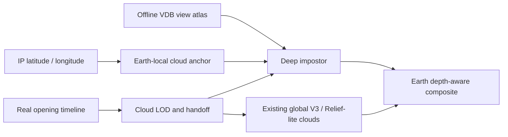

# feat: Validate offline-baked LuBirth hero clouds

## Overview

Replace further tuning of the isolated real-time Hybrid Cloud spike with one bounded, query-only experiment using an offline-authored volume cloud and a runtime deep-impostor representation. The experiment must run inside LuBirth's real opening timeline and IP-location focus behavior before any production integration is considered.

## Problem Frame

The current Hybrid spike has proved several rendering mechanisms but still lacks convincing volume. Its independent near-to-oblique camera is not the production LuBirth shot. Production changes camera elevation and look-at, shrinks and repositions Earth, fades the IP-derived yaw/pitch focus by opening progress `0.72`, and begins auto-rotation near `0.96`.

The next experiment should spend runtime budget on compositing an offline-quality result rather than constructing cloud volume in the browser.

## Requirements Trace

- R1. Use the real `mapOpeningProgress()` path; do not introduce another substitute camera sweep.
- R2. Preserve IP-derived initial focus, Earth-local attachment, and the existing shared cloud-field drift.
- R3. Show high-detail volume during the close hold, then hand off cleanly to the existing global cloud representation as Earth recedes.
- R4. Remain query-only; do not change the default homepage policy.
- R5. Prove visual quality, continuity, performance, transfer size, and GPU residency before promotion.

## Scope Boundaries

- The spike is an art-directed hero-cloud experiment, not a claim of live local weather.
- Do not extend the current analytic ellipsoid/local-volume renderer.
- Do not replace the global V3/Relief-lite far cloud layer.
- Do not support unrestricted free-camera orbit.
- Do not promote the result to the default homepage in this plan.

## Key Technical Decisions

- **Earth-local, not screen-space:** mount the baked representation under the existing Earth transform so IP focus, Earth pitch/yaw, scale, and auto-rotation apply consistently.
- **Actual timeline, not a synthetic sweep:** drive evidence with `mapOpeningProgress()` and the production location-offset logic.
- **Time-bounded high detail:** use the deep impostor primarily during progress `0–0.22`; crossfade during the main pullback around `0.22–0.68`; use only the global far cloud after the handoff.
- **View-dependent bake:** bake a small set of views sampled from the real close-to-pullback path, with color/opacity, front depth, normal or bent normal, optical depth, and AO/scatter. Do not ship a single flat RGBA card as the final candidate.
- **Optical-depth handoff:** transition between near and far representations in optical-depth space to reduce brightness pumping and alpha popping.
- **Shared footprint and drift:** bind the near anchor to the same cloud offset used by the global field, and make the bake manifest include its matching far-footprint data so the handoff does not morph between unrelated silhouettes.
- **IP semantics:** for the spike, choose a deterministic hero-cloud archetype near the active visitor location. Production promotion requires an explicit decision between art-directed placement and strict V3-truth placement.

## Intended Runtime Flow

> This is directional guidance for review, not implementation specification.

## Implementation Units

- [x] **Unit 1: Produce one auditable offline bake**

**Goal:** Create one high-quality hero-cloud asset suitable for the real close shot.

**Requirements:** R3, R5

**Dependencies:** A licensed or internally generated VDB source.

**Files:**
- Create: `packages/lubirth-hero/scripts/prepare-baked-cloud-impostor.mjs`
- Create: `apps/site/public/assets/lubirth/cloud-impostor/`
- Create: `tests/e2e/lubirth-baked-cloud-contract.spec.ts`

**Approach:**
- Sample only view directions needed by the real opening path.
- Package view metadata, channel meanings, source hash, dimensions, color space, and asset license/provenance in a manifest.
- Generate separate desktop and mobile tiers if the desktop atlas cannot meet mobile transfer/residency limits.

**Test scenarios:**
- Contract: every declared view and channel exists and matches its manifest dimensions and hash.
- Contract: depth and optical-depth channels stay within their declared numeric ranges.
- Error path: an incomplete or incompatible atlas fails capability/asset validation instead of silently using a flat fallback.

**Verification:**
- The baked reference itself visibly contains a readable cloud top, side, underside, and internal attenuation before browser integration.

- [x] **Unit 2: Build a query-only real-timeline spike**

**Goal:** Render the baked cloud through the actual LuBirth camera, Earth transform, and IP focus lifecycle.

**Requirements:** R1, R2, R3, R4

**Dependencies:** Unit 1

**Files:**
- Create: `packages/lubirth-hero/src/LandingBakedCloudImpostor.tsx`
- Create: `apps/site/app/lubirth-baked-cloud-spike/page.tsx`
- Create: `apps/site/components/LuBirthBakedCloudSpikeRoute.tsx`
- Modify: `packages/lubirth-hero/src/EarthMoonScene.tsx`
- Test: `tests/e2e/lubirth-baked-cloud-spike.spec.ts`

**Approach:**
- Add only an explicit spike-mode seam to `EarthMoonScene`; keep the production cloud policy unchanged.
- Select/interpolate baked views using the camera direction transformed into the cloud anchor's local frame.
- Depth-test against Earth and use baked depth for limited parallax and soft surface intersection.
- Drive the anchor with the existing shared cloud offset, crossfade its matched footprint to the global cloud layer during the pullback, and release near-cloud resources after handoff.
- Handle delayed IP resolution without snapping: keep the candidate hidden or softly transition its anchor only after location state is usable.

**Test scenarios:**
- Happy path: progress `0→1` uses the production timeline and completes the near-to-far handoff without exposing a flat card.
- Geo coverage: representative northern, southern, dateline-adjacent, and default coordinates begin focused on the Earth-local cloud anchor.
- Drift: a non-zero shared cloud offset moves the near anchor and its far footprint together.
- Edge case: delayed or failed IP lookup preserves the default-location shot without a visible jump.
- Motion: rapid forward/reverse progress does not pop, double-cloud, or leak stale near resources.
- Integration: Earth occludes the cloud correctly while Earth rotates, pitches, translates, and scales.

**Verification:**
- A full opening capture shows materially stronger volume than the current Hybrid spike at 1× viewing size.
- The cloud remains spatially attached to Earth and hands off before the baked representation becomes visibly planar.

- [x] **Unit 3: Decide promotion or rejection**

**Goal:** Make one explicit route decision based on the real shot rather than continue parameter iteration.

**Requirements:** R4, R5

**Dependencies:** Unit 2

**Files:**
- Create: `docs/lubirth-baked-cloud-evidence/<date>/README.md`
- Modify: `docs/lubirth-hybrid-cloud-architecture.md`
- Test: `tests/e2e/lubirth-baked-cloud-spike.spec.ts`

**Approach:**
- Compare baked candidate, current production clouds, and the stopped Hybrid spike at identical progress and geo inputs.
- Record GPU timing, frame cadence, valid sample count, transfer bytes, decoded GPU residency, and mobile-tier behavior.
- End with `PROMOTE`, `CONTINUE ONE BOUNDED FIX`, or `REJECT`; do not allow open-ended look tuning.

**Test scenarios:**
- Performance: desktop cloud GPU p95 remains within the existing `3 ms` cloud gate and overall rAF gates remain intact.
- Stability: repeated progress reversals cause no asset reallocation or view-selection flicker.
- Visual: close, pullback, and handoff frames have no obvious card edge, depth intersection, brightness pulse, or duplicate cloud mass.
- Mobile: the mobile tier completes the same lifecycle without loading desktop-only views.

**Verification:**
- Evidence is bound to the tested source and assets by manifest and checksums.
- Default homepage behavior and policy remain unchanged unless a later, separately approved promotion plan is created.

## Risks & Mitigations

| Risk | Mitigation |
|---|---|
| A single baked view reads as a card | Use view interpolation, baked depth, and complete the handoff before large angular divergence |
| Arbitrary IP positions make one cloud semantically false | Treat the spike as art-directed and require a separate placement decision before promotion |
| Atlas transfer or residency erases the performance win | Enforce desktop/mobile manifests and reject assets that exceed the existing cloud budget |
| Near/far representations double brightness | Blend optical depth and test rapid progress reversal |
| The spike repeats the previous camera mismatch | Reuse production timeline and location-offset logic directly |

## Acceptance Gate

Proceed beyond the spike only if all are true:

- the full real opening path is visibly better than the current Hybrid result;
- representative IP coordinates remain spatially correct;
- near-to-far handoff is not noticeable at normal playback speed;
- desktop cloud GPU p95 is at or below `3 ms`;
- mobile uses a bounded mobile asset tier;
- no default-home policy or route is changed.

If the visual gain is still weak, stop both the baked candidate and the current Hybrid route rather than adding another rendering stage.

## Relevant Project References

- `packages/visual-core/src/theatre/openingTimeline.ts`
- `packages/lubirth-hero/src/EarthMoonScene.tsx`
- `apps/site/visual/scenes/LuBirthSceneSlot.tsx`
- `packages/lubirth-hero/src/LandingReliefCloud.tsx`
- `apps/site/components/LuBirthHybridCloudKillSpikeRoute.tsx`
- `docs/lubirth-hybrid-cloud-architecture.md`
