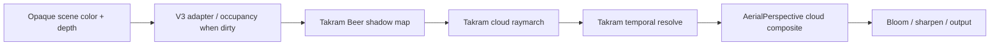

# LuBirth Takram-first 行星体积云 Spike 实施计划

> 状态：Task -1 / Task -1R 已完成并留下可复核 evidence。当前结论是 `V3_INPUT_CONTRACT_PASS`、`DISPOSABLE_RENDERER_REJECTED`、`TAKRAM_VISUAL_AND_COST_UNTESTED`；本 amendment 只授权 Task 0T/0V/0P 真实 Takram parity spike，原 Task 0–8 仍未授权。
> 计划日期：2026-08-05。
> 主实现：[takram-design-engineering/three-geospatial@b012ad0](https://github.com/takram-design-engineering/three-geospatial/tree/b012ad06d858fc035d88aacfd73f092f93c994e4)，MIT。
> 正式性能依据：[LuBirth 混合云架构 Phase -1（当前 line 911）](../../lubirth-hybrid-cloud-architecture.md#phase--1---visual-kill-spike)。
> 可读取复盘依据：`/Users/aitoshuu/.config/superpowers/worktrees/MiraLith/codex-lubirth-cloud-asset-opening/docs/lubirth-cloud-asset-opening-retrospective-2026-08-05.md`。
> 输入完整性：用户提供的 `MiraLith-lubirth-reference-absorption-spike/docs/lubirth-cloud-volume-v3-evidence/2026-08-05/README.md` 当前不在给定路径、现有 worktree 或仓库历史中；本计划不伪造该文档结论，只吸收已提供 findings，文件恢复后必须补做一次证据差异 review。

**目标：** 在不改变默认首页策略的前提下，验证 `@takram/three-clouds` 能否成为 LuBirth 近景/行星尺度体积云的主实现，并用现有 Cloud Field V3 驱动云团身份、覆盖、塔状高度和内部结构。

**核心判断：** LuBirth 的“行星级云层”不是一套需要全球 GIS 导航精度的天气系统，而是把一个稳定的 Earth-local 云体构图随地球一起放大。Takram 已具备球壳相交、地表遮挡、场景深度裁剪、Beer shadow map、时间上采样和大气合成；它文档中“global cloud coverage / views from space”仍列为 planned feature，是需要在本项目镜头中实测的风险，不再作为排除它的理由。Task -1R 的 disposable shader 只验证坐标、HDR、V3 输入和测量协议，既不具备 Takram 的表示/resolve 路径，也不能以其 36.255915 ms 成本否决 Takram；Task 0T/0V/0P 的目标正是消除这项 gate inversion。

**性能判定：**

- Task 0P 的实际 Takram pipeline `cloud GPU p95 <= 4.0 ms`：只记为 `TAKRAM_SPIKE_VIABLE`，最多允许继续研究；不是 production promotion 依据。
- Task 0P 的实际 Takram pipeline `cloud GPU p95 <= 3.0 ms`：只有在固定 parity visual quality、`adaptive=false`、完整 stage/RT 计量均通过时，才设置 `promotionEligible=true`；仍不是原 Task 0–8 或 production promotion 的授权。
- Task -1 的 `cloud GPU p95 > 4.0 ms`：只记为 `DISPOSABLE_RENDERER_REJECTED`；它不能阻断 Task 0T/0V/0P，也不能推断 Takram 的视觉或成本。
- Task 0P 中实际启用的 Takram pipeline `cloud GPU p95 > 4.0 ms`：记为 `TAKRAM_OVER_BUDGET`；仍不外推为“高质量体积云必然超预算”。

**执行边界：**

1. 历史首次执行只包含 Task -1：球壳、原始 V3 密度、`24/6`、`32/2`、`48/6` disposable microbenchmark；它不安装 Takram、不建共享 pipeline、不做 temporal、occupancy 或 adaptive。
2. Task -1 的测量结论只确定 V3 输入合同与 disposable renderer 的去留；它不再是 Takram 安装、视觉或成本验证的授权门。
3. 本 amendment 只允许顺序执行 Task 0T → Task 0V → Task 0P；每一段都在独立 query route 中运行，且不激活默认首页、`/lubirth-revised`、原 Task 0–8 或 production policy。
4. 只有 Task 0P 产出 `TAKRAM_SPIKE_VIABLE` 后，才可以发起一份新的完整集成 amendment；它本身仍不解锁原 Task 0–8。
5. 即使未来最终 `PROMOTION_ELIGIBLE`，本计划也不修改 production 默认策略；推广需要独立确认。

**本轮 findings review：**

| finding | 结论 | 本计划处置 |
| --- | --- | --- |
| inverse scale 后 ray direction 非单位、scene depth 是 world distance | `BLOCKER / VALID` | 第 1.2.1 节改为一般二次式，禁止 normalize camera ray；Task -1/1 增加 non-1 scale、rotation、translation 与 depth clamp CPU/GPU tests |
| 首轮 GPU 数据前 scope 过大 | `BLOCKER / VALID` | 新增首次唯一可执行的 Task -1；未通过前禁止 Takram install、统一 pipeline、temporal、occupancy、adaptive |
| RT/HDR/colorspace/tone mapping 未锁定 | `BLOCKER / VALID` | 新增第 1.7 节格式/语义/单一 OutputPass 合同与 HDR/gamma probes |
| `4 ms` 与正式 `3 ms` 混用 | `BLOCKER / VALID` | `<=4 ms` 只保留 spike，Task 5 `<=3 ms` 仅成为 candidate，最终 fixed-quality clean run 才能 promotion |
| RT 统计不完整、adaptive 可用 `0.35` 刷门槛 | `HIGH / VALID` | scene/composite/atmosphere 等全部入 registry；冻结 visual floor，promotion run 强制 `adaptive=false`，低于 floor 仅算 degraded evidence |
| 用无 BSM/temporal/atmosphere 的 disposable shader 阻止 Takram | `BLOCKER / VALID` | Task -1R 成本仅重分类为 `DISPOSABLE_RENDERER_REJECTED`；新增 Task 0T stock、0V V3 adapter、0P actual Takram cost 三段 parity spike |

---

## 1. 已锁定的技术决策

### 1.1 Takram 是主实现，不再只是算法参考

采用 `@takram/three-clouds` 的原因不是许可证单一因素，而是它与当前 LuBirth 栈高度重合：

| 项目条件 | Takram 固定版本 |
| --- | --- |
| Three.js | peer `>=0.170`；上游当前开发使用 `0.184.0` |
| React / R3F | React `>=19`、R3F `>=9.0.4` |
| 项目当前版本 | React `19.2.5`、R3F `9.6.0`、Three `0.184.0` |
| 云能力 | 球形云层、BSM、场景深度、temporal upscale/filter、light shafts、haze |
| 大气协同 | `CloudsEffect` 原生向 `AerialPerspective` 提供 overlay/shadow |
| 许可证 | MIT |

本计划直接依赖并固定：

| 依赖 | 固定版本/提交 | 用途 |
| --- | --- | --- |
| [`@takram/three-clouds`](https://github.com/takram-design-engineering/three-geospatial/tree/b012ad06d858fc035d88aacfd73f092f93c994e4/packages/clouds) | `0.7.6` / `b012ad06…` | 主体积云实现 |
| `@takram/three-atmosphere` | `0.19.1` | `Atmosphere`、`AerialPerspective` 和 LUT |
| `@takram/three-geospatial` | `0.9.1` | `Ellipsoid`、纹理加载和坐标工具 |
| `@react-three/postprocessing` | `3.0.4` | Takram 要求的 R3F composer |
| `postprocessing` | `6.39.1` | 底层 effect/pass |
| Takram cloud asset ref | `45a1c6c1bb9fd38b3680fd120795ff4c32df68ff` | shape、shape detail、turbulence |

固定提交中的实现证据：

- [`CloudsEffect.ts`](https://github.com/takram-design-engineering/three-geospatial/blob/b012ad06d858fc035d88aacfd73f092f93c994e4/packages/clouds/src/CloudsEffect.ts) 已公开 `worldToECEFMatrix`、`ellipsoid`、`resolutionScale`、`temporalUpscale` 和 cloud/shadow budgets。
- [`clouds.frag`](https://github.com/takram-design-engineering/three-geospatial/blob/b012ad06d858fc035d88aacfd73f092f93c994e4/packages/clouds/src/shaders/clouds.frag) 已有 sphere intersection、camera height 分支、scene depth、BSM 和 temporal velocity 输出。
- [`CloudsPass.ts`](https://github.com/takram-design-engineering/three-geospatial/blob/b012ad06d858fc035d88aacfd73f092f93c994e4/packages/clouds/src/CloudsPass.ts) 已有 current/resolve/history 与 quarter-resolution temporal upscale。
- [`qualityPresets.ts`](https://github.com/takram-design-engineering/three-geospatial/blob/b012ad06d858fc035d88aacfd73f092f93c994e4/packages/clouds/src/qualityPresets.ts) 说明上游默认 primary budget 高达 200–500，LuBirth 必须显式覆盖，不能直接套 `high`。
- [cloud README limitations](https://github.com/takram-design-engineering/three-geospatial/blob/b012ad06d858fc035d88aacfd73f092f93c994e4/packages/clouds/README.md#limitations) 把 global coverage/space view 列为未完成项，所以本计划对实际镜头设 visual kill gate，而不是假定必然可用。

`ZyFou/ProceduralTerrains` 降为 contingency reference。Task -1 允许一支不导出 production API 的 disposable pre-integration shader，只用于球壳/V3/步数成本与坐标合同；它不能演化为第二套云系统，也不能单凭其成本推断 Takram BSM/temporal 的最终成本。除此之外，Task 5 之前不重写 Takram 已经提供的 raymarch、shadow、resolve 或 temporal；只有固定上游无法满足 LuBirth 必需的一般 ray parameter/scene-depth 合同，或无法暴露 equirectangular mapping、history reset、计时边界时，才允许提交窄范围 `pnpm patch`，并逐项记录差异与上游 hash。

### 1.2 “放大”通过 world-to-ECEF bridge 实现

LuBirth 的 Earth mesh 是 Y-up 的球，Takram 使用 Z-up ECEF。每帧先把动态地球的 world transform 消掉，再把 Earth-local 半径映射到 Takram 的物理半径：

```ts
const TAKRAM_BOTTOM_RADIUS_M = 6_360_000;
const meterScale = TAKRAM_BOTTOM_RADIUS_M / composition.earth.radius;

worldToECEF =
  makeScale(meterScale, meterScale, meterScale)
    .multiply(localYUpToEcefZUp)
    .multiply(inverse(earth.matrixWorld));
```

`localYUpToEcefZUp` 固定为保持右手系的 `rotationX(+PI / 2)`：

```text
Earth local +X -> ECEF +X
Earth local +Y -> ECEF +Z
Earth local +Z -> ECEF -Y
```

因此：

- 地球在 opening 中平移、旋转或统一缩放，ECEF 内始终是半径 `6,360 km` 的稳定球体。
- 云层高度以 Takram 米制参数表达，但画面里会随 LuBirth 地球一起放大。
- 不需要把 LuBirth 场景整体改成真实地球米制。
- 只接受统一缩放；检测到非统一 scale、奇异矩阵或负 determinant 时立即 fallback。

为了让可见球面与 Takram 大气底边严格一致，spike 使用：

```ts
const ellipsoid = new Ellipsoid(
  TAKRAM_BOTTOM_RADIUS_M,
  TAKRAM_BOTTOM_RADIUS_M,
  TAKRAM_BOTTOM_RADIUS_M
);
```

`correctAltitude=false`。这不是 WGS84 导航场景，不能让 WGS84 扁率与 LuBirth 球形 mesh 在地平线产生双边界。

太阳方向也必须进入同一坐标系：

```ts
sunDirectionECEF
  .copy(sceneLightDirectionWorld)
  .transformDirection(worldToECEF)
  .normalize();
```

帧顺序固定：

```text
-2  EarthMoonScene 更新 earth matrix / sceneLightDirection
-1  Takram bridge 更新 worldToECEF / sunDirectionECEF
 0  CloudsEffect 更新 weather、BSM、raymarch、resolve
 1  唯一 composer 完成 cloud/atmosphere/bloom/output
```

#### 1.2.1 Ray parameter 与 scene depth 必须使用同一距离单位

`worldToECEF` 含 Earth inverse scale。世界空间单位方向经其线性部分变换后通常不再是单位向量；因此球壳相交不能假定二次项 `a=1`，也不能先 normalize 再把结果直接与世界距离比较。

固定合同：

```ts
const rayOriginWorld = cameraWorldPosition;
const rayDirectionWorld = normalizedWorldRayDirection;

const rayOriginEcef = transformPoint(rayOriginWorld, worldToEcef);
const rayDirectionEcefPerWorldUnit = transformLinear(
  rayDirectionWorld,
  worldToEcef
); // 禁止 normalize

const relativeOrigin = rayOriginEcef.sub(sphereCenterEcef);
const a = rayDirectionEcefPerWorldUnit.dot(rayDirectionEcefPerWorldUnit);
const halfB = relativeOrigin.dot(rayDirectionEcefPerWorldUnit);
const c = relativeOrigin.dot(relativeOrigin) - radiusEcef * radiusEcef;
const discriminant = halfB * halfB - a * c;
const tNearWorld = (-halfB - Math.sqrt(discriminant)) / a;
const tFarWorld = (-halfB + Math.sqrt(discriminant)) / a;
```

这里 `t` 仍是世界空间距离，因为世界 ray 写成 `originWorld + t * normalizedDirectionWorld`，ECEF ray 使用的是同一个 `t` 和未归一化的线性变换方向。Three.js 的 `Vector3.transformDirection(matrix)` 会归一化，**只允许用于太阳方向**，禁止用于 camera ray。

场景 depth 合同固定为：

```ts
const scenePositionWorld = reconstructWorldPosition(depthTexture, uv);
const tSceneWorld = dot(
  scenePositionWorld - rayOriginWorld,
  rayDirectionWorld
);
const tCloudExitWorld = Math.min(tFarWorld, tSceneWorld);
```

- 禁止把 nonlinear device depth、view-space `-z`、归一化后的 ECEF ray distance 与 `tNearWorld/tFarWorld` 混比。
- 对透视 ray，scene depth 必须先重建 world position；对天空像素使用显式 `Infinity` sentinel。
- `a <= epsilon`、负 discriminant、反向/相机内壳情形都必须显式处理，不能传播 NaN。
- 即使 production 最终完全走 Takram shader，Task -1 仍要用 CPU analytic oracle 与 disposable GPU pixel probe 锁定参数合同，Task 1 再验证固定上游在 LuBirth bridge 下遵守同一合同；任一失败即 `COORDINATE_KILL`，不能靠加 bias 掩盖。

### 1.3 Cloud Field V3 仍是唯一宏观云场

输入仍是：

```text
apps/site/public/assets/lubirth/textures/earth-cloud-field-nasa-lite-2k.png
layoutId = v3-r-depth-g-height-b-morphology-a-concavity
```

不得把 V3 的 `G/B/A` 静默当成四个独立 coverage 层。Task 2 生成显式 Takram adapter：

```text
takram-v1-r-base-g-tower-b-structure-a-wisp
```

所有输出通道必须先乘 V3 `R` 的 source-footprint mask：

```ts
base      = sourceCoverage;
tower     = sourceCoverage * towerFromHeight(sourceHeight);
structure = sourceCoverage * structureFromMorphology(sourceMorphology);
wisp      = sourceCoverage * wispFromConcavity(sourceConcavity);
```

这样 `G/B/A` 只雕刻已有 V3 云体，不能在 clear-air 制造新云。

Takram 当前 `getGlobeUv()` 固定走 cube-sphere local tiling，而 LuBirth V3 是 equirectangular。允许的第一处上游补丁只做：

```glsl
vec2 getGlobeUv(const vec3 position) {
  return getSphericalUv(position);
}
```

由于坐标 bridge 对 longitude 做了右手系旋转，adapter 构建时显式 `flipU`，并把 `HOME_CLOUD_FIELD_OFFSET_X/Y` 写进 manifest。三个方向基准必须由单元测试锁定，禁止靠截图反复调到“差不多”。

运行时 weather transform 固定为：

```ts
clouds.localWeatherRepeat.set(1, 1);
clouds.localWeatherOffset.set(
  -HOME_CLOUD_FIELD_OFFSET_X - homeCloudOffset.current,
  HOME_CLOUD_FIELD_OFFSET_Y
);
clouds.localWeatherVelocity.set(0, 0);
```

负的 U offset 来自 `rotationX(+PI / 2)` 与 adapter `flipU`，不能再靠材质内第二次翻转补偿。

#### 1.3.1 资产开场 REJECT 复盘转化为本轮硬门槛

上一轮 cloud asset opening 的工程连续性全部成立，但视觉仍被 REJECT。本轮不再把“可逐帧寻址、数值贴球、切换无黑帧”当成摄影级体积成立的代理指标：

- **先看真实镜头，再建机制。** Task -1 必须先输出实际 opening camera 的 `0.00/0.06/0.12/0.18` 原始帧；源表现未过关时，不安装 Takram、不建 composer、不做 temporal/adaptive。
- **可寻址不等于有可感知演化。** 四帧必须能追踪同一云团身份，同时看见结构/视差/厚度的变化；只改整体 opacity 或曝光不算演化。
- **数值贴球不等于视觉贴球。** 必须同时具备地理身份、随球视差、云核遮挡、云底/云核/云顶层次，不能从稠密云核看穿太空或地表。
- **V3 是宏观身份，不是假体积终点。** Task -1 只判断 V3 能否作为体积密度控制源并提供第一轮 isolated cost 数据；不允许把二维场加薄壳 opacity 调高后宣称体积成立。
- **不靠遮羞机制过门。** 主观 gate 截图关闭 bloom、veil、blur、temporal 和 adaptive；Relief-lite/volume handoff 两侧先裸比较，表示不匹配时不得用 `TransitionVeil` 掩盖。
- **资产仍是 cloud-only。** 不使用含地球/背景/大气的 full-scene plate；所有证据都必须能把云与地表、背景分别开关。
- **测试通过不等于推广。** seeking、reverse、fallback、dispose、typecheck 只是工程门槛；visual review 与 GPU/RT gate 仍拥有否决权。

### 1.4 单一 render owner

Challenger 激活时，下面三条路径不能同时存在：

- `LandingPostEffect` 的 Three examples `EffectComposer`
- `LandingVolumetricAtmospherePass` 的手工 scene render
- 新的 Takram/pmndrs composer

唯一合法顺序：



Task 3–5 的 spike 先使用 Takram `AerialPerspective` 完成必要 composite，旧 bloom/sharpen 暂停。只有通过 Task 5 kill checkpoint，Task 6 才把 LuBirth bloom/sharpen 迁入同一 pmndrs pipeline。

### 1.5 Query-only 变体与 fallback

新增独立类型，不把 challenger 偷塞进现有 `LandingCloudMode`：

```ts
export type LandingPlanetaryCloudVariant =
  | "off"
  | "takram-spatial"
  | "takram-temporal"
  | "takram-optimized";
```

只允许以下入口：

```text
/lubirth-planetary-cloud-spike?cloud=takram-spatial
/lubirth-planetary-cloud-spike?cloud=takram-temporal
/lubirth-planetary-cloud-spike?cloud=takram-optimized
```

默认 `/`、`/lubirth-revised`、medium/low/fallback、reduced-motion 和 capability probe 失败全部继续使用现有 Relief-lite/Nasa-lite 策略。默认路由不得下载 Takram chunk、生成大气 LUT、分配 cloud RT 或编译 cloud shader。

### 1.6 固定性能与内存合同

正式测量环境：

```text
Apple M4
System Chrome headed
production build
1440 × 960 CSS px
DPR 1
至少 120 个有效 GPU 样本
```

状态机：

| 条件 | 决策 | 后续 |
| --- | --- | --- |
| Task -1 coordinate/HDR/timer 合同失败 | `EARLY_KILL` | 停止 Task 0–8 |
| Task -1 micro visual 失败 | `EARLY_REPRESENTATION_FAIL` | 停止 Task 0–8；不得把 disposable representation 失败解释为 V3 或 Takram-first 否决 |
| Task -1 所有 visual-passing case `>4 ms` | `DISPOSABLE_RENDERER_REJECTED` | 只否决 disposable renderer；允许本 amendment 的 Task 0T，不允许原 Task 0–8 |
| 原 Task 5 的视觉/遮挡/资源恢复任一硬门槛失败 | `KILL` | 停止 Task 6–8 |
| 原 Task 5 的 cloud GPU p95 `> 4.0 ms` | `KILL` | 停止 Task 6–8 |
| 原 Task 5 的 cloud GPU p95 `(3.0, 4.0] ms` | `SPIKE_VIABLE` | 可继续优化，不可 production promotion |
| 原 Task 5 的 cloud GPU p95 `<= 3.0 ms`，frozen visual floor、`adaptive=false`、HDR/RT/visual 均通过 | `PROMOTION_ELIGIBLE` | 只获得后续推广资格，本计划不自动改首页 |

`3.0 ms` 是项目正式门槛；`4.0 ms` 只用于判断是否值得继续 spike。

所有性能判定还必须满足固定质量下限，防止 adaptive 或隐藏降采样“刷过”门槛：

- Task 4 先把通过视觉 review 的最低配置冻结为 `quality-floor.json`；冻结后再开始 Task 5 计时。
- production gate 整轮必须 `adaptive=false`、分辨率与步数固定；任何自动缩放都会使整轮证据失效，而不是只丢弃变慢帧。
- spatial candidate 的 `resolutionScale` 绝对不得低于 `0.5`；Takram temporal candidate 的外部 `resolutionScale` 固定为 `1.0`，内部 quarter-resolution current/history 行为单独记录。
- `resolutionScale=0.35` 或任何低于 frozen visual floor 的结果只能标为 `DEGRADED_RUNTIME_ONLY`，不能贡献 `SPIKE_VIABLE` 或 `PROMOTION_ELIGIBLE` 样本。
- 最终 `<=3 ms` 必须在 frozen visual floor 或更高质量上成立；`<=4 ms` 仍只表示 challenger 值得继续研究。

GPU 计时必须覆盖实际启用的全部 challenger stage：

```ts
takramCoreMs =
  hasSplitCoreQueries
    ? beerShadowMs + raymarchResolveMs
    : combinedTakramUpdateMs; // still includes BSM + raymarch + resolve

cloudGpuMs =
  occupancyGenerateMs +
  occupancyDilateMs +
  takramCoreMs +
  cloudCompositeMs;
```

最终 gate 使用：

```ts
gateGpuP95Ms = Math.max(
  percentile(allValidFrames, 0.95),
  occupancyActive ? percentile(occupancyUpdateFrames, 0.95) : 0
);
```

规则：

- 原生 Takram candidate 没有独立 occupancy 时，前两项为 `0` 且 `occupancyActive=false`。
- 一旦 optimized candidate 启用 occupancy，生成和全部 dilation pass 必须计入发生该更新的帧，不能用更新周期除掉再美化结果。
- occupancy candidate 的正式窗口必须包含至少 `10` 个 occupancy update frames；门槛取全帧 p95 与 update-frame p95 的较大值，防止低频更新被普通 p95 隐去。
- `raymarchResolveMs` 可作为一个不可嵌套 query scope，但不能漏掉 resolve。
- `cloudCompositeMs` 必须包含把 cloud overlay 写入最终 scene color 的实际 pass。
- `EXT_disjoint_timer_query_webgl2` 不可用或发生 disjoint 时，该轮不能给 GPU PASS。

内存不是只统计 `cloud/history`。`challengerIncrementalRtBytes` 必须枚举：

- V3 adapter/occupancy 及其 dilation ping-pong targets；
- Takram current color、depth/velocity、shadow-length；
- full-resolution resolve/history；
- BSM cascades；
- composer input/output 与 depth/normal buffers；
- AerialPerspective 临时目标；
- bloom mip chain、sharpen/output 临时目标；
- challenger 新增的 LUT render targets。

registry 必须跟踪 allocation/dispose lifetime，分别输出 steady live bytes 与 peak concurrent live bytes；`challengerIncrementalRtBytes` 固定指 peak concurrent live RT bytes，而不是只看截图时仍存活的 target，也不是把已复用/已释放 target 的 lifetime bytes 重复累加。

正式上限沿用混合云架构：desktop tested max DPR 下 peak `<= 64 MiB`。静态源纹理另列 `challengerTextureBytes`，不得混进 RT 后漏报。RT 计算统一使用实际 allocation 尺寸（含 DPR、layer、sample、mip 和 ping-pong），而不是 CSS 尺寸：

```ts
attachmentByteLength =
  allocatedWidth *
  allocatedHeight *
  layers *
  Math.max(1, samples) *
  bytesPerPixel *
  mipFactor;

targetByteLength = sum(colorAndDepthAttachments, attachmentByteLength);
```

multisample target 与 resolve target 必须分别计数；`peakBytes` 是 allocation/dispose 时间线上的最大同时 live bytes。

### 1.7 RT、HDR、颜色空间和 tone mapping 合同

所有候选路径共享以下语义，不能交给库默认值碰运气：

| 资源/阶段 | 最低格式 | `colorSpace` / 语义 |
| --- | --- | --- |
| V3 weather、shape、turbulence、STBN、occupancy | 实际源格式；mask 至少 RGBA8 | `NoColorSpace`，纯数据，禁止 sRGB decode |
| opaque scene color | RGBA16F / HalfFloat | scene-linear HDR，禁止中途 clamp 到 `[0,1]` |
| scene depth | Depth24/UnsignedInt 或更高 | nonlinear device depth；采样后必须重建 world position |
| cloud accumulation | RGBA16F / HalfFloat | RGB 为 premultiplied scene-linear in-scattered radiance；A 明确记录为 transmittance `T` |
| cloud depth/velocity/shadow length | 上游实际 half-float 格式 | `NoColorSpace` 数据；格式与 attachment 数写入 manifest |
| resolve/history/composite | RGBA16F / HalfFloat | scene-linear HDR；不得标为 sRGB |
| BSM、atmosphere LUT | 上游实际 R/RG/RGBA half-float | `NoColorSpace` 数据，逐项进入 RT registry |
| bloom mip、sharpen temporary | RGBA16F / HalfFloat | scene-linear HDR，全部 mip 进入 peak bytes |
| final backbuffer | 浏览器 sRGB backbuffer | 只在唯一 final output pass 做一次 output conversion |

固定合成式：

```glsl
vec3 compositeLinear = cloudRadianceLinear + sceneLinear * cloudTransmittance;
```

固定颜色流程：

```text
sRGB art texture decode
→ scene-linear opaque/HDR cloud integration
→ linear cloud composite
→ linear bloom
→ linear sharpen
→ one final OutputPass
→ display sRGB
```

spike route 显式固定并记录当前 LuBirth baseline：

```ts
renderer.toneMapping = NoToneMapping;
renderer.toneMappingExposure = 1;
renderer.outputColorSpace = SRGBColorSpace;
```

- `OutputPass` 是唯一 tone/output transform owner；中间 shader、Takram overlay、composer 或 renderer 不能再做第二次 gamma/tone mapping。
- 如果后续要比较 ACES/AgX，必须作为独立、同输入 A/B，并重新冻结 visual floor；不得在计时窗口中切换，也不得把它混入本计划 baseline。
- HDR probe 必须在 final output 前验证 `0.25/1/4/16` linear ladder 中 `4` 与 `16` 未被裁切。
- gamma probe 用 `0.18` linear gray 验证只发生一次 linear→sRGB；cloud disabled 时 challenger final output 与现有 `LandingPostEffect` baseline 的 LDR pixel delta 必须在量化误差内。
- capability probe 必须实际 render/readback RGBA16F，而不是只检查 extension 字符串；格式不支持时 fallback Relief-lite。

---

## 2. 目标文件结构

```text
packages/lubirth-hero/
├── package.json
├── scripts/
│   ├── generate-takram-cloud-weather.mjs
│   └── vendor-takram-cloud-assets.mjs
└── src/
    ├── EarthMoonHero.tsx
    ├── EarthMoonScene.tsx
    ├── types.ts
    ├── index.ts
    └── planetaryCloud/
        ├── index.ts
        ├── planetaryCloudContract.ts
        ├── planetaryCloudMath.ts
        ├── planetaryCloudPolicy.ts
        ├── planetaryCloudTelemetry.ts
        ├── takramSourceLock.ts
        ├── TakramEarthBridge.tsx
        ├── TakramCloudWeather.ts
        ├── TakramCloudAssetLoader.ts
        ├── TakramCloudGpuProfiler.ts
        ├── TakramCloudTargetRegistry.ts
        ├── TakramCloudOccupancyPass.ts
        ├── TakramCloudAdaptiveController.ts
        ├── LuBirthTakramCloudPipeline.tsx
        └── microbench/
            ├── cloudShellMicrobenchContract.ts
            ├── cloudShellMicrobenchShader.ts
            ├── CloudShellMicrobenchProfiler.ts
            └── LuBirthCloudShellMicrobench.tsx

apps/site/
├── app/lubirth-planetary-cloud-microbench/page.tsx
├── app/lubirth-planetary-cloud-spike/page.tsx
├── components/LuBirthPlanetaryCloudMicrobenchClient.tsx
├── components/LuBirthPlanetaryCloudSpikeClient.tsx
└── public/assets/lubirth/takram-clouds/
    ├── shape.bin
    ├── shape-detail.bin
    ├── turbulence.png
    ├── stbn.bin
    ├── earth-cloud-field-takram-v1.png
    └── manifest.json

patches/
└── @takram__three-clouds@0.7.6.patch

tests/
├── unit/
│   ├── lubirthPlanetaryCloudMicrobenchMath.spec.ts
│   ├── lubirthTakramCloudContract.spec.ts
│   ├── lubirthTakramEarthBridge.spec.ts
│   ├── lubirthTakramWeatherAdapter.spec.ts
│   └── lubirthTakramAdaptiveController.spec.ts
└── e2e/
    ├── lubirth-planetary-cloud-microbench.spec.ts
    ├── lubirth-takram-cloud-contract.spec.ts
    ├── lubirth-takram-cloud-color.spec.ts
    ├── lubirth-takram-cloud-visual.spec.ts
    └── lubirth-takram-cloud-performance.spec.ts
```

---

## 3. 实施任务

### Task -1：先做球壳 + V3 pre-integration microbenchmark

> 这是首次唯一可执行任务。它不安装 Takram、不修改 `EarthMoonScene`、不建设共享 composer，也不实现 occupancy、temporal、adaptive、BSM 或 transition。

**Files**

- Create: `packages/lubirth-hero/src/planetaryCloud/planetaryCloudMath.ts`
- Create: `packages/lubirth-hero/src/planetaryCloud/microbench/cloudShellMicrobenchContract.ts`
- Create: `packages/lubirth-hero/src/planetaryCloud/microbench/cloudShellMicrobenchShader.ts`
- Create: `packages/lubirth-hero/src/planetaryCloud/microbench/CloudShellMicrobenchProfiler.ts`
- Create: `packages/lubirth-hero/src/planetaryCloud/microbench/LuBirthCloudShellMicrobench.tsx`
- Create: `apps/site/components/LuBirthPlanetaryCloudMicrobenchClient.tsx`
- Create: `apps/site/app/lubirth-planetary-cloud-microbench/page.tsx`
- Create: `tests/unit/lubirthPlanetaryCloudMicrobenchMath.spec.ts`
- Create: `tests/e2e/lubirth-planetary-cloud-microbench.spec.ts`
- Create: `docs/lubirth-planetary-cloud-evidence/2026-08-05/microbench/README.md`
- Create: `docs/lubirth-planetary-cloud-evidence/2026-08-05/microbench/manifest.json`
- Create: `docs/lubirth-planetary-cloud-evidence/2026-08-05/microbench/visual-review.json`
- Create: `docs/lubirth-planetary-cloud-evidence/2026-08-05/microbench/checkpoint.json`

#### -1A：锁定 disposable microbench 的边界

- [ ] 只复用项目现有 Three/R3F 和原始 `earth-cloud-field-nasa-lite-2k.png`；不得新增 Takram/package/remote asset。
- [ ] 场景只包含：一个 LuBirth opaque Earth sphere + depth、一个同心球壳 raymarch、V3 四通道密度、一个方向光、一个 half-resolution cloud accumulation/resolve 和一个 full-resolution linear composite。
- [ ] 不加载 atmosphere LUT、shape volume、turbulence、STBN、BSM、normal pass、bloom、sharpen、veil、history 或 adaptive controller。
- [ ] shader 不从 `planetaryCloud` public index 导出，不能被默认首页引用；Task -1 结束后只作为 evidence harness 保留，不得演化为 production renderer。
- [ ] 球壳固定使用 `8 km` base / `52 km` thickness；原始 V3 通道语义固定为：

```glsl
float sourceCoverage = weather.r;
float normalizedHeight = shellHeight01(positionEcef);
float cloudTop = mix(0.35, 1.0, weather.g);
float verticalProfile =
  smoothstep(0.0, 0.08, normalizedHeight) *
  (1.0 - smoothstep(max(0.08, cloudTop - 0.18), cloudTop, normalizedHeight));
float morphologyGain = mix(0.75, 1.25, weather.b);
float concavityGain = mix(1.0, 0.72, weather.a);
float density = sourceCoverage * verticalProfile * morphologyGain * concavityGain;
```

此公式只提供保守的三维高度分布和 secondary-ray 成本；没有 shape noise，所以通过只能说明 V3 适合作为宏观控制源，不能宣称达到最终摄影级体积。

#### -1B：在第一次 GPU 数据前先锁 ray/depth 与 HDR 合同

- [ ] `raySphereInterval()` 必须实现第 1.2.1 节的一般二次式，使用 `a=dot(directionEcefPerWorldUnit, directionEcefPerWorldUnit)`；禁止假定 `a=1`。
- [ ] scene depth 必须重建 world position，再得到 `tSceneWorld`；测试 shader 提供 `showSceneDepthClamp=1` debug view。
- [ ] CPU analytic tests 至少覆盖以下组合，并与直接 world-space sphere oracle 的 `tNear/tFar` 在容差内一致：

| case | translation | rotation | uniform scale | expected |
| --- | --- | --- | ---: | --- |
| identity | `[0,0,0]` | identity | `1.0` | baseline interval |
| enlarged | `[2.5,-1.25,0.75]` | Y `37°` + X `-18°` | `1.75` | `t` 仍为 world distance |
| reduced | `[-3,0.4,2]` | arbitrary quaternion | `0.6` | `t` 仍为 world distance |
| translated/rotated occluder | `[1.2,0.3,-2.8]` | Z `61°` | `1.4` | scene mesh 在已知 `tSceneWorld` 截断 cloud |
| rejected transform | any | any | non-uniform / negative / singular | deterministic fallback |

- [ ] GPU pixel probe 在 sphere 前、中、后各放一个已知 world-distance occluder，分别断言完全遮挡、部分截断、无遮挡；至少运行一次非 `1.0` Earth scale + rotation + translation 组合。
- [ ] RT 明确为 RGBA16F scene/cloud/composite + Depth24；V3 为 `NoColorSpace` 数据；final `OutputPass` 只做一次 linear→sRGB。
- [ ] HDR ladder 与 `0.18` gray gamma probe 通过；`4/16` linear 值在 final output 前保持大于 `1`，不得提前裁切或 double gamma。

#### -1C：先做实际 opening camera 的裸画面 review

- [ ] 每个 case 在同一固定配置（`1440×960`、DPR 1、`resolutionScale=0.5`、`adaptive=false`）下采集 `progress=0.00/0.06/0.12/0.18`；关闭 bloom、atmosphere、veil、blur、temporal 和 adaptive，只保留 final sRGB conversion。
- [ ] 并排输出 cloud-only、Earth-only、raw composite 与 density debug；禁止 full-scene plate。
- [ ] `microbench/visual-review.json` 必须对每个 case 逐项人工记录 `PASS/FAIL + evidence path`；`MICRO_VISUAL_PASS` 只有存在至少一个全项通过的 case 才为 PASS：

  - 同一 V3 云团在四帧中可追踪，不靠整体 opacity 变化制造“演化”；
  - nonzero camera/Earth motion 产生正确球面视差，云不漂离地球；
  - 云底/云核/云顶和侧面厚度可辨；
  - 稠密云核不会看穿太空或地表，inner sphere/scene depth 遮挡正确；
  - clear-air 不被 G/B/A 制造出新云；
  - 不出现 longitude seam、整圈白边、双层球或提前 HDR clipping。

该门槛只判断“值得把 V3 接入完整体积系统”，不要求 disposable shader 已达到最终 photographic look。

#### -1D：视觉通过后只测三组固定步数

三组配置的第一个数字是 primary/view samples，第二个数字是每个 primary sample 的 to-sun/light samples；`groundSteps=0`：

```ts
export const CLOUD_SHELL_MICROBENCH_CASES = Object.freeze({
  "24/6": { primarySteps: 24, lightSteps: 6 },
  "32/2": { primarySteps: 32, lightSteps: 2 },
  "48/6": { primarySteps: 48, lightSteps: 6 }
});
```

- [ ] 只对 `microbench/visual-review.json` 全项通过的 case 开正式 GPU 窗口；视觉全失败时直接 `EARLY_REPRESENTATION_FAIL`，不花时间做 120-frame 性能采样。
- [ ] 性能测量固定 Apple M4 / headed System Chrome / production build / `1440×960` / DPR 1 / `resolutionScale=0.5` / `adaptive=false`。
- [ ] 每个 visual-passing case 先 hidden warmup `120` frames，再采集至少 `120` 个有效 GPU frames；compile、resize、hidden、context restore、disjoint 样本作废。
- [ ] microbench cloud total 必须逐帧覆盖：

```ts
microbenchCloudGpuMs =
  densityAndLightRaymarchMs +
  resolveMs +
  cloudCompositeMs;
```

opaque baseline 不计入 cloud GPU，但其 color/depth RT 必须进入 incremental RT peak；三项 query 不得重叠，不能用 CPU time 代替。
- [ ] 同时输出每个 case 的 `p50/p95`、样本数、invalid/disjoint 数、RT live/peak bytes、shader define、V3 hash、camera matrix 与 Earth matrix。

#### -1E：强制 early checkpoint

```json
{
  "measurementDecision": "EARLY_KILL | EARLY_REPRESENTATION_FAIL | MICROBENCH_OVER_BUDGET | MICROBENCH_VIABLE",
  "scopeDisposition": {
    "v3Input": "V3_INPUT_CONTRACT_PASS | V3_INPUT_CONTRACT_FAIL",
    "disposableRenderer": "DISPOSABLE_RENDERER_REJECTED | DISPOSABLE_RENDERER_NOT_REJECTED",
    "takram": "TAKRAM_VISUAL_AND_COST_UNTESTED"
  },
  "bestCase": "24/6 | 32/2 | 48/6 | null",
  "bestCloudGpuP95Ms": null,
  "validGpuSamples": 0,
  "microVisualGate": "PASS | FAIL",
  "coordinateGate": "PASS | FAIL",
  "hdrColorGate": "PASS | FAIL",
  "incrementalRtPeakBytes": 0
}
```

原始 measurement 判定固定为：

```ts
if (!coordinatePass || !hdrColorPass || !timerSupported) {
  return "EARLY_KILL";
}
if (!microVisualPass) {
  return "EARLY_REPRESENTATION_FAIL";
}
if (Math.min(...visualPassingCaseP95Ms) > 4) {
  return "MICROBENCH_OVER_BUDGET";
}
return "MICROBENCH_VIABLE";
```

- `<=4 ms` 在此仍只是 disposable renderer 的 incomplete early-cost viability；即使 `<=3 ms` 也绝不能给 `PROMOTION_ELIGIBLE`。
- `EARLY_KILL` / `EARLY_REPRESENTATION_FAIL` 是该 isolated harness 的历史失败分类，不能外推为 V3 或 Takram-first 不可行。
- 当前 `MICROBENCH_OVER_BUDGET` measurement 映射为 `DISPOSABLE_RENDERER_REJECTED`，并固定 `V3_INPUT_CONTRACT_PASS` / `TAKRAM_VISUAL_AND_COST_UNTESTED`。它只授权 Task 0T，不能运行原 Task 0–8。
- `MICROBENCH_VIABLE` 也只说明 disposable evidence 未拒绝；在本 amendment 下仍必须先完成 0T → 0V → 0P，不能直接执行原 Task 0。

验证：

```bash
pnpm exec playwright test -c playwright.unit.config.ts \
  lubirthPlanetaryCloudMicrobenchMath.spec.ts
pnpm exec playwright test tests/e2e/lubirth-planetary-cloud-microbench.spec.ts \
  --project=desktop
pnpm --filter @miralith/site build
git diff --check
```

---

### Amendment：Task 0T/0V/0P 真实 Takram parity spike

> 本节优先于第 1.6 节和 Task -1E 中任何把 `MICROBENCH_OVER_BUDGET` 当作 Takram install 阻断条件的表述。它只改变后续授权与 checkpoint 解释，不修改 Task -1R 的原始截图、GPU 数字或 disposable shader 的历史证据。

#### 当前三轴 checkpoint

Task -1R 已完成其应完成的合同验证，但不再承担 Takram 的替代性 visual/cost gate。当前证据必须在后续 manifest 与决策文档中按以下三个独立结论表达：

```text
V3_INPUT_CONTRACT_PASS
DISPOSABLE_RENDERER_REJECTED
TAKRAM_VISUAL_AND_COST_UNTESTED
```

| 轴 | 当前结论 | 可支持的结论 | 明确不能支持的结论 |
| --- | --- | --- | --- |
| V3 输入 | `V3_INPUT_CONTRACT_PASS` | 原始 V3、world-to-ECEF、HDR/gamma、depth 与测量生命周期合同可用作 Takram parity 输入基础 | V3 adapter 必然有 production-quality visual pass |
| disposable renderer | `DISPOSABLE_RENDERER_REJECTED` | 当前 deterministic base-shape + 自制 raymarch/resolve/composite 在 32/2 的实际 p95 为 36.255915 ms，不能作为 renderer 路线继续投资 | Takram、BSM、native temporal resolve 或高质量体积云必然超预算 |
| Takram | `TAKRAM_VISUAL_AND_COST_UNTESTED` | 必须以完整 native path 在 LuBirth opening camera 下测量 | 任何 visual、成本、promotion 或 production 结论 |

`docs/lubirth-planetary-cloud-evidence/2026-08-05/microbench/checkpoint.json` 的顶层 `decision` 重表达为 `DISPOSABLE_RENDERER_REJECTED`，原始 `MICROBENCH_OVER_BUDGET` 写入 `measurementDecision`，并新增上述三轴 `scopeDisposition` 字段；禁止删除或改写原始 121-sample artifact。

#### Task 0T/0V/0P 的共同边界

- 唯一入口是新的 query-only route：`/lubirth-takram-parity-spike?input=stock|v3&progress=0.00|0.06|0.12|0.18`。默认 `/`、`/lubirth-revised`、原 `/lubirth-planetary-cloud-spike` 和 capability fallback 不得请求 Takram chunk、Takram asset、atmosphere LUT 或新增 RT。
- route 使用与 Task -1R 相同的 LuBirth opening camera / Earth transform mirror，并继续复用已经通过的 `buildLuBirthWorldToEcef` 一般二次式与 scene-depth 合同；不得修改 `EarthMoonScene`、`LandingCloudMode`、默认 composer 或首页 policy。
- 所有 Takram 纹理都是固定版本官方文件的本地、hash-locked 副本；不得让 `Clouds` 落回默认 GitHub URL。默认 URL、Takram 之外的云 asset、或从 V3 以外生成新宏观 weather 图都应使 e2e 失败。
- “parity”指完整 native `Clouds → AerialPerspective` 路径，而不是把 Takram 的 texture 用回 disposable shader。不得自制 raymarch、BSM、temporal resolve、history buffer 或 cloud composite 来代替 Takram。
- Task 0T/0V/0P 的任何 `PASS` 都只授权记录 parity 结论和提交后续完整集成 amendment；它们不自动解锁原 Task 0–8，也不改变默认产品路由。

### Task 0T：Stock Takram parity

> **授权：已授权。** 目标是在 LuBirth opening camera 中运行 `@takram/three-clouds@0.7.6` 的完整、未调参 native 观感路径，判断 Takram 本身是否与该 framing 相容。它不读取 V3，也不创建 V3 adapter。

**Files**

- Modify: `package.json`
- Modify: `packages/lubirth-hero/package.json`
- Modify: `pnpm-lock.yaml`
- Create: `packages/lubirth-hero/src/planetaryCloud/parity/TakramParityContract.ts`
- Create: `packages/lubirth-hero/src/planetaryCloud/parity/TakramParityAssetLoader.ts`
- Create: `packages/lubirth-hero/src/planetaryCloud/parity/LuBirthTakramParityScene.tsx`
- Create: `packages/lubirth-hero/src/planetaryCloud/parity/TakramStockParityPipeline.tsx`
- Create: `packages/lubirth-hero/scripts/vendor-takram-parity-assets.mjs`
- Create: `apps/site/app/lubirth-takram-parity-spike/page.tsx`
- Create: `apps/site/components/LuBirthTakramParitySpikeClient.tsx`
- Create: `apps/site/public/assets/lubirth/takram-parity/stock/manifest.json`
- Create: `tests/unit/lubirthTakramParityContract.spec.ts`
- Create: `tests/e2e/lubirth-takram-parity.spec.ts`
- Create: `tests/e2e/lubirth-takram-parity-visual.spec.ts`
- Create: `docs/lubirth-planetary-cloud-evidence/2026-08-05/takram-parity/stock-visual-review.json`

#### 0T-A：先锁定可复现的 official stock input

- [ ] 先在 `lubirthTakramParityContract.spec.ts` 写失败测试，固定 package versions、MIT license、official asset ref、SHA-256、尺寸、3D texture 格式和无远程 URL 合同；再安装下列明确版本并使测试通过：

```json
{
  "@react-three/postprocessing": "3.0.4",
  "@takram/three-atmosphere": "0.19.1",
  "@takram/three-clouds": "0.7.6",
  "@takram/three-geospatial": "0.9.1",
  "postprocessing": "6.39.1"
}
```

- [ ] vendor script 从 `@takram/three-clouds@0.7.6` 的固定 upstream asset ref 复制 **stock local weather、shape、shape detail、turbulence、STBN** 到 `takram-parity/stock/`。stock weather 与其余 asset 必须是 byte-identical local copy；manifest 记录 npm version、upstream commit/ref、license、source URL、hash、dimensions、encoding 和 copy timestamp。
- [ ] asset loader 只返回显式加载的本地 `Texture`/`Data3DTexture`；e2e 监听请求并断言没有 `githubusercontent`、`media.githubusercontent`、Takram default URL 或 V3 PNG。单元测试对每个 texture 强制 `NoColorSpace` / 既定 wrap/filter / `flipY`，并在 context restore 后重建。
- [ ] 记录并以 telemetry 断言 native stock defaults：`qualityPreset="high"`、`resolutionScale=1`、`temporalUpscale=true`、`lightShafts=true`、`shapeDetail=true`、`turbulence=true`、`haze=true`、默认 `CloudLayers.DEFAULT`。除本地 asset substitution、LuBirth bridge 和本地 scene wiring 外，禁止传递 coverage、step、layer、shadow、lighting 或 temporal tuning prop。
- [ ] 若已安装的 `0.7.6` 与上述 pinned stock audit 不符、无法使用本地副本保持完整 feature set，或 telemetry 无法证明 BSM/temporal/AerialPerspective 已在 native path 中启用，则记录 `PARITY_SETUP_BLOCKED` 并停止在 0T-A；不得把 setup 差异伪装成 `TAKRAM_VISUAL_MISMATCH`，也不得静默增加自定义调参。

#### 0T-B：只在 isolated query route 运行完整 native path

- [ ] 先写 route contract e2e：`input=stock` 只在 `/lubirth-takram-parity-spike` 动态加载 parity subpath；默认路由/原 spike route 的 network trace 必须为零 Takram request。测试必须在 `0.00/0.06/0.12/0.18` 确认 mirror 的 camera/Earth matrix 与 Task -1R opening matrix sample 一致。
- [ ] `TakramParityContract.ts` 定义 `TAKRAM_PARITY_BOTTOM_RADIUS_M = 6_360_000`、`TAKRAM_PARITY_ELLIPSOID = new Ellipsoid(6_360_000, 6_360_000, 6_360_000)`、`TakramParityInput = "stock" | "v3"` 与 `TakramParityTelemetry`；`LuBirthTakramParityScene` 只镜像 opening 地球、opaque depth、太阳和 camera。`TakramStockParityPipeline` 在 priority `-1` 写入 `worldToECEFMatrix` 与 ECEF sun direction，并对非统一/负/奇异 Earth transform 显式显示 fallback telemetry，不修改生产场景。
- [ ] pipeline 必须使用 Takram 官方的 single composer 顺序，且不出现 `disableDefaultLayers`、自定义 `CloudLayer`、自制 cloud resolve 或自制 composite：

```tsx
<Atmosphere ellipsoid={TAKRAM_PARITY_ELLIPSOID} correctAltitude={false} ground>
  <EffectComposer enableNormalPass>
    <Clouds
      localWeatherTexture={stock.localWeather}
      shapeTexture={stock.shape}
      shapeDetailTexture={stock.shapeDetail}
      turbulenceTexture={stock.turbulence}
      stbnTexture={stock.stbn}
    />
    <AerialPerspective sky={sky} sunLight={sunLight} skyLight={skyLight} />
  </EffectComposer>
</Atmosphere>
```

- [ ] visual e2e 先捕获 raw cloud/debug buffer 与 full native composite，再写 `stock-visual-review.json`。每个 opening frame 都必须确认：官方 shape/detail/turbulence 可见、BSM 实际参与、temporal history 已生效、AerialPerspective 完成最终合成、Earth/depth 遮挡和云地附着正确、没有连续白色 shell、黑帧、丢失 asset 或双 composer。不得以 bloom、veil、曝光或自制 shader 修图通过。
- [ ] 如果 stock native path 在实际 opening camera 下不满足上述 visual gate，固化 `TAKRAM_VISUAL_MISMATCH`，停止 Task 0V；不得为救 stock 观感而先改 V3、造第二条 renderer 或改写 Takram lighting/resolve。

验证：

```bash
pnpm exec playwright test -c playwright.unit.config.ts lubirthTakramParityContract.spec.ts
MIRALITH_TAKRAM_PARITY_CAPTURE=1 pnpm exec playwright test \
  tests/e2e/lubirth-takram-parity.spec.ts \
  tests/e2e/lubirth-takram-parity-visual.spec.ts --project=desktop
pnpm --filter @miralith/lubirth-hero typecheck
pnpm --filter @miralith/site build
git diff --check
```

提交建议：

```bash
git commit -m "feat(lubirth): add stock takram parity spike"
```

### Task 0V：V3 adapter parity

> **前置条件：** Task 0T 的 stock visual gate 为 PASS。目标是让 V3 只承担宏观 coverage/weather，其他所有 Takram asset、default layers、BSM、shape/detail、turbulence、STBN、temporal 与 AerialPerspective 必须与 Task 0T 完全相同。

**Files**

- Create: `packages/lubirth-hero/scripts/generate-takram-parity-v3-weather.mjs`
- Create: `packages/lubirth-hero/src/planetaryCloud/parity/TakramParityV3Adapter.ts`
- Modify: `packages/lubirth-hero/src/planetaryCloud/parity/TakramParityContract.ts`
- Modify: `packages/lubirth-hero/src/planetaryCloud/parity/TakramStockParityPipeline.tsx`
- Create: `apps/site/public/assets/lubirth/takram-parity/v3/manifest.json`
- Create: `apps/site/public/assets/lubirth/takram-parity/v3/weather.png`
- Create: `tests/unit/lubirthTakramParityV3Adapter.spec.ts`
- Modify: `tests/e2e/lubirth-takram-parity.spec.ts`
- Modify: `tests/e2e/lubirth-takram-parity-visual.spec.ts`
- Create: `docs/lubirth-planetary-cloud-evidence/2026-08-05/takram-parity/v3-adapter-visual-review.json`

#### 0V-A：把 V3 转成未修改 Takram weather domain

- [ ] 先写 adapter 单测：固定 `+X/+Y/+Z`、longitude seam、北/南极与四个 known V3 texel 的 native `getGlobeUv()` 对照，断言生成 weather 在未修改 Takram cube-sphere domain 中采回同一 V3 source sample。禁止在 Task 0V 打 equirectangular shader patch；这样 stock 与 V3 的 renderer 差异严格只剩 weather input。
- [ ] generator 读取 `earth-cloud-field-nasa-lite-2k.png`，把它 rasterize 到 Takram 原生 tileable weather domain。输出必须 deterministic：同一 source hash 生成两次得到同一 output hash；manifest 写入 source/output hash、orientation、native UV mapping hash、`flipU/flipY`、tile repeat 和 generator version。
- [ ] V3 `R` 是强制 source-footprint mask，任何 `R < clearAirThreshold` 输出四个 channel 都为零。`G/B/A` 只能在已有 `R` footprint 内分别塑造 Takram default layer 的 tower/structure/wisp weather signal；不得在 clear-air 添加 coverage，也不得改变 shape/detail/turbulence/BSM/temporal 参数。

#### 0V-B：只替换 weather，逐项与 stock 比较

- [ ] `input=v3` 与 `input=stock` 共享同一个 `TakramStockParityPipeline`、同一 composer、同一 Earth/camera matrix、同一 asset loader 和同一 native default props；唯一不同字段是 `localWeatherTexture` 与 telemetry 中的 input/hash。e2e 断言两种输入的 renderer config deep-equal（排除 weather identity）。
- [ ] 复用 0T 的四帧视觉采集与 raw/full composite review。V3 candidate 必须保留 V3 宏观身份、clear-air footprint、云地附着、base/core/top 可读性和 native temporal/atmosphere 观感；不得因 adapter 失败回退到 disposable shader 或关闭 Takram feature。
- [ ] stock PASS 而 V3 gate FAIL 时固化 `V3_ADAPTER_VISUAL_FAIL`，记录相同 frame 的 stock/V3 side-by-side、adapter manifest 和失败项；0P 只允许继续测 visual-pass 的 stock candidate，不能把失败 V3 adapter 的性能当成有效证据。

验证：

```bash
pnpm --filter @miralith/lubirth-hero generate:takram-parity-v3-weather
pnpm exec playwright test -c playwright.unit.config.ts lubirthTakramParityV3Adapter.spec.ts
MIRALITH_TAKRAM_PARITY_CAPTURE=1 pnpm exec playwright test \
  tests/e2e/lubirth-takram-parity.spec.ts \
  tests/e2e/lubirth-takram-parity-visual.spec.ts --project=desktop
pnpm --filter @miralith/lubirth-hero typecheck
git diff --check
```

提交建议：

```bash
git commit -m "feat(lubirth): add v3 takram parity adapter"
```

### Task 0P：Actual Takram cost

> **前置条件：** Task 0T stock 或 Task 0V V3 candidate 至少一个通过 visual gate。只测 visual-pass candidate；每个 candidate 的完整 native pipeline 单独建立窗口，禁止跨输入、quality 或 history population 合并。

**Files**

- Create: `packages/lubirth-hero/src/planetaryCloud/parity/TakramParityGpuProfiler.ts`
- Create: `packages/lubirth-hero/src/planetaryCloud/parity/TakramParityMeasurementContract.ts`
- Modify: `packages/lubirth-hero/src/planetaryCloud/parity/TakramStockParityPipeline.tsx`
- Modify: `apps/site/components/LuBirthTakramParitySpikeClient.tsx`
- Create: `playwright.takram-parity-system-chrome.config.ts`
- Create: `tests/unit/lubirthTakramParityGpuProfiler.spec.ts`
- Create: `tests/e2e/lubirth-takram-parity-performance.spec.ts`
- Create: `docs/lubirth-planetary-cloud-evidence/2026-08-05/takram-parity/system-chrome-gpu.json`
- Create: `docs/lubirth-planetary-cloud-evidence/2026-08-05/takram-parity/checkpoint.json`
- Create: `docs/lubirth-planetary-cloud-evidence/2026-08-05/takram-parity/README.md`

#### 0P-A：计量完整 native pipeline，而不是替身 stage

- [ ] 先写 profiler 单测，覆盖 no-op baseline、copy-only baseline、combined native total、分阶段 query、NaN、同一 polling epoch 的全批 disjoint、resize、context restore 和 hidden→visible reset；直到每个窗口补足 120 个有效样本才停止。每帧原始 stage/total sample 必须保存，不得只保存 p50/p95。
- [ ] GPU scope 必须覆盖实际启用的 native BSM、cloud raymarch、native temporal resolve/history 与 AerialPerspective cloud composite。若公开 API 无法安全拆开 BSM/resolve，允许记录一个 `nativeCloudsUpdateMs`，但必须另记录包住 BSM 到 AerialPerspective 输出的非重叠 `nativeCloudPipelineTotalMs`；gate 永远使用 total，不能靠缺失 stage 降低结果。

```ts
interface TakramParityGpuFrame {
  frameId: number;
  noOpMs: number | null;
  copyOnlyMs: number | null;
  beerShadowMs: number | null;
  nativeCloudsUpdateMs: number | null;
  aerialPerspectiveCompositeMs: number | null;
  nativeCloudPipelineTotalMs: number;
  disjoint: boolean;
  valid: boolean;
}
```

- [ ] profiler 使用 `EXT_disjoint_timer_query_webgl2`，采样前清历史 disjoint；hidden 时同步清空 pending queries/sample population，visible 后从完整 ready frame warmup 120 frames；resize、shader compile、context restore、quality mutation 与 non-finite result 使当前 population 作废。此行为必须沿用并独立复验 Task -1R 已修正的协议，而不是假设 timer query 永远稳定。

#### 0P-B：以固定官方 parity preset 做正式 System Chrome 窗口

- [ ] stock candidate 保持 Task 0T 的 official default props；V3 candidate 保持 Task 0V 的完全相同 props。两者都不得降低 `resolutionScale`、关闭 temporal、关闭 BSM/shape detail/turbulence/AerialPerspective、启用 adaptive 或从 visual review 后再调低预算。
- [ ] 在 headed System Chrome / production build / Apple M4 / 1440×960 CSS px / DPR 1 下，对每个 visual-pass candidate 进行 120-frame warmup + 至少 120 有效 non-disjoint samples。artifact 必须记录 browser executable、renderer/vendor、viewport、DPR、native resolved quality/temporal state、asset hashes、V3 adapter hash（若适用）、raw samples、baseline samples、invalid reasons、RT inventory 和全部 stage p50/p95。
- [ ] total p95 的 checkpoint 只按完整 native pipeline 判定：

```text
TAKRAM_OVER_BUDGET   when nativeCloudPipelineTotalMs p95 > 4.0 ms
TAKRAM_SPIKE_VIABLE  when nativeCloudPipelineTotalMs p95 <= 4.0 ms
promotionEligible    only when p95 <= 3.0 ms, fixed parity quality and adaptive=false
```

- [ ] `TAKRAM_SPIKE_VIABLE` 只说明真实 Takram candidate 值得进行下一轮完整集成 architecture review；即使 `promotionEligible=true`，仍不得运行原 Task 0–8、改默认首页或把测试 route 变成产品路径。

#### 0P-C：写清楚哪一层失败，而不是把结论折叠成 KILL

`takram-parity/checkpoint.json` 使用如下 schema；每个不可达分支显式写 `NOT_RUN` 与前置失败原因：

```json
{
  "v3InputContract": "V3_INPUT_CONTRACT_PASS",
  "disposableRenderer": "DISPOSABLE_RENDERER_REJECTED",
  "stockSetup": "PASS | PARITY_SETUP_BLOCKED",
  "stockVisual": "PASS | TAKRAM_VISUAL_MISMATCH",
  "v3AdapterVisual": "PASS | V3_ADAPTER_VISUAL_FAIL | NOT_RUN",
  "candidateCosts": {
    "stock": "TAKRAM_OVER_BUDGET | TAKRAM_SPIKE_VIABLE | NOT_RUN",
    "v3": "TAKRAM_OVER_BUDGET | TAKRAM_SPIKE_VIABLE | NOT_RUN"
  },
  "promotionEligible": false,
  "nextAuthorizedWork": "NONE | ARCHITECTURE_REVIEW_ONLY"
}
```

- [ ] `TAKRAM_VISUAL_MISMATCH`：不执行 0V/0P；结论只针对 Takram stock path 在 LuBirth framing 的 visual fit。
- [ ] `V3_ADAPTER_VISUAL_FAIL`：stock 数据保留，V3 candidate 不执行 cost window；结论只针对 V3 adapter，不否决 Takram renderer。
- [ ] `TAKRAM_OVER_BUDGET`：只否决相应 visual-pass Takram parity preset；不得借此声称所有高质量体积云超预算。
- [ ] `TAKRAM_SPIKE_VIABLE`：停止在 parity evidence review，准备新 amendment；不得把它误写成原 Task 0–8 的自动通行证。

验证：

```bash
pnpm exec playwright test -c playwright.unit.config.ts lubirthTakramParityGpuProfiler.spec.ts
MIRALITH_TAKRAM_PARITY_PERF_EVIDENCE=1 pnpm exec playwright test \
  -c playwright.takram-parity-system-chrome.config.ts \
  --project=desktop-system-chrome
pnpm --filter @miralith/lubirth-hero typecheck
pnpm --filter @miralith/site typecheck
pnpm --filter @miralith/site build
git diff --check
```

提交建议：

```bash
git commit -m "perf(lubirth): record takram parity cost evidence"
```

---

### Task 0：固定依赖、许可证和离线资产

> **原完整集成路径，当前未授权。** Task -1 或 Task 0P 的任何结果都不能自动运行本任务；前置条件改为：Task 0P 至少一个 candidate 为 `TAKRAM_SPIKE_VIABLE`，parity evidence review 已确认，并且用户确认一份明确说明 full-integration scope 的新 amendment。届时必须先协调 Task 0T 已锁定的 package/asset/route，不能把下面的旧依赖与 asset 步骤原样重复执行。

**Files**

- Modify: `package.json`
- Modify: `packages/lubirth-hero/package.json`
- Modify: `pnpm-lock.yaml`
- Create: `packages/lubirth-hero/src/planetaryCloud/UPSTREAM.md`
- Create: `packages/lubirth-hero/src/planetaryCloud/takramSourceLock.ts`
- Create: `packages/lubirth-hero/scripts/vendor-takram-cloud-assets.mjs`
- Create: `apps/site/public/assets/lubirth/takram-clouds/manifest.json`
- Create: `tests/unit/lubirthTakramCloudContract.spec.ts`

- [ ] 在 `@miralith/lubirth-hero` 固定安装：

```json
{
  "@react-three/postprocessing": "3.0.4",
  "@takram/three-atmosphere": "0.19.1",
  "@takram/three-clouds": "0.7.6",
  "@takram/three-geospatial": "0.9.1",
  "postprocessing": "6.39.1"
}
```

- [ ] `UPSTREAM.md` 记录 repo commit、npm version、MIT license、asset ref、实际补丁文件和未修改部分。不得只写浮动 `main` URL。
- [ ] 从固定 npm package/asset ref 复制 shape、shape detail、turbulence、STBN 到本地 public 目录，并写 SHA-256、尺寸、格式、source URL。
- [ ] 禁止运行时使用 Takram 默认的 `media.githubusercontent.com` URL；测试扫描 bundle/config，出现默认远程 URL 即失败。
- [ ] 记录包兼容证据：上游 commit 使用 Three `0.184.0`、R3F `9.6.1`、React `19.2.6`，与本项目版本不存在 peer major mismatch。
- [ ] 此任务只建立依赖与证据，不激活任何 route。

验证：

```bash
pnpm install --frozen-lockfile=false
pnpm exec playwright test -c playwright.unit.config.ts lubirthTakramCloudContract.spec.ts
pnpm --filter @miralith/lubirth-hero typecheck
git diff --check
```

提交建议：

```bash
git add package.json pnpm-lock.yaml packages/lubirth-hero/package.json \
  packages/lubirth-hero/src/planetaryCloud/UPSTREAM.md \
  packages/lubirth-hero/src/planetaryCloud/takramSourceLock.ts \
  packages/lubirth-hero/scripts/vendor-takram-cloud-assets.mjs \
  apps/site/public/assets/lubirth/takram-clouds tests/unit
git commit -m "chore(lubirth): lock takram cloud source and assets"
```

---

### Task 1：把 Task -1 的坐标 oracle 扩展成 Takram bridge 合同

**Files**

- Create: `packages/lubirth-hero/src/planetaryCloud/planetaryCloudContract.ts`
- Modify: `packages/lubirth-hero/src/planetaryCloud/planetaryCloudMath.ts`
- Create: `packages/lubirth-hero/src/planetaryCloud/planetaryCloudPolicy.ts`
- Modify: `packages/lubirth-hero/src/planetaryCloud/UPSTREAM.md`
- Modify: `packages/lubirth-hero/src/types.ts`
- Create if required by audit: `patches/@takram__three-clouds@0.7.6.patch`
- Create: `tests/unit/lubirthTakramEarthBridge.spec.ts`

- [ ] 定义固定常量：

```ts
export const TAKRAM_BOTTOM_RADIUS_M = 6_360_000;
export const TAKRAM_CLOUD_SHELL_BASE_ALTITUDE_M = 8_000;
export const TAKRAM_CLOUD_SHELL_THICKNESS_M = 52_000;
export const TAKRAM_WORLD_SCALE_EPSILON = 1e-4;
```

`52 km` 是与当前 `HOME_CLOUD_SHELL_RADIUS = 1.008` 同量级的视觉高度，不宣称是真实气象高度。

- [ ] 实现纯函数：

```ts
buildLuBirthWorldToEcef(earthMatrixWorld, compositionRadius)
transformLuBirthSunDirectionToEcef(worldDirection, worldToEcef)
transformWorldRayToEcefParameterization(originWorld, directionWorld, worldToEcef)
raySphereIntervalGeneral(originEcef, directionEcefPerWorldUnit, radiusEcef)
reconstructSceneWorldDistance(depth, uv, inverseProjection, cameraMatrixWorld)
validateUniformPlanetScale(earthMatrixWorld)
resolvePlanetaryCloudCapability(input)
resolvePlanetaryCloudVariant(query, capability, quality, reducedMotion)
```

- [ ] 单元测试至少覆盖：

  - 任意 position/rotation/uniform scale 下，Earth-local surface 都映射到 `6_360_000 m`。
  - local north 映射到 ECEF +Z。
  - local +Z 的 longitude 翻转与 adapter manifest 一致。
  - world sun direction 经 bridge 后仍为单位向量。
  - camera ray 的 ECEF 方向**不归一化**，一般二次式在 uniform scale `0.6/1.0/1.4/1.75` 下都返回 world-distance `t`。
  - translation + arbitrary rotation + non-1 uniform scale 组合与 world-space analytic sphere oracle 一致。
  - reconstructed `tSceneWorld` 在前/中/后 occluder cases 中正确 clamp cloud interval。
  - 非统一 scale、负 scale、不可逆 matrix、WebGL2/half-float/depth capability 缺失全部返回 fallback。
  - `off` 是所有非 spike route 的默认值。

- [ ] 对 pinned `clouds.frag` 和 scene-depth reconstruction 做 source audit，并把 exact upstream hash、ray origin/direction 变换、sphere interval 公式、scene depth 单位写入 `UPSTREAM.md`：

  - 若上游保留未归一化 direction，则 interval 必须包含一般 `a`；
  - 若上游归一化 direction，则必须显式把 interval 与 scene depth 换回同一 world-ray parameter；
  - 若两者均未满足，用最小 patch 改为第 1.2.1 节合同，并给 source-hash + shader-text + GPU pixel regression；
  - 无法以窄 patch 修正时直接 `COORDINATE_KILL`，不进入 Task 2。

- [ ] capability probe 在分配完整资源前验证：

  - WebGL2；
  - half-float color target 可渲染；
  - depth texture；
  - Takram 当前 MRT attachment 数量；
  - timer query 只影响性能判定，不影响 liveness；
  - 所需 texture size 和 3D texture 能力。

验证：

```bash
pnpm exec playwright test -c playwright.unit.config.ts lubirthTakramEarthBridge.spec.ts
pnpm --filter @miralith/lubirth-hero typecheck
git diff --check
```

---

### Task 2：构建显式 V3 weather adapter，并只补 Takram 的 globe UV

**Files**

- Create: `packages/lubirth-hero/scripts/generate-takram-cloud-weather.mjs`
- Create: `packages/lubirth-hero/src/planetaryCloud/TakramCloudWeather.ts`
- Modify: `packages/lubirth-hero/src/planetaryCloud/UPSTREAM.md`
- Create: `apps/site/public/assets/lubirth/takram-clouds/earth-cloud-field-takram-v1.png`
- Modify: `apps/site/public/assets/lubirth/takram-clouds/manifest.json`
- Create/Modify: `patches/@takram__three-clouds@0.7.6.patch`
- Modify: `package.json`
- Modify: `packages/lubirth-hero/package.json`
- Modify: `pnpm-lock.yaml`
- Create: `tests/unit/lubirthTakramWeatherAdapter.spec.ts`

- [ ] 生成器读取现有 V3 PNG，而不是另造噪声天气图。
- [ ] adapter 输出固定为线性 RGBA8，保留 2:1 equirectangular 尺寸、longitude seam 和 mip 安全边界。
- [ ] 四通道都受 source coverage gate 约束；对 `R < clearAirThreshold` 的输入，四个输出必须全为零。
- [ ] manifest 记录：

```ts
{
  sourceSha256,
  outputSha256,
  sourceLayoutId: "v3-r-depth-g-height-b-morphology-a-concavity",
  outputLayoutId: "takram-v1-r-base-g-tower-b-structure-a-wisp",
  orientation: "equirectangular-y-up-source-to-z-up-ecef",
  flipU: true,
  flipY: true,
  offsetX: HOME_CLOUD_FIELD_OFFSET_X,
  offsetY: HOME_CLOUD_FIELD_OFFSET_Y,
  generatorVersion
}
```

- [ ] 用 `pnpm patch @takram/three-clouds@0.7.6` 在运行时真正使用的 shader build 与对应 source 中只新增 globe-UV hunk；若 Task 1 已因坐标 audit 产生 hunk，必须原样保留并分别测试：

```glsl
vec2 getGlobeUv(const vec3 position) {
  return getSphericalUv(position);
}
```

- [ ] 补丁测试固定上游文件 hash 和 patch hunk。上游升级导致 hunk 不再匹配时必须显式 review，不能静默跳过。
- [ ] 不在本任务修改 Takram raymarch、lighting、temporal 或质量 presets。
- [ ] 为四个 Takram `CloudLayer` 定义明确语义；任何 layer coverage 都不能绕过 V3 R。
- [ ] 把 `generate:takram-cloud-weather` 加到 `packages/lubirth-hero/package.json`，并验证同一输入连续生成两次 hash 相同。
- [ ] 在 Task -1 harness 中做 `original V3 ↔ adapter` 同镜头裸画面对照，固定 `0.00/0.06/0.12/0.18`：cloud-only、density debug、raw composite 都不得开启 bloom/veil/temporal。
- [ ] adapter 必须保持 source-footprint 零 false-positive；同一宏观云团身份、经纬位置和 clear-air 边界在两侧可对应。表示两侧未对齐时先修 adapter，不得进入 Task 3 后用 transition 掩盖。

验证：

```bash
pnpm --filter @miralith/lubirth-hero generate:takram-cloud-weather
pnpm exec playwright test -c playwright.unit.config.ts lubirthTakramWeatherAdapter.spec.ts
pnpm --filter @miralith/lubirth-hero typecheck
git diff --check
```

---

### Task 3：建立 query-only 路由和唯一 Takram render owner

**Files**

- Create: `packages/lubirth-hero/src/planetaryCloud/TakramEarthBridge.tsx`
- Create: `packages/lubirth-hero/src/planetaryCloud/TakramCloudAssetLoader.ts`
- Create: `packages/lubirth-hero/src/planetaryCloud/LuBirthTakramCloudPipeline.tsx`
- Create: `packages/lubirth-hero/src/planetaryCloud/index.ts`
- Modify: `packages/lubirth-hero/src/EarthMoonHero.tsx`
- Modify: `packages/lubirth-hero/src/EarthMoonScene.tsx`
- Modify: `packages/lubirth-hero/src/index.ts`
- Modify: `packages/lubirth-hero/package.json`
- Modify: `apps/site/visual/scenes/LuBirthSceneSlot.tsx`
- Create: `apps/site/components/LuBirthPlanetaryCloudSpikeClient.tsx`
- Create: `apps/site/app/lubirth-planetary-cloud-spike/page.tsx`
- Create: `tests/e2e/lubirth-takram-cloud-contract.spec.ts`
- Create: `tests/e2e/lubirth-takram-cloud-color.spec.ts`

- [ ] `@miralith/lubirth-hero` 增加独立 subpath export：

```json
{
  "./planetary-cloud": "./src/planetaryCloud/index.ts"
}
```

- [ ] spike client 只在 query variant 非 `off` 时 dynamic import 该 subpath。
- [ ] `TakramEarthBridge` 在 priority `-1` 更新 `AtmosphereApi.worldToECEFMatrix` 和 `sunDirection`。
- [ ] `TakramCloudAssetLoader` 把 weather 作为 `Texture` 对象传给 `Clouds`，显式设置 `NoColorSpace`、`RepeatWrapping` on S、`ClampToEdgeWrapping` on T、linear mip filtering 和 manifest 锁定的 `flipY`；不能把 URL 直接交给 Takram 默认 loader，因为它会把 T 也设为 repeat 并在极区产生南北回卷。
- [ ] pipeline 使用本地固定资产：

```tsx
<Atmosphere
  ref={atmosphereRef}
  ellipsoid={LUBIRTH_TAKRAM_ELLIPSOID}
  correctAltitude={false}
  ground
>
  <EffectComposer enableNormalPass frameBufferType={HalfFloatType}>
    <Clouds
      ref={cloudsRef}
      disableDefaultLayers
      coverage={0.5}
      localWeatherTexture={weatherTexture}
      shapeTexture={shapeTexture}
      shapeDetailTexture={shapeDetailTexture}
      turbulenceTexture={turbulenceTexture}
      stbnTexture={stbnTexture}
    >
      <CloudLayer
        channel="r"
        altitude={8_000}
        height={26_000}
        densityScale={0.18}
        shapeAmount={0.7}
        shapeDetailAmount={0.45}
        coverageFilterWidth={0.6}
        shadow
      />
      <CloudLayer
        channel="g"
        altitude={10_000}
        height={50_000}
        densityScale={0.11}
        shapeAmount={0.85}
        shapeDetailAmount={0.7}
        weatherExponent={1.15}
        coverageFilterWidth={0.52}
        shadow
      />
      <CloudLayer
        channel="b"
        altitude={8_000}
        height={36_000}
        densityScale={0.06}
        shapeAmount={0.9}
        shapeDetailAmount={0.85}
        weatherExponent={1.2}
        coverageFilterWidth={0.45}
      />
      <CloudLayer
        channel="a"
        altitude={18_000}
        height={20_000}
        densityScale={0.035}
        shapeAmount={0.55}
        shapeDetailAmount={0.25}
        weatherExponent={1.4}
        coverageFilterWidth={0.5}
      />
    </Clouds>
    <AerialPerspective sky sunLight skyLight />
  </EffectComposer>
</Atmosphere>
```

- [ ] 在首个 cloud update 前通过 effect ref 设置 `localWeatherRepeat=(1,1)`、上文固定 offset 和零 velocity；禁止保留 Takram 默认 `repeat=100`。
- [ ] 创建 composer 前显式应用第 1.7 节合同：所有 color intermediates 为 RGBA16F scene-linear，data/LUT targets 为 `NoColorSpace`，renderer 为 `NoToneMapping` / exposure `1` / sRGB output；卸载时恢复原 renderer state。
- [ ] pipeline 的 cloud accumulation 明确输出 premultiplied radiance + transmittance，并用固定式合成；如果 Takram native alpha 语义不同，adapter 必须在 manifest 记录并转换，禁止把 opacity/transmittance 反着用。
- [ ] `cloud=off` 通过 HDR ladder、`0.18` gray 和 baseline pixel parity；`cloud=on` 在 final output 前 readback 证明高光值 `>1` 仍存在。

- [ ] challenger active 时：

  - `showSurfaceTextureClouds=false`
  - `showCloudShells=false`
  - 不 mount `LandingPostEffect`
  - 不 mount `LandingVolumetricAtmospherePass`
  - 只保留一个 priority-1 final render owner

- [ ] capability/asset/shader 任一步失败，dispose 已分配资源并切回 Relief-lite；不能留下半透明黑帧。
- [ ] route unmount、context lost/restored 和 variant 切换都必须释放/重建资源。
- [ ] e2e 断言默认 `/`、`/lubirth-revised` 没有 Takram chunk request、remote asset request、cloud telemetry 或新增 RT。

验证：

```bash
pnpm exec playwright test tests/e2e/lubirth-takram-cloud-contract.spec.ts --project=desktop
pnpm exec playwright test tests/e2e/lubirth-takram-cloud-color.spec.ts --project=desktop
pnpm --filter @miralith/lubirth-hero typecheck
pnpm --filter @miralith/site typecheck
pnpm --filter @miralith/site build
git diff --check
```

---

### Task 4：用 Takram spatial 变体建立视觉正确性 oracle

**Files**

- Modify: `packages/lubirth-hero/src/planetaryCloud/planetaryCloudContract.ts`
- Modify: `packages/lubirth-hero/src/planetaryCloud/LuBirthTakramCloudPipeline.tsx`
- Modify: `tests/e2e/lubirth-takram-cloud-contract.spec.ts`
- Create: `tests/e2e/lubirth-takram-cloud-visual.spec.ts`
- Create: `docs/lubirth-planetary-cloud-evidence/2026-08-05/visual-review.json`
- Create: `docs/lubirth-planetary-cloud-evidence/2026-08-05/quality-floor.json`

- [ ] `takram-spatial` 固定为无 temporal、无 adaptive 的视觉 oracle；它不承担 3/4 ms 性能门槛。
- [ ] 先从 Takram `medium` 能力集合出发，再显式覆盖参数，不直接采用上游 `500` primary iteration 默认值。
- [ ] spatial oracle 的初始固定边界：

```ts
{
  temporalUpscale: false,
  resolutionScale: 1,
  lightShafts: false,
  turbulence: false,
  clouds: {
    maxIterationCount: 96,
    maxIterationCountToSun: 2,
    maxIterationCountToGround: 1
  },
  shadow: {
    cascadeCount: 2,
    mapSize: [256, 256],
    maxIterationCount: 32
  }
}
```

这些是 spike 起点，不是 production 常量；实际值必须随证据写入 telemetry。

- [ ] 固定视觉矩阵：

| progress | 必须观察 |
| ---: | --- |
| `0.00` | 与上一轮复盘相同的初始云团身份、近地平线厚度、云底与遮挡 |
| `0.06` | 同一云团可追踪，并出现真实结构/视差变化 |
| `0.12` | 云核不能看穿地表/太空，不能只靠 opacity 变浓 |
| `0.18` | 近景表示在 handoff 前已独立成立，不依赖 veil |
| `0.22` | 斜视侧面、顶部、silver lining |
| `0.55` | 完整地球轮廓、背面截断、经度 seam |
| `0.85` | 远景稳定、云层不膨胀成第二颗行星 |

- [ ] 三个太阳方向 `front/side/back` 都只使用 `sceneLightDirection` 经 ECEF bridge 的结果。
- [ ] 对同一 camera/Earth-local framing 重跑 identity 与 `translation + arbitrary rotation + uniform scale 0.6/1.4/1.75`；cloud shell、inner-sphere occlusion 和 scene-depth cut 必须在 ECEF 对齐后像素一致，non-uniform/negative/singular matrix 必须 deterministic fallback。
- [ ] 视觉硬门槛：

  - 地表背后的云不能穿过 inner sphere；
  - opaque geometry depth 必须正确遮住云；
  - 云顶、侧面和云底可区分；
  - V3 clear-air 不得被 shape noise 填满；
  - 不能出现 cube-sphere face seam、整圈白边、黑边或双层地球；
  - 不能靠 bloom/blur 掩盖 foam/bubble 轮廓；
  - opening 全程 world-to-ECEF 变换稳定，无云层漂离地球。

- [ ] 第一轮 review 必须使用 raw mode：关闭 atmosphere overlay、bloom、sharpen、veil、temporal 和 adaptive，只保留一次 final sRGB conversion；通过后才补看完整 atmosphere composite。
- [ ] 生成 `0.18 Relief-lite raw / 0.18 Takram raw / 0.22 Relief-lite raw / 0.22 Takram raw` contact sheet。宏观云团身份、轮廓和光学质量无法对应时标记 `REPRESENTATION_KILL`；不得先写 `TransitionVeil`。
- [ ] `visual-review.json` 对“可感知但身份连续的演化、地理身份、视差、云底/核/顶、核心遮挡、clear-air、seam、HDR”逐项给出 `PASS/FAIL + evidence path`；自动 screenshot 完成不能替代主观 verdict。
- [ ] 从所有通过 raw + complete composite review 的配置中，选质量参数最低者并冻结 `quality-floor.json`；真实 GPU 成本留到 Task 5 测量：

```json
{
  "variant": "takram-spatial",
  "resolutionScale": 0.5,
  "primarySteps": 48,
  "sunSteps": 2,
  "groundSteps": 1,
  "shadowCascadeCount": 2,
  "shadowMapSize": [256, 256],
  "shadowSteps": 24,
  "adaptive": false,
  "visualReview": "PASS",
  "evidenceSha256": null
}
```

示例值不是预先宣告 PASS；最终数值必须来自截图 review，且 spatial `resolutionScale` 不得低于 `0.5`。Task 5 只能测该 floor 或更高质量。

- [ ] 若 Takram 在 LuBirth 实际 space framing 中无法正确做 sphere/depth occlusion，本任务直接 `VISUAL_KILL`；不先写第二套自研 raymarch。

这里使用 Playwright 只用于关键视觉验证，unit/type tests 仍是结构验证主体。

验证：

```bash
pnpm exec playwright test tests/e2e/lubirth-takram-cloud-contract.spec.ts --project=desktop
MIRALITH_TAKRAM_CLOUD_CAPTURE=1 \
  pnpm exec playwright test tests/e2e/lubirth-takram-cloud-visual.spec.ts --project=desktop
```

---

### Task 5：完成 optimized、全链路 GPU/RT 计量，并执行强制 kill checkpoint

**Files**

- Create: `packages/lubirth-hero/src/planetaryCloud/TakramCloudGpuProfiler.ts`
- Create: `packages/lubirth-hero/src/planetaryCloud/TakramCloudTargetRegistry.ts`
- Create: `packages/lubirth-hero/src/planetaryCloud/TakramCloudOccupancyPass.ts`
- Create: `packages/lubirth-hero/src/planetaryCloud/planetaryCloudTelemetry.ts`
- Modify: `packages/lubirth-hero/src/planetaryCloud/LuBirthTakramCloudPipeline.tsx`
- Modify: `patches/@takram__three-clouds@0.7.6.patch`
- Create: `tests/e2e/lubirth-takram-cloud-performance.spec.ts`
- Create: `docs/lubirth-planetary-cloud-evidence/2026-08-05/checkpoint.json`
- Create: `docs/lubirth-planetary-cloud-evidence/2026-08-05/CHECKPOINT.md`
- Create: `docs/lubirth-planetary-cloud-evidence/2026-08-05/rt-inventory.json`

- [ ] 读取 Task 4 的 frozen `quality-floor.json`，先测 fixed optimized，不先写复杂扩展。下列配置只是最低起点；如果 visual floor 的任一质量维度更高，checkpoint preset 必须逐维取更高者：

```ts
{
  temporalUpscale: false,
  resolutionScale: 0.5,
  lightShafts: false,
  turbulence: false,
  haze: false,
  clouds: {
    maxIterationCount: 48,
    maxIterationCountToSun: 2,
    maxIterationCountToGround: 1
  },
  shadow: {
    cascadeCount: 2,
    mapSize: [256, 256],
    maxIterationCount: 24
  }
}
```

原计划中的 `48 view × 6 light` 不再作为默认 optimized 合同。Takram 已把 direct/ground/BSM 拆开；主 candidate 固定 `48 primary + 2 sun + 1 ground` 上限。任何 6-light A/B 只能作为被测实验，不能在未计时情况下进入下一任务。

Task 5 的 `takram-optimized` 明确是 spatial optimized：它使用 half-resolution effect buffer，但还不启用 Takram temporal history。这样 checkpoint 衡量的是共享 pipeline、temporal hardening 和 adaptive 之前已经成立的基础成本；`temporalUpscale=true` 只在 Task 7 的 `takram-temporal` A/B 中开启。

- [ ] 整个正式窗口强制 `adaptive=false` 且 `resolutionScale/steps/shadow` immutable；检测到低于 `quality-floor.json`、`resolutionScale=0.35` 或任何 runtime quality mutation 时，整轮标记 `INVALID_QUALITY_FLOOR`，不得进入 p95 判定。

- [ ] GPU profiler 使用非重叠 `EXT_disjoint_timer_query_webgl2` scopes，并按 frame id 延迟回收：

```ts
interface TakramCloudGpuFrame {
  frameId: number;
  occupancyGenerateMs: number;
  occupancyDilateMs: number;
  beerShadowMs?: number;
  raymarchResolveMs?: number;
  combinedTakramUpdateMs?: number;
  cloudCompositeMs: number;
  totalMs: number;
  disjoint: boolean;
}
```

- [ ] 若 Takram 公共 API 只能暴露 `CloudsEffect.update()`，允许把 `beerShadow + raymarch + resolve` 记为一个合并 scope；但总计必须再加 occupancy 和 final cloud composite。禁止回到只包 `renderPlanetaryCloud + resolve` 的旧计时方式。
- [ ] 若 final cloud overlay 无法从 `AerialPerspective` 中独立计时，在同一个 `pnpm patch` 增加最小 begin/end hook；不得用 CPU `performance.now()` 冒充 GPU composite。
- [ ] profiler warmup 至少 120 frames，正式样本至少 120 个；resize、hidden、compile、context restore 和 disjoint 窗口作废。
- [ ] occupancy active 时另收集至少 10 个 update frames，并以 `max(all-frame p95, update-frame p95)` 作为 checkpoint 的 `cloudGpuP95Ms`。

- [ ] `TakramCloudTargetRegistry` 对每个 challenger allocation 记录：

```ts
{
  owner,
  label,
  width,
  height,
  depth,
  attachments,
  internalFormat,
  format,
  type,
  colorSpace,
  samples,
  bytesPerAttachment,
  mipFactor,
  byteLength
}
```

总数必须覆盖第 1.6/1.7 节的全部 RT；尤其是 opaque scene input/output、scene depth/normal、cloud accumulation/depth/velocity、resolve/history、cloud composite、AerialPerspective 临时目标/atmosphere LUT、BSM、occupancy、bloom/sharpen/output。无法可靠枚举的 target 视为 memory gate 失败，而不是填 `0`。

- [ ] `rt-inventory.json` 同时输出 CSS size、allocated pixel size、DPR、render scale、layer/sample/mip、steady live bytes 和 peak concurrent live bytes；Task 5 即使尚未启用 bloom，也必须明确把对应 entry 标为 `notAllocatedYet`，Task 6 启用后补齐并重新执行 memory gate。
- [ ] 在 desktop tested max DPR 下触发一次完整 resize/allocation 生命周期；multisample 与 resolve、ping-pong 两侧、全部 bloom mips 和旧 target 等待 dispose 的重叠窗口都进入 peak。

- [ ] occupancy 不是强制功能。只有 native optimized 的 stage profile 明确显示 empty-air raymarch 是主要成本，才实现低分辨率 coverage max-map + 保守 dilation；并满足：

  - false-negative 为零；
  - dilation 半径覆盖 shape/turbulence 最大位移；
  - on/off 静态 pixel diff 和 optical mass 在门槛内；
  - 生成与每次 dilation 都进入同帧 GPU total；
  - occupancy RT 全部进入 memory total。

- [ ] 固定 telemetry：

```ts
interface LandingPlanetaryCloudTelemetry {
  active: boolean;
  variant: LandingPlanetaryCloudVariant;
  sourceCommit: string;
  sourceLayoutId: string;
  adapterLayoutId: string;
  worldToEcefValid: boolean;
  temporalActive: boolean;
  occupancyActive: boolean;
  adaptiveActive: boolean;
  qualityFloorId: string;
  qualityFloorSatisfied: boolean;
  gpu: {
    supported: boolean;
    sampleCount: number;
    p50Ms?: number;
    p95Ms?: number;
    stages: Record<string, number | undefined>;
  };
  renderTargets: {
    steadyBytes: number;
    peakBytes: number;
    entries: Array<{
      label: string;
      byteLength: number;
      internalFormat: string;
      type: string;
      colorSpace: string;
    }>;
  };
  textures: {
    totalBytes: number;
  };
  primarySteps: number;
  sunSteps: number;
  groundSteps: number;
  renderScale: number;
  fallbackReason?: string;
}
```

只复用同一 snapshot；禁止每帧向 window 累积无限数组。

#### Task 5 强制 checkpoint

在任何 Task 6 文件改动前，写入：

```json
{
  "decision": "KILL | SPIKE_VIABLE | PROMOTION_CANDIDATE",
  "cloudGpuP95Ms": null,
  "validGpuSamples": 0,
  "challengerIncrementalRtBytes": 0,
  "visualGate": "PASS | FAIL",
  "qualityFloorGate": "PASS | FAIL",
  "hdrColorGate": "PASS | FAIL",
  "timerSupported": false,
  "evidenceCommit": null
}
```

判定算法必须是纯函数并有 unit/e2e assertion：

```ts
if (
  !visualPass ||
  !qualityFloorPass ||
  !hdrColorPass ||
  !timerSupported ||
  rtBytes > 64 * MiB
) return "KILL";
if (gpuP95Ms > 4) return "KILL";
if (gpuP95Ms <= 3) return "PROMOTION_CANDIDATE";
return "SPIKE_VIABLE";
```

Task 5 的 `PROMOTION_CANDIDATE` 只表示 fixed spatial 基线已达到正式 3 ms 门槛；必须经过 Task 6 的完整 pipeline/RT 重测、Task 7 可选 temporal 取舍和 Task 9 最终证据后，才允许升级为 `PROMOTION_ELIGIBLE`。

`KILL` 时：

- 立即停止 Task 6、7、8；
- 不建设共享 pipeline、不追加 temporal reset patch、不写 adaptive controller；
- 保留 source lock、测量、截图和失败原因；
- 默认 Relief-lite 不变。

`KILL` 直接跳到 Task 9 的失败证据固化和 Task 10 的去留结论，Task 6–8 整段跳过。

`SPIKE_VIABLE` 或 `PROMOTION_CANDIDATE` 才可继续 Task 6。

验证：

```bash
pnpm exec playwright test tests/e2e/lubirth-takram-cloud-performance.spec.ts \
  --project=desktop
node -e 'const c=require("./docs/lubirth-planetary-cloud-evidence/2026-08-05/checkpoint.json"); if(c.decision==="KILL") process.exit(2)'
```

---

### Task 6：checkpoint 存活后，统一 atmosphere / bloom / output pipeline

> 前置条件：`checkpoint.json.decision !== "KILL"`。

**Files**

- Modify: `packages/lubirth-hero/src/planetaryCloud/LuBirthTakramCloudPipeline.tsx`
- Create: `packages/lubirth-hero/src/planetaryCloud/LuBirthTakramSharpenEffect.ts`
- Modify: `packages/lubirth-hero/src/EarthMoonScene.tsx`
- Modify: `packages/lubirth-hero/src/LandingPostEffect.tsx`
- Modify: `tests/e2e/lubirth-takram-cloud-contract.spec.ts`
- Modify: `tests/e2e/lubirth-takram-cloud-color.spec.ts`
- Modify: `docs/lubirth-planetary-cloud-evidence/2026-08-05/rt-inventory.json`

- [ ] 把 challenger 路径的 bloom/sharpen 迁入 pmndrs composer，顺序固定：

```text
opaque/depth
→ CloudsEffect update
→ AerialPerspective + cloud overlay
→ Bloom
→ LuBirth sharpen
→ output/color conversion
```

- [ ] 复刻现有 LuBirth bloom/sharpen 参数行为，但不再 mount Three examples composer。
- [ ] `LandingPostEffect` 默认路由实现保持不变；只在 challenger active 时由新 pipeline 接管。
- [ ] scene/composite/atmosphere/bloom/sharpen/output 的每一个 target 显式遵守第 1.7 节格式；禁止 composer 默认创建 RGBA8 intermediate。
- [ ] HDR ladder、`0.18` gray、cloud-disabled baseline parity 在完整 pipeline 中重跑；最终仅一个 `OutputPass`，禁止 renderer、Takram shader 与 output pass 重复 tone mapping/gamma。
- [ ] renderer state 必须完整恢复：render target、viewport、scissor、scissorTest、clear color/alpha、autoClear、tone mapping、output color space、XR enabled。
- [ ] e2e 断言每帧只发生一个 final scene render owner；不能 scene 被 composer 与旧 atmosphere pass 各画一次。
- [ ] 更新完整 RT allocation timeline 并重跑 64 MiB peak gate；scene/composite/atmosphere RT 漏一项、格式未知或只按当前 adaptive scale 统计都视为失败。
- [ ] 在 frozen visual floor、`adaptive=false` 下重测 Task 5 完整 cloud cost。pipeline 重构后若 `>4 ms` 或 RT peak `>64 MiB`，decision 回退为 `KILL`，停止 Task 7–8；`(3,4] ms` 仍只是 `SPIKE_VIABLE`，`<=3 ms` 才保留 promotion candidate 身份。

验证：

```bash
pnpm exec playwright test tests/e2e/lubirth-takram-cloud-contract.spec.ts --project=desktop
pnpm exec playwright test tests/e2e/lubirth-takram-cloud-color.spec.ts --project=desktop
pnpm exec playwright test tests/e2e/lubirth-takram-cloud-performance.spec.ts --project=desktop
pnpm --filter @miralith/site build
```

---

### Task 7：只强化 Takram 原生 temporal，不另写一套 TAA

> 前置条件：Task 6 复测仍不为 `KILL`。

**Files**

- Modify: `patches/@takram__three-clouds@0.7.6.patch`
- Create: `packages/lubirth-hero/src/planetaryCloud/TakramCloudHistoryController.ts`
- Modify: `packages/lubirth-hero/src/planetaryCloud/LuBirthTakramCloudPipeline.tsx`
- Create: `tests/unit/lubirthTakramCloudHistory.spec.ts`
- Modify: `tests/e2e/lubirth-takram-cloud-visual.spec.ts`

- [ ] `takram-temporal` 固定从 `resolutionScale=1`、`temporalUpscale=true` 开始，使用 Takram 自带 quarter-resolution current buffer、velocity/depth 和 full-resolution history/resolve。
- [ ] temporal A/B 全程 `adaptive=false`，并各自冻结配置；不能用 temporal 组更低的 visual quality 与 spatial 组比较。
- [ ] current、depth/velocity、shadow-length、双 history、resolve 与 reset 时短暂重叠的旧 targets 全部加入 `rt-inventory.json`，重新执行 64 MiB peak gate。
- [ ] 如上游没有 public reset，只补一个 `resetHistory()` hook；不复制 `CloudsResolveMaterial`。
- [ ] 以下事件必须 invalidate history：

  - viewport/DPR/`resolutionScale` 改变；
  - camera projection 改变；
  - camera teleport 或 opening progress 非连续跳变；
  - earth matrix 超过阈值的平移/旋转/scale 跳变；
  - sun direction、weather asset、variant、layer layout 改变；
  - tab hidden/reappear；
  - WebGL context restore；
  - temporal on/off。

- [ ] history 重置后首帧只使用 current，不混入未初始化内容。
- [ ] reverse sweep `0 → 0.55 → 0.1` 检查：

  - silhouette trailing；
  - 地表 disocclusion smear；
  - 稀云 ghost；
  - cloud mass pumping。

- [ ] temporal 只有满足至少一个条件才保留：

  - GPU p95 相对 non-temporal optimized 降低 `>=15%`；
  - 静态 cloud-body SSIM 提升 `>=0.03`；
  - 主观 grain 明显下降且 reverse sweep 全部通过。

否则保留结构更简单的 `takram-optimized`。

验证：

```bash
pnpm exec playwright test -c playwright.unit.config.ts lubirthTakramCloudHistory.spec.ts
MIRALITH_TAKRAM_CLOUD_CAPTURE=1 \
  pnpm exec playwright test tests/e2e/lubirth-takram-cloud-visual.spec.ts --project=desktop
pnpm exec playwright test tests/e2e/lubirth-takram-cloud-performance.spec.ts --project=desktop
```

---

### Task 8：增加只用于 runtime liveness 的自适应质量

> 前置条件：Task 7 复测仍不为 `KILL`。

**Files**

- Create: `packages/lubirth-hero/src/planetaryCloud/TakramCloudAdaptiveController.ts`
- Modify: `packages/lubirth-hero/src/planetaryCloud/LuBirthTakramCloudPipeline.tsx`
- Modify: `packages/lubirth-hero/src/planetaryCloud/planetaryCloudTelemetry.ts`
- Create: `tests/unit/lubirthTakramAdaptiveController.spec.ts`
- Modify: `tests/e2e/lubirth-takram-cloud-performance.spec.ts`

- [ ] 固定 controller：

```ts
export const TAKRAM_CLOUD_ADAPTIVE_DEFAULTS = Object.freeze({
  checkIntervalMs: 3000,
  targetGpuMs: 2.7,
  productionHighMs: 3.0,
  spikeKillMs: 4.0,
  recoverGpuMs: 2.4,
  highChecksToRecover: 3,
  minResolutionScale: 0.7,
  resolutionStepDown: 0.1,
  resolutionStepUp: 0.05,
  minPrimarySteps: 32
});
```

- [ ] 降级顺序：

```text
resolutionScale
→ primary steps 48 → 40 → 32
→ shape detail
→ BSM map/cascade
→ Relief-lite fallback
```

恢复顺序反向，并要求连续三个 recover window。

- [ ] `sunSteps` 与 `groundSteps` 不在正常 adaptive loop 中抖动；它们的 shader/lighting 变化过大，只能在离散 preset 切换时改变。
- [ ] resize、shader warmup、timer disjoint、tab hidden、history reset 后 suspend 6 秒。
- [ ] 连续两个有效窗口 `>4 ms` 立即 runtime fallback；这不会把最终 spike 的 `>4 ms` 测量改写成 PASS。
- [ ] controller 的 telemetry 每帧记录 `requestedScale/allocatedScale/qualityFloorSatisfied/degradedReason`；任何低于 frozen visual floor 的窗口标记 `DEGRADED_RUNTIME_ONLY`。
- [ ] `0.35` 及低于 `minResolutionScale=0.7` 的 scale 在代码、query 参数和测试注入中都必须 clamp/reject；不能出现只在截图/计时模式偷偷放宽下限的分支。
- [ ] adaptive 只负责 runtime liveness，不参与正式性能判定。最终 production eligibility 必须重新运行 `adaptive=false`、frozen preset 的稳定态并实测 `<=3 ms`；不能因为 controller 降采样后偶尔 `<=4 ms` 就推广。
- [ ] RT memory gate 使用 full-quality allocation 的 peak/high-water；controller 当前降到较小尺寸不能改写或降低已经记录的 challenger peak。

验证：

```bash
pnpm exec playwright test -c playwright.unit.config.ts lubirthTakramAdaptiveController.spec.ts
pnpm exec playwright test tests/e2e/lubirth-takram-cloud-performance.spec.ts --project=desktop
pnpm --filter @miralith/lubirth-hero typecheck
```

---

### Task 9：采集最终视觉、运动、性能、内存与 fallback 证据

**Files**

- Create: `playwright.takram-cloud-system-chrome.config.ts`
- Modify: `tests/e2e/lubirth-takram-cloud-visual.spec.ts`
- Modify: `tests/e2e/lubirth-takram-cloud-performance.spec.ts`
- Create: `docs/lubirth-planetary-cloud-evidence/2026-08-05/README.md`
- Create: `docs/lubirth-planetary-cloud-evidence/2026-08-05/manifest.json`
- Create: `docs/lubirth-planetary-cloud-evidence/2026-08-05/promotion-run.json`
- Create: `docs/lubirth-planetary-cloud-evidence/2026-08-05/checksums.sha256`

- [ ] 使用 headed System Chrome、单 worker、production build，固定 Apple M4 / 1440×960 / DPR 1。
- [ ] 每个保留变体采集 close-opening `0.00/0.06/0.12/0.18` 与 planetary `0.22/0.55/0.85` PNG、一次 forward/reverse WebM 和同名 telemetry JSON；raw gate 与 full-composite 证据分目录保存。
- [ ] 每份 telemetry 包含：

  - Takram commit/package/patch hash；
  - V3 source/adapter hash 与 layout；
  - viewport/DPR/GPU renderer；
  - world-to-ECEF validity；
  - 每个 GPU stage p50/p95 和 total p95；
  - 所有 RT entry 的 format/type/colorSpace/sample/mip/byteLength、steady/peak RT total、texture total；
  - temporal/occupancy/adaptive 状态；
  - frozen quality floor、实际配置和 `qualityFloorSatisfied`；
  - renderer toneMapping/exposure/outputColorSpace 与唯一 OutputPass 断言；
  - primary/sun/ground/shadow budgets；
  - fallback reason。

- [ ] 最终门槛：

| 指标 | 门槛 |
| --- | ---: |
| occupancy generate/dilate + BSM + raymarch + resolve + composite GPU p95 | `<=4 ms` 才能 `SPIKE_VIABLE` |
| production promotion fixed-quality GPU p95 | `<=3 ms`，且 `adaptive=false` |
| 有效 GPU 样本 | `>=120` |
| 整页 RAF p95，3 个窗口取中位窗口 | `<=18 ms` |
| 全部 challenger incremental RT peak | `<=64 MiB` |
| WebGL error | `0` |
| invalid/disjoint sample | 可丢弃，但不能计入样本数 |
| compile hitch | hidden warmup 完成；可见交互无首次编译 |

- [ ] `promotion-run.json` 必须是独立 clean run：读取 frozen `quality-floor.json`、`adaptive=false`、固定 resolution/steps/shadow、至少 120 有效样本。低于 floor、出现动态降采样或缺任一 GPU/RT stage 时，final decision 最多只能是 `SPIKE_VIABLE_BUT_NOT_PROMOTABLE`。
- [ ] adaptive 运行结果另列为 resilience evidence，不能与 `promotion-run.json` 的 samples 合并。

- [ ] 默认/降级矩阵：

  - `/`、`/lubirth-revised`：零 Takram chunk/RT/LUT/shader；
  - medium/low/fallback：Relief-lite；
  - reduced-motion：Relief-lite；
  - WebGL2/MRT/half-float probe fail：Relief-lite；
  - context lost/restored：无黑屏、无双 composer、无旧 history；
  - unmount：所有 effect、pass、RT、texture、query dispose。

- [ ] 最终 decision 不允许模糊文字：

```text
KILL
SPIKE_VIABLE_BUT_NOT_PROMOTABLE
PROMOTION_ELIGIBLE
```

`SPIKE_VIABLE_BUT_NOT_PROMOTABLE` 明确表示可以保留研究 route，但不允许进入 production policy。

执行：

```bash
pnpm exec playwright test tests/e2e/lubirth-takram-cloud-contract.spec.ts \
  --project=desktop
MIRALITH_TAKRAM_CLOUD_CAPTURE=1 \
  pnpm exec playwright test -c playwright.takram-cloud-system-chrome.config.ts
pnpm lint
pnpm typecheck
pnpm build
git diff --check
```

固化 checksum：

```bash
cd docs/lubirth-planetary-cloud-evidence/2026-08-05
rg --files . \
  | rg -v '^\./?checksums\.sha256$' \
  | LC_ALL=C sort \
  | xargs shasum -a 256 \
  > checksums.sha256
```

---

### Task 10：记录去留结论并更新知识图谱

**Files**

- Create: `docs/lubirth-planetary-cloud-decision-2026-08-05.md`
- Create/Modify: `docs/lubirth-planetary-cloud-evidence/2026-08-05/README.md`（Task -1 early kill 时由本任务创建；其余路径修改 Task 9 版本）
- Modify: `graphify-out/graph.json`
- Modify: `graphify-out/GRAPH_REPORT.md`

- [ ] 决策文档必须逐条回答：

  - Takram 球壳/space framing 是否通过 LuBirth 实际镜头；
  - Task -1 的 `24/6、32/2、48/6` 哪一组同时通过 micro visual 与 early-cost GPU gate；
  - world-to-ECEF 放大 bridge 是否稳定；
  - non-1 scale + rotation + translation 下 ray interval 与 scene world depth 是否同单位；
  - equirectangular patch 是否足够小且可维护；
  - V3 四通道身份是否保留；
  - `0.00/0.06/0.12/0.18` 是否表现出可追踪且可感知的结构演化；
  - temporal 是否值得；
  - occupancy 是否启用及净收益；
  - full GPU stage total；
  - scene/composite/atmosphere 在内的全部 RT/texture memory；
  - HDR ladder、single gamma/tone mapping 和 final OutputPass 是否通过；
  - final `<=3 ms` 是否来自 `adaptive=false`、frozen quality floor，而非降到 `0.35`；
  - 默认首页是否零成本；
  - 最终 `KILL / SPIKE_VIABLE_BUT_NOT_PROMOTABLE / PROMOTION_ELIGIBLE`。

- [ ] 在 Task 0T–0P 尚未执行时，决策文档将 Takram visual/cost 字段写为 `TAKRAM_VISUAL_AND_COST_UNTESTED`，并将 Task -1 的原始测量写为 `measurementDecision=MICROBENCH_OVER_BUDGET`、`scopeDisposition.disposableRenderer=DISPOSABLE_RENDERER_REJECTED`；不得伪造 Takram、temporal、occupancy 或完整 pipeline 数据。
- [ ] 在 Task 0T–0P 执行后，决策文档只记录实际完成的 stock/V3 parity 结果；原 Task 1–8、occupancy、adaptive 与 production default 字段若未执行，必须仍为 `NOT_RUN_AFTER_PARITY_SPIKE`。

- [ ] `PROMOTION_ELIGIBLE` 也不直接修改 `landingVisualPolicy.ts` 默认值。推广首页需要独立、经确认的 production plan。
- [ ] 如果缺失的 `lubirth-cloud-volume-v3-evidence/2026-08-05/README.md` 在执行前恢复，先把它与本计划的 V3/坐标/性能假设逐项做差异 review；有冲突时更新计划和 checkpoint schema，再继续执行。
- [ ] 使用当前真实命令，不再假设根目录存在 `/graphify`：

```bash
command -v graphify
graphify update .
graphify query "LuBirth Takram planetary volumetric cloud pipeline"
graphify path "EarthMoonScene" "LuBirthTakramCloudPipeline"
graphify path "LuBirthTakramCloudPipeline" "LandingPostEffect"
```

Expected：

- `command -v graphify` 返回可执行路径；当前环境预期为 `/opt/homebrew/bin/graphify`。
- query 能找到 source lock、scale bridge、V3 adapter、pipeline、telemetry、route 和 tests。
- path 能证明 challenger 只有一个 final render owner。
- 如果 `command -v graphify` 失败，才把知识图谱更新标记为阻塞；不得因错误的 `test -x /graphify` 阻塞整份计划。

验证：

```bash
pnpm lint
pnpm typecheck
pnpm build
git diff --check
git status --short
```

---

## 4. 最终验收清单

- [ ] Takram `0.7.6` 是主实现，repo commit、MIT license、npm 版本和 asset ref 全部固定。
- [ ] Task -1/R 的 `24/6、32/2、48/6` 只作为 V3/坐标/HDR/measurement evidence；其 `MICROBENCH_OVER_BUDGET` 已重表达为 `DISPOSABLE_RENDERER_REJECTED`，不作为 Takram visual/cost gate。
- [ ] Task 0T/0V/0P 先分别验证 stock native path、唯一 V3 weather adapter 差异和完整 native pipeline 成本；在无新的明确 amendment 前，原 Task 0–8 仍未执行。
- [ ] “行星级”通过 Earth-local → ECEF 的统一 scale bridge 实现，不要求真实 GIS 世界尺度。
- [ ] Y-up → Z-up、longitude flip、V3 offsets 有纯函数测试；non-1 scale + rotation + translation 的 ray interval 采用一般二次式，scene depth 与返回 `t` 都是 world distance。
- [ ] Cloud Field V3 仍是唯一宏观云源，adapter 不在 clear-air 制造云。
- [ ] 实际 opening camera 的 `0.00/0.06/0.12/0.18` raw contact sheet 已证明身份连续、结构演化、视差、厚度与核心遮挡；没有用 opacity、bloom 或 veil 代替表示正确性。
- [ ] Takram patch 只包含被证据证明必要的 globe UV、timer hook、history reset；没有复制整套 raymarch。
- [ ] challenger 只在 query-only spike route 动态加载。
- [ ] challenger active 时只有一个 final render owner。
- [ ] parity checkpoint 区分 `TAKRAM_VISUAL_MISMATCH`、`V3_ADAPTER_VISUAL_FAIL`、`TAKRAM_OVER_BUDGET` 和 `TAKRAM_SPIKE_VIABLE`；任何结论都不自动运行原 Task 0–8。
- [ ] GPU total 包含 occupancy generation/dilation、BSM、raymarch、resolve、cloud composite。
- [ ] 内存包含 scene/composite/atmosphere、cloud/history、BSM/LUT、bloom mips 和临时重叠在内的所有 challenger RT；按 allocation timeline 报 steady/peak。
- [ ] RGBA16F scene-linear HDR 一直保留到唯一 final OutputPass；HDR ladder、`0.18` gray、single gamma/tone mapping 均通过。
- [ ] Task 0P 的完整 native total `<=4 ms` 才标记 `TAKRAM_SPIKE_VIABLE`；`<=3 ms` 只设置 `promotionEligible=true`，仍需独立 full-integration amendment 才能讨论 production promotion。
- [ ] `resolutionScale=0.35` 或低于 visual floor 的结果只算 runtime degraded evidence，不能进入 promotion samples；RT peak 也不能被降采样改写。
- [ ] 默认首页、中低档、reduced-motion 和 capability failure 继续使用 Relief-lite，且没有 Takram bundle/RT/LUT 成本。
- [ ] visual、reverse sweep、GPU、RAF、memory、context recovery 和 dispose 都有可复核证据。
- [ ] 知识图谱使用 `command -v graphify` 与 `graphify update .` 正常更新。
- [ ] 本计划不自动修改 production 默认策略。
